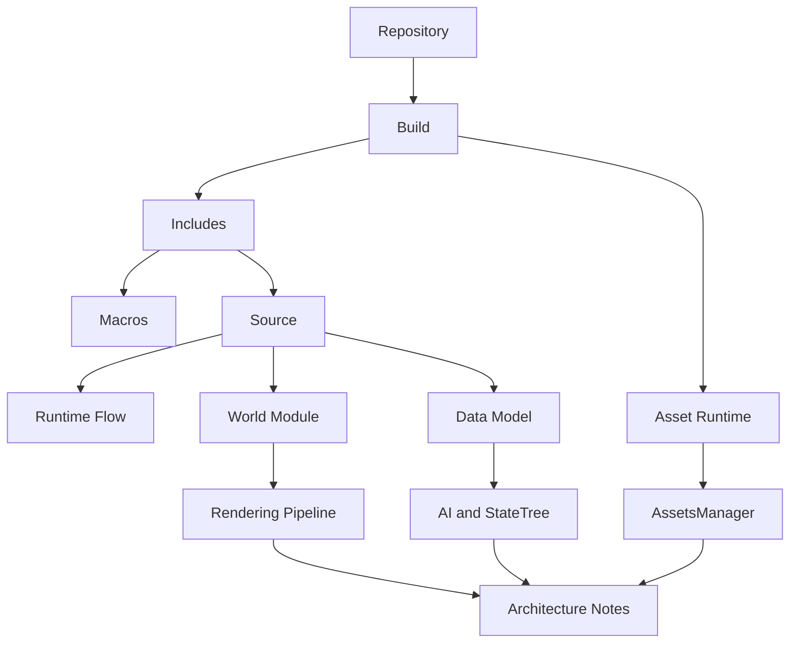

# Путеводитель по архитектурной книге HoMM

Эта глава нужна не для повторного пересказа всей книги, а для навигации.
Если `ProjectOverview.md` — это титульная страница, то этот файл отвечает на вопрос:
куда именно идти дальше в зависимости от задачи.

## Что это за книга

`Docs/Architecture/` описывает проект как систему связанных слоёв:
- сборка и упаковка;
- контрактный слой `Includes`;
- исполняемый runtime;
- модель данных;
- asset engine;
- AI и `StateTree`;
- подробные разборы структур и модулей.

Книга не заменяет:
- `README.md`, где описан общий замысел;
- `ToDo.md`, где живут рабочие задачи.

Её роль — объяснить, как проект устроен изнутри.

## Как лучше читать книгу

Ниже не "правильный порядок для всех", а несколько понятных маршрутов.

### Если нужна общая картина проекта

Начни с этих глав:
1. [Репозиторий и документация](01_Repository_and_Docs.md)
2. [Сборка, упаковка и образ диска](02_Build_and_Packing.md)
3. [Includes и контрактный слой](03_Includes_and_Contracts.md)
4. [Source и runtime-модули](04_Source_Runtime_and_Modules.md)
5. [Модель данных](05_Data_Model.md)
6. [TickScheduler и cadence-обновление объектов](19_TickScheduler_and_Object_Cadence.md)
7. [Главный архитектурный подход](16_Asset_Centric_Runtime_Approach.md)
8. [AssetsManager и исполнение assets](26_AssetsManager_and_Asset_Execution.md)

Это самый короткий путь к пониманию того, как проект собирается, как загружается и из каких слоёв состоит.

### Если нужно включиться в разработку кода

Иди так:
1. [Сборка, упаковка и образ диска](02_Build_and_Packing.md)
2. [Includes и контрактный слой](03_Includes_and_Contracts.md)
3. [Макро-система и флаги](17_Macro_System_and_Flag_Orchestration.md)
4. [Source и runtime-модули](04_Source_Runtime_and_Modules.md)
5. [Поток рантайма и управление](06_Runtime_Flow_and_Control.md)
6. [TickScheduler и cadence-обновление объектов](19_TickScheduler_and_Object_Cadence.md)
7. [Детальный разбор модулей](20_Modules_Deep_Dive_Index.md)
8. [Архитектурные заметки и риски](08_Architecture_Notes_and_Risks.md)

Этот маршрут лучше всего объясняет:
- как проект собирается;
- как устроены контракты;
- как макросы реально управляют рантаймом;
- где искать код конкретных модулей.

### Если интересует макро-система, флаги и подмена поведения

Читай в таком порядке:
1. [Includes и контрактный слой](03_Includes_and_Contracts.md)
2. [Макро-система и флаги](17_Macro_System_and_Flag_Orchestration.md)
3. [Поток рантайма и управление](06_Runtime_Flow_and_Control.md)
4. [EntryPoint](21_EntryPoint.md)
5. [Модуль World](25_World_Module.md)

Это путь для задач, где важно понять:
- как устроены флаги;
- как патчатся loop, swap и interrupt handlers;
- как self-modifying macros участвуют в реальном runtime.

### Если интересует rendering pipeline

Иди так:
1. [Модуль World](25_World_Module.md)
2. [Rendering pipeline](18_Rendering_Pipeline.md)
3. [Макро-система и флаги](17_Macro_System_and_Flag_Orchestration.md)
4. [Поток рантайма и управление](06_Runtime_Flow_and_Control.md)

Здесь собран весь материал про:
- draw-фазы мира;
- двойную буферизацию;
- dirty screen blocks;
- длинный swap;
- роль прерываний и курсорного микропайплайна.

### Если интересует object tick, cadence и scheduler

Читай в таком порядке:
1. [FObject](12_FObject.md)
2. [Поток рантайма и управление](06_Runtime_Flow_and_Control.md)
3. [TickScheduler и cadence-обновление объектов](19_TickScheduler_and_Object_Cadence.md)
4. [Модуль Session](24_Session_Module.md)
5. [Модуль World](25_World_Module.md)

Этот маршрут нужен для задач, где важно понять:
- как `FObject` связывается с chunk-моделью мира;
- как `Spawn` получает `CadencePassId`;
- почему нужен bootstrap первого прохода;
- где scheduler уже встроен в runtime, а где ещё остаётся незавершённым.

### Если интересует asset engine

Этот путь даёт самую важную ось проекта:
1. [Сборка, упаковка и образ диска](02_Build_and_Packing.md)
2. [FAssets и runtime-зеркало ресурса](15_FAssets_and_GameState_Assets.md)
3. [Главный архитектурный подход](16_Asset_Centric_Runtime_Approach.md)
4. [AssetsManager и исполнение assets](26_AssetsManager_and_Asset_Execution.md)

### Если интересует AI и `StateTree`

Читай в таком порядке:
1. [Модель данных](05_Data_Model.md)
2. [AI и StateTree](07_AI_and_StateTree.md)
3. [FObjectCharacterAI и FAIContext](14_FObjectCharacterAI_and_FAIContext.md)
4. [Поток рантайма и управление](06_Runtime_Flow_and_Control.md)
5. [Модуль World](25_World_Module.md)

## Как устроена книга по слоям

Книгу удобнее воспринимать не как один длинный список файлов, а как несколько этажей.

### Этаж 1. Общая архитектура

Это главы, которые дают базовую модель проекта:
- [Репозиторий и документация](01_Repository_and_Docs.md)
- [Сборка, упаковка и образ диска](02_Build_and_Packing.md)
- [Includes и контрактный слой](03_Includes_and_Contracts.md)
- [Source и runtime-модули](04_Source_Runtime_and_Modules.md)
- [Модель данных](05_Data_Model.md)
- [Поток рантайма и управление](06_Runtime_Flow_and_Control.md)
- [AI и StateTree](07_AI_and_StateTree.md)

### Этаж 2. Концептуальные механизмы

Это главы, которые описывают самые сильные инженерные идеи проекта:
- [Главный архитектурный подход](16_Asset_Centric_Runtime_Approach.md)
- [Макро-система и флаги](17_Macro_System_and_Flag_Orchestration.md)
- [Rendering pipeline](18_Rendering_Pipeline.md)
- [TickScheduler и cadence-обновление объектов](19_TickScheduler_and_Object_Cadence.md)

### Этаж 3. Детальные разборы структур

Если нужно разбирать сущности поштучно:
- [Индекс структур](09_Structs_Deep_Dive_Index.md)
- [FParticipant и PlayerActions](10_FParticipant_and_PlayerActions.md)
- [FCharacter](11_FCharacter.md)
- [FObject](12_FObject.md)
- [FObjectCharacter](13_FObjectCharacter.md)
- [FObjectCharacterAI и FAIContext](14_FObjectCharacterAI_and_FAIContext.md)
- [FAssets и runtime-зеркало ресурса](15_FAssets_and_GameState_Assets.md)

### Этаж 4. Детальные разборы модулей

Если нужно разбирать runtime по крупным состояниям и подсистемам:
- [Индекс модулей](20_Modules_Deep_Dive_Index.md)
- [EntryPoint](21_EntryPoint.md)
- [Модуль Core](22_Core_Module.md)
- [Модуль MainMenu](23_MainMenu_Module.md)
- [Модуль Session](24_Session_Module.md)
- [Модуль World](25_World_Module.md)
- [AssetsManager и исполнение assets](26_AssetsManager_and_Asset_Execution.md)

### Этаж 5. Инженерные выводы и риски

Финальная глава:
- [Архитектурные заметки и риски](08_Architecture_Notes_and_Risks.md)

Она нужна после чтения остальных разделов, а не до них.

## Карта движения по книге

## Что держать в голове при чтении

Есть несколько опорных идей, без которых книгу труднее собирать в цельную картину.

### Проект мыслит слоями

Здесь важно не только "что лежит в файле", но и на каком уровне ответственности этот файл находится:
- сборка;
- контракты;
- runtime;
- данные;
- экранный цикл;
- AI.

### `Includes` — это не просто заголовки

В этом проекте `Includes/` задаёт:
- словарь терминов;
- номера битов;
- layout структур;
- адресные константы;
- макро-язык системы.

### Макросы — часть архитектуры

Нельзя читать `Macro/` как набор удобных шорткатов.
Через него проект реально:
- патчит обработчики;
- управляет main loop;
- переключает экранный режим;
- открывает и закрывает ветви поведения через self-modifying code.

### Рендер — это state machine, а не одна функция

Для мира нужно держать в голове всю цепочку:
- `Launch`
- `Loop`
- `Draw`
- `PipelineHexagons`
- `Interrupt`
- `Swap`
- `MemcpyScreen`

### `AssetsManager` — это один из главных двигателей рантайма

Он не просто загружает ресурсы.
Через него проект:
- размещает код и данные;
- выбирает страницы памяти;
- исполняет code-assets;
- связывает builder и runtime в одну систему.

## Как поддерживать книгу в актуальном состоянии

Если меняется:
- сборка и упаковка — обновлять главы 02, 16 и 26;
- макро-система или флаговые контракты — обновлять главы 03 и 17;
- экранный цикл мира — обновлять главы 18 и 25;
- объектный tick, cadence или `TickScheduler` — обновлять главу 19;
- модель данных — обновлять главы 05 и 09-15;
- AI-слой — обновлять главы 07 и 14;
- модульная структура runtime — обновлять главы 04 и 20-26.

То есть книга должна развиваться вместе с кодом.
Её задача — быть рабочим архитектурным документом, а не разовым обзором.
