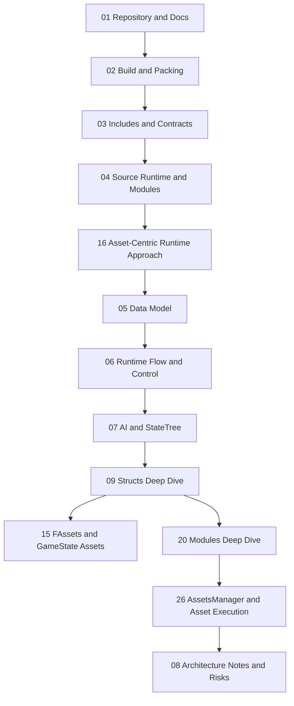

# Книга Архитектуры HoMM

Этот раздел документации описывает проект как систему слоёв, контрактов, модулей, структур данных и runtime-потоков.
Его задача — объяснить не только из каких папок состоит репозиторий, но и как эти папки превращаются в целостную исполняемую систему.

## О Чём Эта Книга

В корне проекта уже есть несколько документов, но у каждого из них своя роль:
- `README.md` объясняет замысел проекта и общий человеческий контекст разработки;
- `ToDo.md` фиксирует рабочие задачи и технические долги;
- `Description (ru).txt` даёт краткое текстовое описание;
- `Docs/Architecture/` хранит системное архитектурное описание проекта.

Эта книга не заменяет `README.md` и не дублирует `ToDo.md`.
Она отвечает на вопрос: как именно проект устроен изнутри.

## Как Читать Книгу

Есть несколько маршрутов чтения.

### 1. Быстрый маршрут

Если нужно быстро понять общую архитектуру, достаточно пройти главы в таком порядке:
1. [01_Repository_and_Docs.md](01_Repository_and_Docs.md)
2. [03_Includes_and_Contracts.md](03_Includes_and_Contracts.md)
3. [04_Source_Runtime_and_Modules.md](04_Source_Runtime_and_Modules.md)
4. [16_Asset_Centric_Runtime_Approach.md](16_Asset_Centric_Runtime_Approach.md)
5. [05_Data_Model.md](05_Data_Model.md)
6. [26_AssetsManager_and_Asset_Execution.md](26_AssetsManager_and_Asset_Execution.md)
7. [07_AI_and_StateTree.md](07_AI_and_StateTree.md)

### 2. Путь для нового разработчика

Если задача — включиться в работу над кодом, лучше читать так:
1. [01_Repository_and_Docs.md](01_Repository_and_Docs.md)
2. [02_Build_and_Packing.md](02_Build_and_Packing.md)
3. [03_Includes_and_Contracts.md](03_Includes_and_Contracts.md)
4. [04_Source_Runtime_and_Modules.md](04_Source_Runtime_and_Modules.md)
5. [16_Asset_Centric_Runtime_Approach.md](16_Asset_Centric_Runtime_Approach.md)
6. [05_Data_Model.md](05_Data_Model.md)
7. [06_Runtime_Flow_and_Control.md](06_Runtime_Flow_and_Control.md)
8. [15_FAssets_and_GameState_Assets.md](15_FAssets_and_GameState_Assets.md)
9. [07_AI_and_StateTree.md](07_AI_and_StateTree.md)
10. [09_Structs_Deep_Dive_Index.md](09_Structs_Deep_Dive_Index.md)
11. [20_Modules_Deep_Dive_Index.md](20_Modules_Deep_Dive_Index.md)
12. [26_AssetsManager_and_Asset_Execution.md](26_AssetsManager_and_Asset_Execution.md)
13. [08_Architecture_Notes_and_Risks.md](08_Architecture_Notes_and_Risks.md)

### 3. Путь для проектирования AI

Если интересует в первую очередь логика поведения, полезнее такой порядок:
1. [05_Data_Model.md](05_Data_Model.md)
2. [06_Runtime_Flow_and_Control.md](06_Runtime_Flow_and_Control.md)
3. [07_AI_and_StateTree.md](07_AI_and_StateTree.md)
4. [14_FObjectCharacterAI_and_FAIContext.md](14_FObjectCharacterAI_and_FAIContext.md)
5. [16_Asset_Centric_Runtime_Approach.md](16_Asset_Centric_Runtime_Approach.md)
6. [25_World_Module.md](25_World_Module.md)
7. [26_AssetsManager_and_Asset_Execution.md](26_AssetsManager_and_Asset_Execution.md)
8. [08_Architecture_Notes_and_Risks.md](08_Architecture_Notes_and_Risks.md)

### 4. Путь для понимания asset engine

Если нужно понять главный runtime-механизм проекта, читать стоит так:
1. [02_Build_and_Packing.md](02_Build_and_Packing.md)
2. [03_Includes_and_Contracts.md](03_Includes_and_Contracts.md)
3. [16_Asset_Centric_Runtime_Approach.md](16_Asset_Centric_Runtime_Approach.md)
4. [15_FAssets_and_GameState_Assets.md](15_FAssets_and_GameState_Assets.md)
5. [20_Modules_Deep_Dive_Index.md](20_Modules_Deep_Dive_Index.md)
6. [26_AssetsManager_and_Asset_Execution.md](26_AssetsManager_and_Asset_Execution.md)

## Карта Книги

## Структура Глав

### Глава 01. Репозиторий и документация

Разбирает проект сверху вниз:
- какие папки лежат в корне;
- что является исходниками, а что артефактами и инструментами;
- как разграничены `README`, `ToDo` и архитектурные документы.

### Глава 02. Сборка и упаковка

Объясняет, как проект переходит от исходников к TR-DOS образу:
- что делает `Builder`;
- как разделяются `Pack` и `Build`;
- как используются pages;
- как организованы assets и их упаковка.

### Глава 03. Includes и контрактный слой

Разбирает `Includes` как основу архитектуры:
- константы;
- макросы;
- страницы;
- kernel bindings;
- структуры;
- глобальные переменные.

### Глава 04. Source и модули рантайма

Описывает исполняемый код:
- `EntryPoint`;
- `Modules`;
- `Core`;
- `MainMenu`;
- `Session`;
- `World`;
- предметные и платформенные подсистемы.

### Глава 05. Модель данных

Подробно описывает игровые сущности и связи между ними:
- `FParticipant`;
- `FCharacter`;
- `FObject`;
- `FObjectCharacter`;
- `FObjectCharacterAI`;
- `FPlayerActions`.

### Глава 06. Поток рантайма и управление

Показывает, как система живёт во времени:
- что происходит при старте;
- как переключаются модули;
- как запускается `World`;
- как разводятся путь человека и путь AI.

### Глава 07. AI и StateTree

Определяет AI-слой проекта:
- `FStateTreeDescriptor`;
- `FStateTreeContext`;
- `FBlackboard`;
- `FAIContext`;
- `FStateTreeTask`;
- `FStateTreeTransition`.

### Глава 09. Детальный разбор структур

Открывает второй слой книги и раскладывает ключевые структуры как самостоятельные архитектурные единицы:
- `FParticipant` и `FPlayerActions`;
- `FCharacter`;
- `FObject`;
- `FObjectCharacter`;
- `FObjectCharacterAI` и `FAIContext`.

### Глава 15. `FAssets` и runtime-зеркало ассета

Выделяет asset-запись как отдельную системную сущность:
- как устроен `FAssets`;
- почему он занимает всего 8 байт;
- как он связывает диск, ОЗУ и runtime;
- зачем в `GameState` хранится копия последнего загруженного ассета.

### Глава 16. Главный архитектурный подход проекта

Формулирует самую сильную идею проекта:
- код и данные существуют как единый asset-space;
- исполняемые модули рассматриваются как загружаемые assets;
- память проектируется как явный page-based ресурс;
- Builder и runtime связаны через один общий язык ресурсов.

### Глава 20. Детальный разбор модулей

Открывает второй слой книги для исполняемого кода и разбирает модульную ось проекта по отдельным runtime-единицам:
- `EntryPoint`;
- `Core`;
- `MainMenu`;
- `Session`;
- `World`.

### Глава 26. `AssetsManager` и движок исполнения ассетов

Подробно разбирает центральный runtime-механизм проекта:
- инициализацию asset-table;
- выбор памяти под ресурс;
- mark/release модель;
- загрузку и распаковку;
- запуск code-assets и функций внутри них;
- связи между `AssetsManager`, макросами и модулями.

### Глава 08. Архитектурные заметки и риски

Фиксирует инженерные выводы:
- сильные стороны модели;
- текущие ограничения;
- рискованные места;
- направления дальнейшего углубления документации и архитектуры.

## Детальные Индексы

### Индекс структур

- [09_Structs_Deep_Dive_Index.md](09_Structs_Deep_Dive_Index.md)
- [10_FParticipant_and_PlayerActions.md](10_FParticipant_and_PlayerActions.md)
- [11_FCharacter.md](11_FCharacter.md)
- [12_FObject.md](12_FObject.md)
- [13_FObjectCharacter.md](13_FObjectCharacter.md)
- [14_FObjectCharacterAI_and_FAIContext.md](14_FObjectCharacterAI_and_FAIContext.md)
- [15_FAssets_and_GameState_Assets.md](15_FAssets_and_GameState_Assets.md)

### Индекс модулей

- [20_Modules_Deep_Dive_Index.md](20_Modules_Deep_Dive_Index.md)
- [21_EntryPoint.md](21_EntryPoint.md)
- [22_Core_Module.md](22_Core_Module.md)
- [23_MainMenu_Module.md](23_MainMenu_Module.md)
- [24_Session_Module.md](24_Session_Module.md)
- [25_World_Module.md](25_World_Module.md)
- [26_AssetsManager_and_Asset_Execution.md](26_AssetsManager_and_Asset_Execution.md)

### Концептуальные главы

- [16_Asset_Centric_Runtime_Approach.md](16_Asset_Centric_Runtime_Approach.md)

## Что Важно Держать В Голове При Чтении

У проекта есть несколько ключевых архитектурных идей.

### 1. Проект живёт как слоистая система

Нельзя читать репозиторий просто как набор `.asm` и `.inc` файлов.
Здесь есть чёткое расслоение:
- сборка;
- контракты;
- исполняемый код;
- данные карты и ассетов;
- runtime-состояние;
- AI-слой.

### 2. Includes — это не просто заголовки

`Includes/` в этом проекте — это словарь всей системы.
Он задаёт термины, соглашения и layout памяти.
Многие решения в `Source/` нельзя понять без `Includes/`.

### 3. Самая сильная идея проекта — asset-centric runtime

Код исполняется не только как резидентный бинарник.
Крупные блоки логики, экраны и подготовительные модули живут как assets,
которые можно загрузить, разместить в нужной странице памяти и сразу исполнить.

Это делает `AssetsManager` не побочным сервисом, а фактическим двигателем переходов между крупными состояниями проекта.

### 4. Код исполняется не там же, где хранится

Часть модулей хранится как assets и разворачивается в runtime-память при запуске соответствующего состояния игры.
Это важно для понимания `Modules`, `Launch`, `Execute` и работы со страницами памяти.

### 5. AI не является отдельным внешним контроллером

В текущей архитектуре нет отдельного `Controller` в духе Unreal Engine.
AI выражен через `FObjectCharacterAI -> FAIContext -> StateTree/Blackboard`.
Поэтому анализ AI нужно делать через данные и runtime, а не через абстрактный слой контроллеров.

## Объём Анализа

На момент написания книги в проекте насчитывается примерно:
- 436 файлов в `Builder/`;
- 203 файла в `Includes/`;
- 321 файл в `Source/`.

Это значит, что архитектуру проекта нельзя адекватно описать одной диаграммой или одним обзорным файлом.
Поэтому документация разложена по главам и по отдельным deep-dive разделам.

## Принцип Поддержки Документации

Эта книга должна развиваться вместе с проектом.
Практическое правило простое:
- если меняется слой данных, обновляется глава про модель данных и соответствующий deep dive;
- если меняется порядок запуска или layout модулей, обновляются главы про `Builder`, `Source` и модульные deep dive;
- если меняется asset-runtime слой, обновляются главы про `FAssets`, главный подход и `AssetsManager`;
- если меняется AI-слой, обновляются главы про `StateTree`, `FAIContext` и связанные структуры.

То есть книга является не рекламным описанием проекта, а рабочим архитектурным документом.
