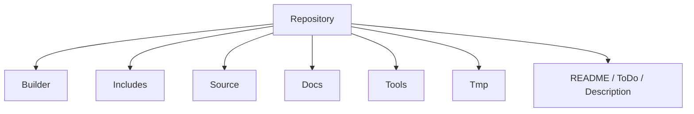

# 01. Репозиторий И Документы

## Назначение Главы

Эта глава описывает проект на самом верхнем уровне.
Она отвечает на вопрос: какие крупные зоны существуют в репозитории и какую роль каждая из них играет в общей системе.

Главная задача этой главы — снять самое первое архитектурное напряжение.
Когда человек впервые открывает проект, он видит одновременно:
- большой `Builder`;
- насыщенный `Includes`;
- ещё более насыщенный `Source`;
- множество графических и metadata-артефактов;
- отдельные временные и инструментальные каталоги.

Без явной карты такой репозиторий воспринимается как один большой массив файлов.
На самом деле он устроен намного более дисциплинированно.

## Корневая Структура Репозитория

В корне проекта находятся следующие основные каталоги:
- `.vscode/`
- `Builder/`
- `Docs/`
- `Includes/`
- `LUA/`
- `Source/`
- `Tmp/`
- `Tools/`
- `_sjasmplus/`

Также в корне лежат важные файлы:
- `.gitignore`
- `Description (ru).txt`
- `HoMM.trd`
- `README.md`
- `ToDo.md`

## Семантика Корневого Уровня

### `.vscode/`

Редакторская зона.
Она не описывает архитектуру игры как таковой, но влияет на удобство локальной разработки.
Её следует воспринимать как слой среды разработки, а не как часть runtime.

### `Builder/`

Это производственный слой.
Здесь проект превращает исходники и ресурсы в итоговые артефакты сборки.
Именно этот каталог отвечает за:
- упаковку модулей кода;
- упаковку графики;
- упаковку metadata;
- упаковку текста;
- создание TR-DOS образа.

Если сравнивать проект с фабрикой, то `Builder/` — это цех сборки и упаковки.

### `Docs/`

Документационный слой.
Именно здесь должны жить:
- архитектурные разборы;
- обзорные материалы для разработчика;
- схемы и карты проекта.

По смыслу `Docs/` не должен превращаться в хранилище случайных заметок.
Его задача — быть местом системных документов.

### `Includes/`

Контрактный слой.
Это один из самых важных каталогов проекта.
Здесь хранятся определения, на которые потом опирается весь исполняемый код:
- структуры;
- константы;
- макросы;
- page-экспорты;
- kernel-binding'и;
- глобальные переменные.

Если `Source/` — это поведение системы, то `Includes/` — её словарь и грамматика.

### `LUA/`

Сервисный скриптовый слой.
Это вспомогательная зона проекта, которая участвует в подготовке данных и поддержке сборки.

### `Source/`

Собственно исполняемый код игры.
Здесь находятся:
- стартовые точки входа;
- запускаемые модули;
- игровой рантайм;
- предметные подсистемы;
- платформенные сервисы.

Это архитектурное ядро поведения проекта.

### `Tmp/`

Временная рабочая зона.
Здесь появляются:
- проверки;
- промежуточные артефакты;
- черновые `.asm`/`.inc`;
- вспомогательные тесты;
- локальные файлы для экспериментов.

Смысл `Tmp/` очень важен: это не слой production-логики, а лаборатория и рабочий стол.

### `Tools/`

Инструментальный слой.
Как и `LUA/`, этот каталог нужен для поддержки процесса разработки, а не для runtime-логики игры.

### `_sjasmplus/`

Локальная инфраструктура сборки.
Это технический уровень, который существует ради того, чтобы проект собирался предсказуемо в нужной среде.

## Роль Корневых Файлов

### `README.md`

`README.md` — это не архитектурный справочник.
Его задача другая:
- дать замысел проекта;
- описать мотивацию разработки;
- показать дух игры, на который ориентируется команда;
- зафиксировать визуальный и человеческий контекст.

То есть `README.md` отвечает на вопрос «что это за проект и зачем он делается».

### `ToDo.md`

`ToDo.md` — это рабочий регистр задач.
Он описывает:
- технические проблемы;
- запланированные улучшения;
- долги;
- производственные задачи.

Он не должен быть архитектурной энциклопедией.
Его роль — фиксация движения работы.

### `Description (ru).txt`

Краткое описание проекта на русском.
Это ещё один контекстный файл, который полезен как краткая вводная, но не заменяет системную документацию.

### `HoMM.trd`

Итоговый образ, артефакт сборки.
Этот файл важен не как исходник, а как конечный продукт pipeline.

## Разграничение Документов

Одно из ключевых требований к хорошему проекту — у разных документов должны быть разные роли.
Если всё смешано в одном файле, документация быстро становится бесполезной.

В текущей структуре роли документов разграничены так:
- `README.md` — входная точка для человека;
- `ToDo.md` — список движения разработки;
- `Docs/Architecture/` — техническая книга о системе.

Это разграничение полезно по нескольким причинам.

### Причина 1. Разный горизонт чтения

`README.md` читается быстро.
`ToDo.md` читается точечно.
Архитектурная книга читается как справочник и карта.

### Причина 2. Разный срок жизни информации

Задача в `ToDo.md` может устареть через неделю.
Архитектурное решение может жить годами.

### Причина 3. Разный адресат

`README.md` нужен всем.
`ToDo.md` нужен тем, кто прямо работает по задачам.
Архитектурная книга нужна тем, кто проектирует, поддерживает и расширяет систему.

## Диаграмма Верхнего Уровня

Диаграмма предельно простая, но она фиксирует главное: проект состоит не из одного “слоя кода”, а из нескольких принципиально разных зон.

## Почему Эта Структура Хороша

У текущего репозитория есть сильная архитектурная сторона: он естественным образом разделён по ответственности.

### `Builder` не смешан с `Source`

Это позволяет говорить о сборке как о самостоятельной подсистеме.
В небольших проектах build-логика часто растворяется внутри исходников.
Здесь она выделена отдельно.

### `Includes` вынесен в самостоятельный слой

Это очень важное преимущество.
Благодаря этому:
- структура памяти не прячется внутри реализации;
- типы и константы читаются отдельно от поведения;
- можно анализировать модель данных без необходимости проходить весь runtime.

### `Docs` существует как отдельная зона

Это создаёт правильное место для архитектурной памяти проекта.
Именно это мы сейчас и используем, превращая разрозненный обзор в книгу.

## Что Уже Видно По Корневой Структуре

Даже без чтения каждого файла можно сделать важные выводы.

### Вывод 1. Проект ориентирован на модульную загрузку

На это указывает сама форма `Builder`, `Assets`, `Pages`, `Modules`, `Kernel`, `Session`, `World`.

### Вывод 2. Проект архитектурно серьёзнее, чем обычный hobby prototype

Количество файлов и глубина каталогов показывают, что это уже не просто несколько экранов и тестовый цикл, а достаточно большая система с осмысленным разделением обязанностей.

### Вывод 3. Данные и поведение уже разведены

`Includes/Structs` и `Source/*` живут раздельно.
Это сильно упрощает документирование и развитие проекта.

## Практический Итог Главы

После этой главы проект стоит воспринимать так:
- корень репозитория задаёт крупные зоны ответственности;
- `Builder` производит артефакты;
- `Includes` определяет язык системы;
- `Source` реализует поведение;
- `Docs` хранит архитектурную память;
- `Tmp`, `Tools`, `LUA`, `_sjasmplus` поддерживают рабочий процесс.

Именно с этой рамкой уже можно переходить к следующей главе — разбору того, как проект собирается, пакуется и раскладывается по памяти.
