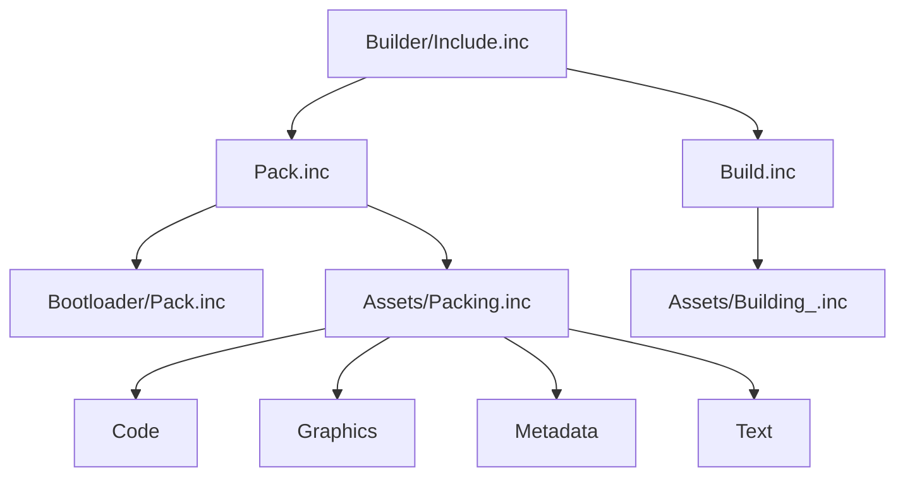

# 02. Сборка, Упаковка И Производство Артефактов

## Назначение Главы

Эта глава описывает производственный конвейер проекта.
Её задача — объяснить, как из исходников, графики, metadata и текстовых ресурсов получается итоговый образ проекта.

Главная мысль этой главы:
`Builder/` в этом проекте — не второстепенный набор скриптов, а полноценная подсистема, которая связывает код, ресурсы и layout памяти.

## Что Находится В `Builder/`

По структуре каталога видно несколько крупных зон:
- `Assets/`
- `Bootloader/`
- `Pass/`
- корневые файлы `Include.inc`, `Pack.inc`, `Build.inc`

Это уже показывает двухступенчатую модель производства:
- сначала идёт упаковка;
- затем сборка готового содержимого;
- всё это координируется через общий `Builder/Include.inc`.

## Главная Точка Входа Сборки

Ключевой файл слоя — `Builder/Include.inc`.
Именно он:
- задаёт настройки сборки;
- определяет версию;
- подключает глобальные include'ы проекта;
- запускает `Pack.inc`;
- затем запускает `Build.inc`.

Это важно, потому что файл выполняет одновременно две роли:
- конфигуратора процесса;
- диспетчера стадий pipeline.

## Настройки Сборки

В `Builder/Include.inc` присутствуют несколько уровней настроек.

### Настройки устройства и среды

Файл явно указывает:
- `DEVICE ZXSPECTRUM256`
- максимальное число страниц памяти;
- минимально допустимое число страниц памяти.

Это значит, что build-слой привязан не просто к абстрактному Z80-коду, а к конкретной модели памяти и устройству исполнения.

### Препроцессорные флаги

В файле определены флаги вида:
- `_DEBUG`
- `_REBUILD`
- `_OPTIMIZE`
- `ENABLE_MOUSE`
- `ENABLE_KEMSTON_JOYSTICK_SEGA`
- `SHOW_FPS`

Эти флаги показывают, что build-слой не только компилирует проект, но и формирует его режим работы.
То есть часть свойств конечной программы задаётся уже на уровне сборки.

### Версия И Образ Диска

Там же задаются:
- `MAJOR`
- `MINOR`
- `TRD_FILENAME`
- `TRD_DISK_1`

Это означает, что система сборки берёт на себя ответственность не только за код, но и за формальный identity результата.

## Карта Страниц Памяти

В `Builder/Include.inc` уже содержится комментарий с layout страниц памяти.
Даже если некоторые страницы пока используются не полностью, сам факт явного описания важен.

Из комментария видно, что проект мыслит память как карту назначений:
- отдельные страницы под карту;
- отдельная страница под ядро;
- отдельные страницы под данные экрана и TR-DOS переменные;
- отдельная теневая экранная страница.

Это говорит сразу о нескольких архитектурных свойствах.

### Свойство 1. Память рассматривается как ресурс верхнего уровня

Она не спрятана “где-то в коде”, а является объектом проектирования.

### Свойство 2. Runtime заранее строится вокруг page-based модели

Следовательно, модульность проекта неизбежно связана с перемещением, загрузкой и разворачиванием блоков кода и данных.

### Свойство 3. Build-слой обязан понимать layout памяти

Он не может быть слепым упаковщиком файлов.
Он должен знать, что и куда пойдёт.

## Стадия `Pack`

Файл `Builder/Pack.inc` описывает упаковочную фазу.

Ключевой смысл этой стадии:
- при `PASS = 2` создаётся пустой TRD-образ;
- затем вызываются упаковщики bootloader'а и assets;
- результатом становится подготовленный набор запакованных артефактов.

Иначе говоря, `Pack` отвечает на вопрос:
что должно оказаться в итоговом контейнере и в каком упакованном виде.

### Почему Это Отдельная Стадия

Разделение `Pack` и `Build` важно.
Оно означает, что проект различает:
- подготовку и упаковку ресурсов;
- построение финальной конфигурации кода.

Такая модель удобнее, чем смешивать всё в одном файле, потому что позволяет отдельно рассуждать о:
- составе assets;
- способе их компрессии;
- порядке записи в образ.

## Стадия `Build`

Файл `Builder/Build.inc` сейчас выглядит компактно, но его роль принципиальна:
- он объявляет, что идёт стадия `Building...`;
- подключает `Assets/Building_.inc`.

Это означает, что build-стадия устроена как композиция более узких файлов, а не как одна длинная линейная простыня.

## Внутренняя Структура `Assets/`

Каталог `Builder/Assets/` делится как минимум на четыре крупные зоны:
- `Code/`
- `Graphics/`
- `Metadata/`
- `Text/`

Это очень полезное архитектурное разделение.

### `Code/`

Этот раздел отвечает за кодовые assets.
Внутри есть как минимум:
- `Original/`
- `Compressed/`

А внутри `Original/` разложены:
- `Core/`
- `Kernel/`
- `MainMenu/`
- `Pages/`
- `Session/`
- `World/`

То есть код проекта явно пакуется по доменным блокам исполнения.

### `Graphics/`

Графический слой также разделён на `Original/` и `Compressed/`.
Внутри видно множество доменных групп:
- `Cursor/`
- `Environment/`
- `GraphPack/`
- `Hero/`
- `Hex/`
- `NPC/`
- `UI/`

Это означает, что визуальные ресурсы не лежат одной кучей, а уже организованы по смысловым пакетам мира.

### `Metadata/`

Здесь находятся описательные и вспомогательные данные проекта.
Особенно важно, что metadata тоже делится на `Original/` и `Compressed/`, а также включает карту и default-настройки.

Это хороший признак зрелости системы: проект различает визуальные ресурсы и описательные данные мира.

### `Text/`

Отдельный текстовый слой показывает, что текстовые данные также рассматриваются как полноценный ресурсный класс.

## Разделение На `Original` И `Compressed`

Практически во всех asset-группах прослеживается один и тот же паттерн:
- есть исходная форма ресурса;
- есть сжатая форма ресурса.

Архитектурный смысл этого разделения очень важен.

### Оно отделяет content от delivery-format

`Original` — это рабочая исходная форма.
`Compressed` — форма доставки и хранения.

### Оно упрощает rebuild

Можно менять исходные ресурсы без необходимости смешивать их с финальной упакованной формой.

### Оно помогает диагностике

Если есть проблема в сжатии или упаковке, можно сравнивать исходный и производный слой как разные сущности.

## Bootloader И Pass

### `Bootloader/`

Наличие отдельного `Bootloader/` означает, что проект различает:
- стартовый загрузчик;
- дальнейший build/runtime-код.

Это полезно архитектурно, потому что загрузчик живёт по своим ограничениям и не должен растворяться в общей логике `Source/`.

### `Pass/`

Папка `Pass/` с файлами вида `Include_0.inc`, `Include_1.inc`, `Include_2.inc` указывает на многошаговый процесс сборки.

Даже если весь механизм ещё не документирован полностью внутри исходников, уже ясно, что build-system использует несколько проходов для:
- подготовки данных;
- упаковки;
- финализации образа.

## Диаграмма Build Pipeline

## Как Build-Слой Связан С Архитектурой Проекта

Очень важно видеть, что `Builder` не существует отдельно от остальной архитектуры.
Он тесно связан с:
- `Includes/Pages/`;
- `Includes/Kernel/`;
- layout памяти;
- модульной загрузкой `Core`, `MainMenu`, `Session`, `World`.

То есть build-system здесь — это не просто упаковщик файлов, а часть архитектурной модели памяти и исполнения.

## Практические Выводы

### Вывод 1. Любое серьёзное изменение архитектуры должно учитывать `Builder`

Если меняется layout модулей или распределение по страницам, менять придётся не только `Source`, но и build-layer.

### Вывод 2. Assets — это не приложение к коду, а равноправный слой проекта

Код, графика, metadata и текст собраны в единую систему поставки.

### Вывод 3. Разделение `Pack` и `Build` — сильное место проекта

Оно помогает сохранить логическую чистоту между подготовкой содержимого и финальным построением результата.

## Переход К Следующей Главе

После понимания `Builder` следующая естественная ступень — `Includes`.
Если `Builder` отвечает за то, как проект производится и раскладывается по памяти, то `Includes` отвечает за то, какими понятиями проект вообще мыслит себя изнутри.
