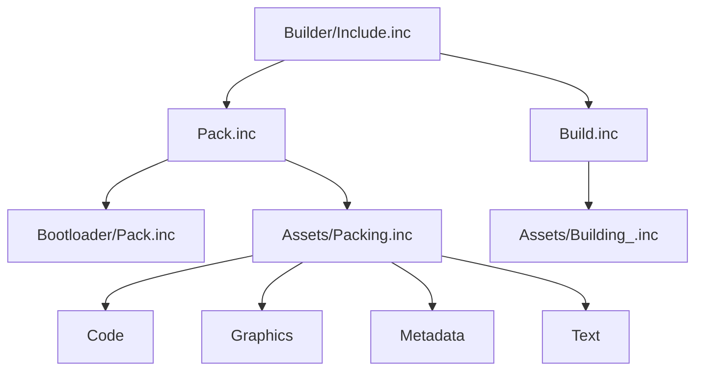

# 02. Сборка, упаковка и формирование образа диска

## Назначение главы

Эта глава описывает конвейер сборки проекта.
Её задача — объяснить, как из исходников, графики, метаданных и текстовых ресурсов получается итоговый образ проекта.

Главная мысль этой главы:
`Builder/` в этом проекте — не второстепенный набор скриптов, а полноценная подсистема, которая связывает код, ресурсы и layout памяти.

## Что находится в `Builder/`

По структуре каталога видно несколько крупных зон:
- `Assets/`
- `Bootloader/`
- `Pass/`
- корневые файлы `Include.inc`, `Pack.inc`, `Build.inc`

Это уже показывает двухступенчатую модель сборки:
- сначала идёт упаковка;
- затем сборка готового содержимого;
- всё это координируется через общий `Builder/Include.inc`.

## Главная точка входа сборки

Ключевой файл слоя — `Builder/Include.inc`.
Именно он:
- задаёт настройки сборки;
- определяет версию;
- подключает глобальные include'ы проекта;
- запускает `Pack.inc`;
- затем запускает `Build.inc`.

Это важно, потому что файл выполняет одновременно две роли:
- конфигуратора процесса;
- диспетчера стадий pipeline.

## Настройки сборки

В `Builder/Include.inc` присутствуют несколько уровней настроек.

### Настройки устройства и среды

Файл явно указывает:
- `DEVICE ZXSPECTRUM256`
- максимальное число страниц памяти;
- минимально допустимое число страниц памяти.

Это значит, что build-слой привязан не просто к абстрактному Z80-коду, а к конкретной модели памяти и устройству исполнения.

### Препроцессорные флаги

В файле определены флаги вида:
- `_DEBUG`
- `_REBUILD`
- `_OPTIMIZE`
- `ENABLE_MOUSE`
- `ENABLE_KEMSTON_JOYSTICK_SEGA`
- `SHOW_FPS`

Эти флаги показывают, что build-слой не только компилирует проект, но и формирует его режим работы.
То есть часть свойств конечной программы задаётся уже на уровне сборки.

### Версия и образ диска

Там же задаются:
- `MAJOR`
- `MINOR`
- `TRD_FILENAME`
- `TRD_DISK_1`

Это означает, что система сборки берёт на себя ответственность не только за код, но и за формальный identity результата.

## Карта страниц памяти

В `Builder/Include.inc` уже содержится комментарий с layout страниц памяти.
Даже если некоторые страницы пока используются не полностью, сам факт явного описания важен.

Из комментария видно, что проект мыслит память как карту назначений:
- отдельные страницы под карту;
- отдельная страница под ядро;
- отдельные страницы под данные экрана и TR-DOS переменные;
- отдельная теневая экранная страница.

Это говорит сразу о нескольких архитектурных свойствах.

### Свойство 1. Память рассматривается как ресурс верхнего уровня

Она не спрятана “где-то в коде”, а является объектом проектирования.

### Свойство 2. Runtime заранее строится вокруг page-based модели

Следовательно, модульность проекта неизбежно связана с перемещением, загрузкой и разворачиванием блоков кода и данных.

### Свойство 3. Build-слой обязан понимать layout памяти

Он не может быть слепым упаковщиком файлов.
Он должен знать, что и куда пойдёт.

## Стадия `Pack`

Файл `Builder/Pack.inc` описывает упаковочную фазу.

Ключевой смысл этой стадии:
- при `PASS = 2` создаётся пустой TRD-образ;
- затем вызываются упаковщики bootloader'а и assets;
- результатом становится подготовленный набор запакованных артефактов.

Иначе говоря, `Pack` отвечает на вопрос:
что должно оказаться в итоговом контейнере и в каком упакованном виде.

Важно, что создание пустого образа — это только самый первый шаг.
Дальше упаковочная стадия:
- подготавливает bootloader;
- формирует code-assets;
- формирует графические, текстовые и описательные ресурсы;
- готовит всё к последующей записи в TRD.

То есть `Pack` не просто открывает контейнер, а превращает исходные материалы проекта в runtime-friendly payload'ы.

### Почему это отдельная стадия

Разделение `Pack` и `Build` важно.
Оно означает, что проект различает:
- подготовку и упаковку ресурсов;
- построение финальной конфигурации кода.

Такая модель удобнее, чем смешивать всё в одном файле, потому что позволяет отдельно рассуждать о:
- составе assets;
- способе их компрессии;
- порядке записи в образ.

## Стадия `Build`

Файл `Builder/Build.inc` сейчас выглядит компактно, но его роль принципиальна:
- он объявляет, что идёт стадия `Building...`;
- подключает `Assets/Building_.inc`.

Это означает, что build-стадия устроена как композиция более узких файлов, а не как одна длинная линейная простыня.

## Внутренняя структура `Assets/`

Каталог `Builder/Assets/` делится как минимум на четыре крупные зоны:
- `Code/`
- `Graphics/`
- `Metadata/`
- `Text/`

Это очень полезное архитектурное разделение.

### `Code/`

Этот раздел отвечает за кодовые assets.
Внутри есть как минимум:
- `Original/`
- `Compressed/`

А внутри `Original/` разложены:
- `Core/`
- `Kernel/`
- `MainMenu/`
- `Pages/`
- `Session/`
- `World/`

То есть код проекта явно пакуется по доменным блокам исполнения.

### `Graphics/`

Графический слой также разделён на `Original/` и `Compressed/`.
Внутри видно множество доменных групп:
- `Cursor/`
- `Environment/`
- `GraphPack/`
- `Hero/`
- `Hex/`
- `NPC/`
- `UI/`

Это означает, что визуальные ресурсы не лежат одной кучей, а уже организованы по смысловым пакетам мира.

### `Metadata/`

Здесь находятся описательные и вспомогательные данные проекта.
Особенно важно, что метаданные тоже делятся на `Original/` и `Compressed/`, а также включает карту и default-настройки.

Это хороший признак зрелости системы: проект различает визуальные ресурсы и описательные данные мира.

### `Text/`

Отдельный текстовый слой показывает, что текстовые данные также рассматриваются как полноценный ресурсный класс.

## Разделение на `Original` и `Compressed`

Практически во всех asset-группах прослеживается один и тот же паттерн:
- есть исходная форма ресурса;
- есть сжатая форма ресурса.

Архитектурный смысл этого разделения очень важен.

### Оно отделяет content от delivery-format

`Original` — это рабочая исходная форма.
`Compressed` — форма доставки и хранения.

### Оно упрощает rebuild

Можно менять исходные ресурсы без необходимости смешивать их с финальной упакованной формой.

### Оно помогает диагностике

Если есть проблема в сжатии или упаковке, можно сравнивать исходный и производный слой как разные сущности.

## Bootloader и Pass

### `Bootloader/`

Наличие отдельного `Bootloader/` означает, что проект различает:
- стартовый загрузчик;
- дальнейший build/runtime-код.

Это полезно архитектурно, потому что загрузчик живёт по своим ограничениям и не должен растворяться в общей логике `Source/`.

### `Pass/`

Папка `Pass/` с файлами вида `Include_0.inc`, `Include_1.inc`, `Include_2.inc` указывает на многошаговый процесс сборки.

Это не абстрактная “многошаговость”, а точная схема из трёх внешних проходов:
- `PASS = 0`
- `PASS = 1`
- `PASS = 2`

Каждый проход подключает один и тот же `Builder/Include.inc`, но с разным значением `PASS`.

### Для чего нужен `PASS = 0`

Первый проход нужен для первичной сборки перемещаемых кодовых модулей.

На этом этапе `MainMenu`, `Session` и `World` собираются при:
- `ORG 0x0000`

После этого Builder сохраняет сырой бинарник вида:
- `*.pack.pass-1`

Это базовый образ кода, который позже будет использоваться как эталон при построении финального relocatable asset'а.

### Для чего нужен `PASS = 1`

Второй проход нужен для выявления адресозависимых мест в коде.

На этом этапе те же самые модули собираются уже при:
- `ORG 0x0100`

После этого сохраняется второй бинарник:
- `*.pack.pass-2`

Разница между `pass-1` и `pass-2` показывает, какие слова внутри кода меняются вместе с базовым адресом размещения.
Именно эти отличия потом превращаются в таблицу релокации.

### Для чего нужен `PASS = 2`

Третий проход — это финализация сборки.

Именно на нём:
- создаётся пустой TRD-образ;
- строится `Resource.#`;
- формируются `Data-0.#` и другие итоговые payload'ы;
- собираются окончательные code-assets;
- всё записывается в образ диска.

Для перемещаемых модулей именно `PASS = 2` делает финальный блок из трёх частей:
- `AdjustmentAdr`;
- таблица релокации;
- код из `pass-1`.

После этого блок сохраняется как `.pack` и затем сжимается в `.pack.ar`.

### Как формируется перемещаемый code-asset

Для code-assets в проекте есть два режима.

#### Код с фиксированным положением

Часть модулей Builder пакует как обычный бинарный payload:
- `Kernel`
- `Core`
- `Page0`
- `Page1`
- `Page3`

Такие блоки не нуждаются в двойной сборке с разными `ORG`.
Они сразу собираются, сохраняются и сжимаются.

#### Код, который можно разместить в разной точке памяти

`MainMenu`, `Session` и `World` формируются иначе.

Builder:
- собирает модуль дважды;
- сравнивает две версии через `LUA/MakeTransitionTable.lua`;
- получает список адресозависимых мест;
- добавляет в начало блока `AdjustmentAddress.asm`;
- дописывает таблицу смещений;
- присоединяет тело модуля из `pass-1`.

По смыслу это не “архив с кодом”, а self-adjusting code block.

### Что делает `MakeTransitionTable.lua`

Несмотря на историческое имя, этот файл строит не gameplay-таблицу переходов, а фактическую таблицу релокации.

Он:
- читает `pass-1` и `pass-2`;
- сравнивает их побайтно;
- находит отличающиеся позиции;
- записывает их как компактную последовательность `DW`-приращений.

Это важно, потому что runtime потом не анализирует код заново.
Он получает уже готовый список мест, которые нужно поправить после загрузки в реальную область ОЗУ.

### Как build-time и runtime делят ответственность

Builder выполняет дорогую часть работы заранее:
- делает два прохода сборки;
- находит адресозависимые слова;
- строит таблицу релокации;
- добавляет корректировщик адресов;
- сжимает финальный payload.

Runtime потом делает только дешёвую часть:
- загружает asset;
- при необходимости распаковывает его;
- запускает встроенный корректировщик;
- передаёт управление уже исправленному коду.

Это один из важнейших инженерных принципов проекта:
сложный анализ переносится в build-time, а рантайм получает дешёвую процедуру исполнения.
## Диаграмма Build Pipeline

## Как Build-слой связан с архитектурой проекта

Очень важно видеть, что `Builder` не существует отдельно от остальной архитектуры.
Он тесно связан с:
- `Includes/Pages/`;
- `Includes/Kernel/`;
- layout памяти;
- модульной загрузкой `Core`, `MainMenu`, `Session`, `World`.

То есть build-system здесь — это не просто упаковщик файлов, а часть архитектурной модели памяти и исполнения.

## Практические выводы

### Вывод 1. Любое серьёзное изменение архитектуры должно учитывать `Builder`

Если меняется layout модулей или распределение по страницам, менять придётся не только `Source`, но и build-layer.

### Вывод 2. Assets — это не приложение к коду, а равноправный слой проекта

Код, графика, метаданные и текст собраны в единую систему поставки.

### Вывод 3. Разделение `Pack` и `Build` — сильное место проекта

Оно помогает сохранить логическую чистоту между подготовкой содержимого и финальным построением результата.

## Переход к следующей главе

После понимания `Builder` следующая естественная ступень — `Includes`.
Если `Builder` отвечает за то, как проект производится и раскладывается по памяти, то `Includes` отвечает за то, какими понятиями проект вообще мыслит себя изнутри.

