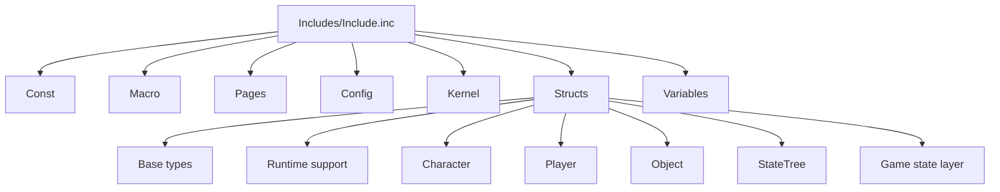

# 03. Includes и контрактный слой

## Назначение главы

Эта глава описывает `Includes/` как фундаментальную часть архитектуры.
Главная идея проста: в этом проекте include-файлы — это не просто служебные заголовки, а единый слой системных контрактов.

Именно `Includes/` определяет:
- какие структуры существуют в проекте;
- как устроены флаги и идентификаторы;
- как описаны страницы памяти;
- как код обращается к kernel-уровню;
- как размещены глобальные переменные;
- какими макросами вообще выражаются многие действия рантайма.

Без понимания этого слоя чтение `Source/` неизбежно будет поверхностным.

## Главная точка входа `Includes`

Центральный файл уровня — `Includes/Include.inc`.
Он агрегирует основные подслои в таком порядке:
- `Const/Include.inc`
- `Macro/Include.inc`
- `Pages/Include.inc`
- `Config/Include.inc`
- `Kernel/Include.inc`
- `Structs/Include.inc`
- `Variables/Include.inc`

Этот порядок не случаен.
Он отражает естественную иерархию зависимостей.

## Почему порядок имеет значение

### Сначала константы

Потому что идентификаторы, биты, enum-подобные значения и числовые соглашения нужны почти всему остальному проекту.

### Затем макросы

Потому что значительная часть ассемблерной логики в проекте выражается именно через макросы.
Чтобы код инициализации, загрузки и переключения экранов был читаемым, макросы должны быть доступны рано.

### Затем страницы и конфигурация

Потому что layout памяти и конфигурационные соглашения определяют условия, в которых будет существовать всё остальное.

### Затем kernel-binding'и

Потому что после знания памяти и конфигурации можно описывать интерфейс взаимодействия с низким уровнем.

### Затем структуры

Потому что после определения среды можно описать сами данные, которыми пользуется игра.

### Затем переменные

Потому что глобальные runtime-переменные обычно опираются и на layout памяти, и на уже описанные структуры.

## Основные подслои `Includes`

### `Const/`

Это слой фактов о мире системы.
Здесь живут:
- идентификаторы assets;
- константы событий;
- константы игры;
- константы ввода;
- константы карты;
- константы памяти;
- константы объектов;
- константы игрока.

По смыслу этот слой отвечает на вопрос: какими именованными числовыми значениями пользуется проект.

### `Macro/`

Это слой выразительных инструментов ассемблера.
Он превращает низкоуровневые последовательности в более читаемые операции, например:
- загрузку assets;
- копирование памяти;
- работу с флагами;
- установку render/main loop handlers;
- page-related операции.

Если `Const/` задаёт словарь значений, то `Macro/` задаёт словарь действий.

На обзорном уровне этого достаточно, но для данного проекта есть важная оговорка:
`Macro/` не ограничивается helper-макросами.
Через него проект:
- связывает код с layout `GameState`;
- патчит адреса loop/render/interrupt handlers;
- переключает режимы swap;
- открывает и закрывает отдельные ветви поведения через self-modifying code.

Подробно этот слой разобран в [17_Macro_System_and_Flag_Orchestration.md](17_Macro_System_and_Flag_Orchestration.md).

### `Pages/`

Этот слой описывает страницы памяти и page-specific exports.
Он критически важен для понимания того, как модульный код оказывается в runtime.

### `Config/`

Конфигурационный слой, который задаёт compile-time и system-wide соглашения.

### `Kernel/`

Это интерфейс проекта к более низкому уровню исполнения.
Наличие отдельного каталога `Kernel/` делает архитектуру чище:
вместо того чтобы прятать low-level адреса и вызовы по всему проекту, они собраны в одном месте.

### `Structs/`

Один из центральных подслоёв системы.
Именно он описывает модель данных проекта.

### `Variables/`

Этот слой задаёт глобальные runtime-переменные и layout доступа к состоянию игры.

## `Structs/Include.inc` как вторая точка сборки

После `Includes/Include.inc` вторым по важности агрегатором является `Includes/Structs/Include.inc`.
Он собирает базовые типы и предметные структуры.

Последовательность его подключений очень показательна.

### Базовые универсальные типы

Сначала подключаются базовые структуры и utility-типы:
- `Value.inc`
- `Disk.inc`
- `Vector8.inc`
- `Vector16.inc`
- `Address.inc`
- `Assets.inc`
- `Cursor.inc`
- `Function.inc`

Это значит, что проект сначала определяет низкоуровневые строительные блоки,
а уже потом переходит к предметным сущностям.

### Поддерживающие runtime-типы

Затем идут структуры вроде:
- `Path.inc`
- `Tick.inc`
- `Size.inc`
- `Keys.inc`
- `Item_ID.inc`
- `WorldInfo.inc`
- `SpriteBound.inc`
- `SpriteClipping.inc`
- `SpriteNotClipping.inc`
- `UI.inc`
- `Map/Include.inc`
- `SaveSlot.inc`

Это очень важный промежуточный слой.
Он уже не совсем “базовый тип”, но ещё и не высокоуровневая игровая сущность.
Это словарь runtime-инфраструктуры.

### Предметные семейства

После этого подключаются предметные блоки:
- `Character/Include.inc`
- `Event/Include.inc`
- `Player/Include.inc`
- `Object/Include.inc`
- `StateTree/Include.inc`

То есть только после определения базового математического, адресного и служебного лексикона проект переходит к игровым сущностям.

### Высший слой состояния игры

В конце подключаются:
- `Game_State.inc`
- `Game_Config.inc`
- `Hard_Config.inc`
- `Game_Session.inc`

Это означает, что агрегирующий include движется от простого к сложному:
от атомарных типов — к runtime-инфраструктуре — к предметным сущностям — к целостным структурам состояния игры.

## Семейства структур

### `Structs/Character/`

Семейство персонажа включает:
- экипировку;
- боевые состояния;
- первичные навыки;
- вторичные навыки;
- саму структуру `FCharacter`.

Это показывает, что персонаж в проекте мыслится как составной объект из нескольких тематических подструктур.

### `Structs/Player/`

Включает:
- `Actions.inc`
- `Participant.inc`

То есть уровень игрока и участника сейчас сознательно держится компактным.
Он сосредоточен вокруг двух идей:
- кто владеет сущностями;
- какие команды формирует человек.

### `Structs/Object/`

Семейство объектов включает:
- базовый объект;
- UI-объекты;
- объект-персонаж;
- AI-расширение объекта-персонажа;
- construction/object defaults.

Из этого уже видно, что объектный слой играет роль моста между миром, визуализацией и игровыми сущностями.

### `Structs/StateTree/`

Это текущий основной contract-слой для AI и дерева состояний.
Здесь находятся:
- `Context.inc`
- `Task.inc`
- `Transition.inc`
- `Descriptor.inc`
- `Blackboard.inc`
- `AIContext.inc`

Структуры в этой папке определяют язык AI-уровня.

## Диаграмма Include-иерархии

## Зачем вообще нужен такой слой

В маленьких проектах include-файлы часто становятся хаотичным сборником повторно используемых кусков.
Здесь же они играют намного более дисциплинированную роль.

### Роль 1. Централизация терминов

Все ключевые понятия системы имеют устойчивые определения.
Например:
- что такое объект;
- что такое персонаж;
- что такое участник;
- что такое AI-контекст;
- что такое структура страницы или адреса.

### Роль 2. Централизация layout-памяти

Для систем программирования под жёсткие ограничения памяти это критически важно.
Нельзя позволить себе, чтобы размер и layout структур были “размазаны” по реализации.

### Роль 3. Повышение читаемости `Source`

Код в `Source/` становится читаемее, когда имена полей, флагов и структур уже определены отдельно.

### Роль 4. Снижение стоимости изменений

Если приходится менять layout или вводить новую сущность, это можно делать осмысленно на уровне контрактов, а не править десятки реализаций вслепую.

## Особенность проекта: Includes как архитектурная память

У этого проекта `Includes/` — не просто техническая библиотека.
Это слой, который хранит архитектурную память системы.

По этим файлам можно понять:
- какими сущностями оперирует игра;
- как система мыслит память;
- как она моделирует данные;
- какие связи считаются фундаментальными.

Поэтому при чтении проекта правильная стратегия такая:
сначала понять `Includes`, и только потом идти в глубину `Source`.

## Переход к следующей главе

После `Includes` становится возможным осмысленно читать исполняемый код.
Именно этому посвящена следующая глава: как из контрактов рождается реальный runtime, какие модули существуют в `Source/` и как они запускаются.

Если же задача связана именно с макросами, флагами и подменой поведения, после этой обзорной главы лучше сразу перейти к [17_Macro_System_and_Flag_Orchestration.md](17_Macro_System_and_Flag_Orchestration.md).

