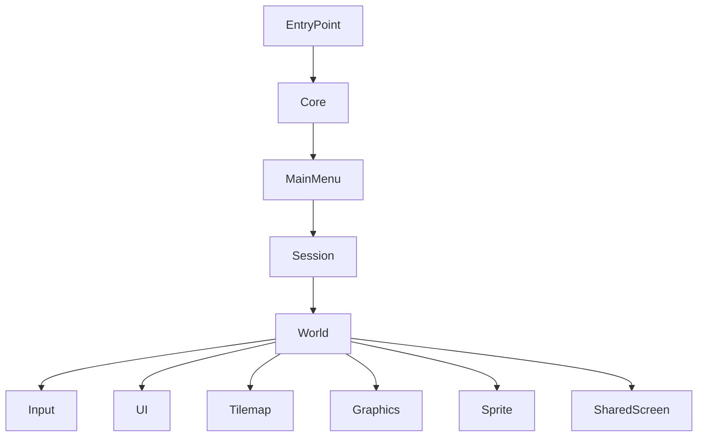

# 04. Source, Runtime И Модули

## Назначение Главы

Эта глава посвящена исполняемому коду проекта.
Если предыдущие главы отвечали на вопросы «где что лежит» и «какими терминами пользуется система», то теперь речь идёт о том, как проект реально работает во времени.

`Source/` — это слой поведения.
Именно здесь проект:
- запускается;
- переключает состояния;
- разворачивает модули в память;
- принимает ввод;
- обновляет мир;
- отрисовывает экран;
- готовит карту и игровые объекты;
- выполняет AI-логику.

## Верхний Уровень `Source/`

Внутри `Source/` есть большой набор каталогов. Среди них особенно заметны:
- `AssetsManager`
- `Buffers`
- `Character`
- `ChunkArray`
- `Cursor`
- `Decompressor`
- `Draw`
- `EntryPoint`
- `Event`
- `Functions`
- `Input`
- `Interrupt`
- `MainMenu`
- `Math`
- `Memory`
- `Minimap`
- `Modules`
- `Object`
- `Participant`
- `Sprite`
- `StateTree`
- `TableGeneration`
- `Tick`
- `TR-DOS`
- `UI`
- `Utilities`
- `World`

Уже по этому списку видно, что `Source/` состоит из трёх больших семейств:
- модульное ядро запуска;
- предметные игровые подсистемы;
- низкоуровневые сервисы.

## EntryPoint

### Состав

`Source/EntryPoint/` содержит:
- `EntryPoint.asm`
- `Loop.asm`
- `Swap.asm`
- `Include.inc`

### Смысл

Это стартовая область проекта.
`Include.inc` собирает entry-point модуль и размещает его в зарезервированной области памяти.

### Что Делает `EntryPoint.asm`

В самой точке входа видно очень важную минималистичную последовательность:
- включаются прерывания;
- выполняется `HALT`;
- затем вызывается запуск `Core`;
- затем вызывается запуск `MainMenu`.

То есть начальный сценарий жизни проекта таков:
1. стартовая точка
2. инициализация ядра
3. переход в главное меню

Это уже задаёт главную ось рантайма.

## `Modules/` Как Диспетчер Исполняемых Состояний

`Source/Modules/Include.inc` подключает модули:
- `Core/Execute.asm`
- `World/Execute.asm`
- `Session/Execute.asm`
- `MainMenu/Execute.asm`

Важно понять архитектурный смысл этого каталога.

### Он не содержит всю бизнес-логику модулей

Он содержит именно слой запуска модулей как assets.
Это своего рода диспетчер перехода между крупными состояниями приложения.

### Он задаёт язык переходов между состояниями

Когда код вызывает `ExecuteModule.Core` или `ExecuteModule.World`, это не просто переход к подпрограмме.
Это вызов механизма загрузки/разворачивания соответствующего asset-модуля.

## Модуль `Core`

### Роль

`Core` — это первичная инициализация базовых систем.

### Состав

`Source/Modules/Core/Include.inc` подключает:
- `Kernal.asm`
- `Initialize_Core.asm`
- `Initialize_Input.asm`
- `VersionText.asm`

### Execute-фаза

`Core/Execute.asm` делает следующее:
- включает страницу assets;
- настраивает загрузку `ASSETS_ID_CORE`;
- передаёт управление на `Core.Kernel.Init` через asset-запуск.

Это означает, что ядро проекта рассматривается как специальный кодовый asset, который надо загрузить и выполнить.

### Архитектурный смысл

`Core` — это не просто “общие функции”, а модуль инициализации среды исполнения.
Он готовит фундамент, на котором потом живут меню и мир.

## Модуль `MainMenu`

### Execute-фаза

`MainMenu/Execute.asm`:
- включает страницу assets;
- загружает asset главного меню;
- запускает его.

### Launch-фаза

`MainMenu/Launch.asm` выполняет более содержательную работу:
- сохраняет страницу загруженного asset'а;
- копирует блок deploy-кода в общую рабочую область;
- выставляет main loop;
- выставляет флаги `ML_TRANSITION | ML_ENTER | ML_UPDATE`;
- задаёт главный render;
- устанавливает interrupt handler;
- разрешает сканирование ввода;
- разрешает смену экранов;
- разрешает отображение FPS;
- устанавливает позицию мыши.

### Что Это Значит

Главное меню в проекте — это полноценное runtime-состояние, а не статическая сцена.
Оно имеет собственные:
- loop;
- render;
- interrupt handler;
- код deploy-разворачивания.

То есть архитектурно `MainMenu` устроено тем же языком, что и `World`, только с другой функциональной задачей.

## Модуль `Session`

### Execute-фаза

`Session/Execute.asm` отличается от `MainMenu` и `World` тем, что принимает идентификатор запускаемой функции в регистре `A`.
Это означает, что session-модуль задуман как многофункциональный runtime-asset.

### Launch-фаза

`Session/Launch.asm`:
- сохраняет страницу asset'а;
- извлекает фактический адрес запускаемой функции из `GameState.Assets`;
- передаёт управление по этому адресу.

### Session как Shared Code Block

`Source/Modules/Session/Session.inc` показывает, что для `Session` существует shared code block, включающий:
- `Map/Include.inc`
- `Core/Include.inc`
- `SaveSlot/Include.inc`

Это очень важный архитектурный признак.
`Session` — не просто экран или одно состояние, а слой подготовки игрового мира, загрузки карты, сохранений и служебных операций.

## Модуль `World`

### Почему Это Центральный Модуль

`World` — один из самых насыщенных модулей проекта.
Здесь сходятся:
- графика;
- tilemap;
- UI мира;
- sprite-слой;
- ввод;
- генерация таблиц;
- shared screen;
- рендер;
- работа с объектами.

### Состав Include-цепочки

`Source/Modules/World/Include.inc` подключает:
- `Kernel_Bind.inc`
- `Launch.asm`
- `UI/Include.inc`
- `Input/Include.inc`
- `Tilemap/Include.inc`
- `Graphics/Include.inc`
- генераторы таблиц из `Source/TableGeneration`
- геометрические и hex-утилиты из `Source/Utilities/Hexagon`
- блоки deploy-кода для `Sprite`, `World`, `SharedScreen`

### Что Это Показывает

`World` — не монолитный файл, а композиция нескольких слоёв:
- интерфейсный;
- входной;
- tilemap-слой;
- графический;
- математико-табличный;
- deploy-слой.

### Launch-фаза `World`

`Source/Modules/World/Launch.asm` делает особенно важную работу:
- сохраняет страницу asset'а мира;
- скрывает основной экран атрибутами;
- копирует deploy-код мира и shared-screen кода;
- генерирует и копирует таблицы;
- загружает и инициализирует sprite-слой персонажа и курсора;
- отображает игровое окно;
- устанавливает main loop мира;
- устанавливает render pipeline мира;
- устанавливает interrupt handler;
- разрешает ввод;
- настраивает shadow/render flags;
- инициализирует стартовую позицию мыши.

### Архитектурный Вывод

`World` — это не просто модуль с игровым циклом.
Это runtime-площадка, которая во время запуска сама достраивает часть своей среды исполнения:
- deploy-блоки;
- таблицы;
- shared screen;
- sprites;
- handlers.

Это один из наиболее интересных моментов архитектуры проекта.

## Предметные Подсистемы `Source/`

Кроме модулей запуска, в `Source/` есть предметные подсистемы.

### `Character/`

Содержит логику персонажей, пути, утилиты адресации и движения.
Этот каталог логично связан с `FCharacter` и `FObjectCharacter`, но не тождественен им.
Он описывает поведение персонажей, а не только их данные.

### `Object/`

Содержит:
- классификацию объектов;
- сортировку объектов;
- object utilities.

Это operational-слой для world entities.

### `Participant/`

Содержит поведение, связанное с участниками игры.
На уровне архитектуры это мост между моделью владения и логикой gameplay-сценариев.

### `StateTree/`

Специализированный AI-каталог.
Даже если часть runtime-логики ещё находится в стадии развития, наличие отдельного каталога подчёркивает, что AI рассматривается как самостоятельная подсистема.

### `Buffers/`

Буферный слой.
Это важная часть проекта, потому что при page-based и low-level runtime-архитектуре буферы часто становятся опорным механизмом обмена и staging-логики.

## Платформенные И Сервисные Подсистемы

### `Input/`

Содержит подкаталоги:
- `Keyboard`
- `Mouse`
- `Kempston`

Это говорит о сознательном разделении источников ввода.

### `Draw/` и `Sprite/`

Здесь расположен слой непосредственной отрисовки.
Заметь, что проект различает:
- мир как предметную сцену;
- draw-layer как технику вывода.

### `Math/`, `Memory/`, `Utilities/`

Это поддерживающий базис рантайма.
Именно он даёт проекту общие операции, без которых невозможно реализовать более высокие модули.

### `TableGeneration/`

Отдельный интересный слой.
Судя по world-launch коду, проект генерирует специальные таблицы на старте модуля мира.
Это оптимизационная техника, характерная для systems-программирования под ограниченную платформу.

## Диаграмма Runtime-Модулей

## Главный Архитектурный Паттерн `Source/`

Если описать `Source/` одной фразой, то это модульный runtime, в котором крупные состояния игры представлены как загружаемые и разворачиваемые code-assets.

Это очень важная мысль.
Здесь нет модели “всё навсегда лежит в памяти и просто вызывается по адресу”.
Вместо этого архитектура строится вокруг:
- загрузки модуля;
- deploy-копирования;
- установки loop/render/interrupt handlers;
- работы с ограниченным layout памяти.

## Практический Итог Главы

После разбора `Source/` проект стоит читать так:
- `EntryPoint` запускает первичную ось жизни программы;
- `Modules` диспетчеризует крупные runtime-состояния;
- `Core` готовит среду исполнения;
- `MainMenu` задаёт состояние интерфейсного ожидания;
- `Session` подготавливает или загружает игровые данные;
- `World` поднимает игровой runtime мира;
- остальные каталоги обслуживают предметную и платформенную механику этого runtime.

Следующий шаг — посмотреть, какими сущностями и связями всё это наполняется на уровне данных.
