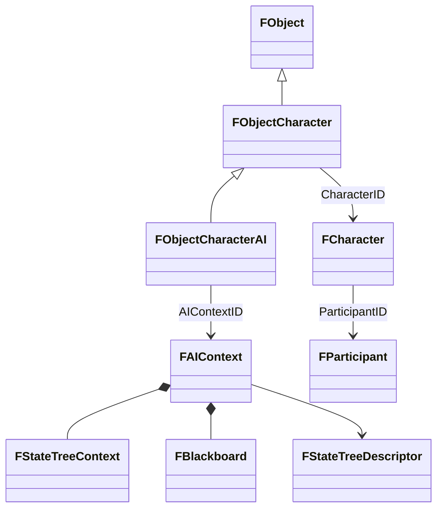

# 05. Модель данных

## Назначение главы

Эта глава описывает ключевые структуры данных проекта и связи между ними.
Она отвечает на вопрос: какими сущностями проект описывает игрока, персонажа, объект на карте, команды человека и AI-расширение.

Важно понимать, что здесь речь идёт не обо всём `Includes/Structs`, а о центральной оси игровых данных:
- участник игры;
- персонаж;
- объект в мире;
- объект-персонаж;
- AI-объект-персонаж;
- команды человека.

## Базовая идея модели

В текущем виде проект разводит несколько уровней представления:
- участник игры как владелец и режим человек/компьютер;
- персонаж как постоянный набор игровых данных;
- объект как видимая сущность мира;
- объект-персонаж как активный world-носитель персонажа;
- AI-расширение как дополнительный runtime-слой только для тех персонажей, которые действительно управляются AI.

Это очень важная архитектурная развязка.
Она не даёт смешать в одной структуре сразу все роли.

## Главный граф связей

Этот граф полезен тем, что он показывает не поля, а архитектурные отношения.

## `FParticipant`

### Что это такое

`FParticipant` — это участник игры как сторона владения.
Он хранит не конкретное перемещение по карте и не отрисовку, а принадлежность, стартовые параметры и связанный набор персонажей.

### Что в нём особенно важно

Ключевое поле — это `Faction`, внутри которого лежат флаги принадлежности.
Особенно важен бит `CH`:
- `0` — человек;
- `1` — компьютер.

Это означает, что именно участник игры, а не объект мира напрямую, определяет режим управления.

### Почему это хорошо

Такой подход отделяет:
- “кому принадлежит сущность”;
- “как она управляется”.

То есть логика контроля привязана к стороне, а не к случайному bit-field внутри world-object.

### Ограничения и особенности

Сейчас `FParticipant` также хранит массив персонажей участника.
Это полезно, но требует аккуратности: при перемещении структур персонажей по массивам необходимо поддерживать целостность ссылок.

## `FCharacterSettings` и `FCharacter`

Проект различает:
- настройки персонажа как стартовый шаблон;
- сам runtime-экземпляр персонажа.

Это видно по наличию `FCharacterSettings` и `FCharacter`.

### `FCharacterSettings`

Это конфигурационный уровень персонажа.
Он используется при инициализации и отражает стартовые параметры.

### `FCharacter`

Это уже полноценная игровая сущность данных, которая хранит:
- `Class`;
- `ParticipantID`;
- `Skils`;
- `CombatStates`;
- `Equipment`;
- `ObjectID`.

### Что это значит архитектурно

`FCharacter` — это не visual object и не UI-элемент.
Это persistent gameplay entity.
Он хранит то, что делает персонажа персонажем в игровых правилах.

### Зачем нужен `ObjectID`

Поле `ObjectID` связывает данные персонажа с world-object.
То есть `FCharacter` знает, какой объект на карте сейчас его представляет.

Это создаёт двустороннюю связь:
- `FObjectCharacter` знает свой `CharacterID`;
- `FCharacter` знает свой `ObjectID`.

Это удобно, но требует дисциплины при перемещении объектов и персонажей внутри массивов.

## `FObject`

### Роль структуры

`FObject` — базовый тип видимой сущности мира.
Он хранит то, что делает объект объектом сцены:
- класс;
- флаги;
- позицию;
- чанк;
- спрайт;
- границы;
- настройки.

### Почему это отдельный слой

Это важно, потому что объект мира и персонаж — не одно и то же.
Персонаж можно понимать как игровую сущность с инвентарём, навыками и владельцем.
Объект мира — это то, что реально живёт на карте, рисуется и обновляется.

Такое разделение позволяет:
- не раздувать gameplay-профиль визуальными полями;
- не смешивать правила и рендер;
- использовать общую объектную основу для разных классов сущностей.

### Поле `Class`

Поле класса несёт сразу два смысла:
- нижние биты задают класс объекта;
- старшие биты кодируют принадлежность к фракции.

Это типичный для low-level проекта подход к плотной упаковке данных.

### Флаги и позиция

Наличие флагов `DF` и `TF` показывает, что `FObject` участвует не только в хранении состояния, но и в runtime-механике обновления.

## `FObjectCharacter`

### Что добавляет эта структура

`FObjectCharacter` расширяет `FObject` и вводит слой активной world-сущности персонажа.
Он добавляет:
- `CharacterID`;
- `PathID`;
- `WayPointID`;
- `Delta`;
- `Direction`.

### Архитектурный смысл

Это слой, где встречаются:
- базовый объект мира;
- связь с gameplay-персонажем;
- состояние движения.

То есть `FObjectCharacter` — это воплощённый на карте персонаж.

### Почему здесь именно движение

Поля движения логично живут на уровне object-on-map, а не внутри `FCharacter`.
`FCharacter` хранит, кто это такое по правилам игры.
`FObjectCharacter` хранит, как он существует в пространстве мира прямо сейчас.

Это очень удачное разграничение.

## `FObjectCharacterAI`

### Что это такое

`FObjectCharacterAI` — расширение `FObjectCharacter` для персонажей, которыми управляет AI.
Сейчас оно добавляет ровно одно поле:
- `AIContextID`.

### Почему это хорошо

Такой подход означает, что AI не навязан всем объектам и всем персонажам.
Он подключается только там, где действительно нужен.

Это экономит:
- память;
- архитектурную чистоту;
- когнитивную нагрузку при чтении базовых структур.

### Почему один `AIContextID` лучше, чем два отдельных ID

Вместо хранения отдельных ссылок на:
- blackboard;
- state tree context;
- descriptor;

объект хранит один идентификатор контекста AI.
Это позволяет сгруппировать AI-состояние как единое runtime-целое.

### Важное ограничение

Такой объект должен обрабатываться кодом как полный размер `FObjectCharacterAI`, а не как базовый `FObjectCharacter`.
Иначе дополнительный байт ссылки на AI будет потерян при копировании или перемещении.

## `FPlayerActions`

### Зачем нужна эта структура

Она задаёт слой команд человека.
Сейчас структура очень компактна и хранит:
- `SelectedHeroID`;
- `Action`.

### Что она представляет архитектурно

Это не описание персонажа и не объект мира.
Это канал намерения игрока.

То есть проект разводит:
- данные сущности;
- команды человека;
- runtime AI.

Такое разделение принципиально правильно.

## Источник управления: Human Vs AI

Одно из самых важных следствий модели данных — способ определения управления.

У проекта нет отдельного `Controller` в стиле игровых движков высокого уровня.
Вместо этого режим управления выводится через цепочку:
- `FObjectCharacter -> FCharacter -> FParticipant`.

Если `FParticipant.Faction.Flags.CH = 0`, путь идёт через `FPlayerActions`.
Если `CH = 1`, подключается `FObjectCharacterAI` и `FAIContext`.

## Что такое `FAIContext` в модели данных

На уровне этой главы важно понять следующее:
`FAIContext` — это не ещё один персонаж и не ещё один объект мира.
Это runtime-расширение поведения.

Он хранит:
- ссылку на описание поведения;
- runtime-состояние дерева;
- рабочие данные AI.

То есть по смыслу это “мозг”, а не “тело” и не “персонаж”.

## Источник истины и производные данные

Для этой модели полезно зафиксировать правило.

### Источники истины

Ими являются:
- `FParticipant` для владения и режима стороны;
- `FCharacter` для persistent gameplay-состояния персонажа;
- `FObject`/`FObjectCharacter` для world-присутствия сущности.

### Производные и рабочие данные

К ним относятся:
- `FPlayerActions`;
- `FAIContext`;
- `FStateTreeContext`;
- `FBlackboard`.

Это очень важное разграничение.
Оно предотвращает архитектурную ошибку, когда runtime-решения начинают дублировать канонические данные мира.

## Модель ID-связей

В проекте активно используются идентификаторы вместо тяжёлых прямых ссылок.
Это видно по полям:
- `ParticipantID`
- `ObjectID`
- `CharacterID`
- `AIContextID`

Такой стиль подходит платформе и архитектуре проекта по нескольким причинам:
- он компактен;
- он предсказуем по layout'у;
- он хорошо сочетается с массивами структур;
- он даёт контроль над памятью.

Но у него есть цена:
необходимо очень внимательно поддерживать целостность ID при перемещении объектов и персонажей.

## Практический итог главы

Текущую модель данных можно сформулировать так:
- участник игры владеет персонажами и задаёт режим человек/AI;
- персонаж хранит постоянные игровые данные;
- объект представляет сущность в мире;
- объект-персонаж связывает мир и persistent-персонажа;
- AI-объект добавляет только ссылку на AI-контекст;
- команды человека и runtime AI разведены в отдельные структуры, а не смешаны с каноническими данными.

Следующая глава покажет, как эти сущности начинают жить во времени в рамках запуска, main loop и переключения состояний.
