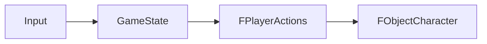
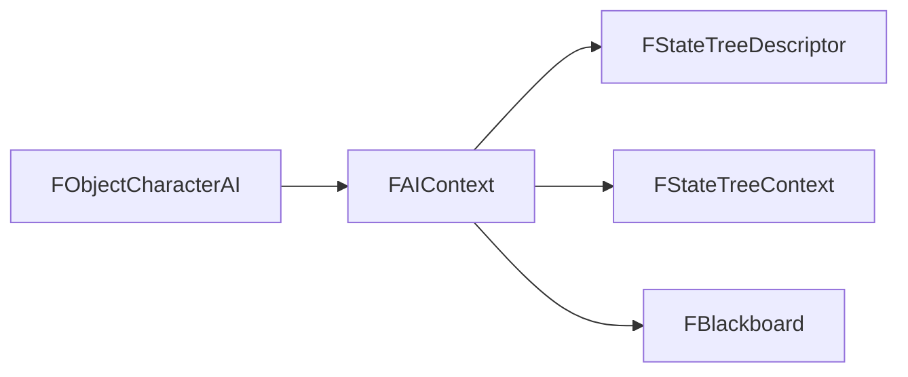

# 06. Поток Рантайма И Управление

## Назначение Главы

Если предыдущая глава описывала сущности, то эта объясняет процесс.
Она отвечает на вопрос: что происходит с проектом во времени — от старта программы до работы мира, обработки ввода, выбора действий человеком и тиков AI.

Главная идея здесь такая:
архитектура проекта живёт как система переключаемых runtime-состояний, где модули загружаются как assets, разворачиваются в рабочую память и выставляют свои loop/render/interrupt handlers.

## Самая Короткая Версия Runtime-Потока

На верхнем уровне проект можно читать так:

```text
EntryPoint -> Core -> MainMenu -> Session -> World
```

Это не просто последовательность каталогов.
Это ось жизненного цикла приложения.

## Старт Программы

### EntryPoint

`EntryPoint` делает минимум, но этот минимум принципиален:
- включает прерывания;
- выполняет `HALT`;
- запускает `Core`;
- запускает `MainMenu`.

На этом уровне нет сложной предметной логики.
Есть только строгое переключение в более высокоуровневые модули.

### Почему Это Хорошо

Это удерживает точку входа маленькой и предсказуемой.
В хорошо устроенной low-level системе точка входа не должна превращаться в мешанину инициализации всех подсистем сразу.

## Фаза `Core`

`Core` поднимает фундамент среды исполнения.
Это включает:
- ядро;
- начальную инициализацию;
- ввод;
- служебные тексты версии.

Архитектурно `Core` решает задачу подготовки почвы.
Он не является самим gameplay-миром, но без него никакой следующий шаг не имеет устойчивой опоры.

## Фаза `MainMenu`

После `Core` приложение переходит в `MainMenu`.

### Что Там Важно

На фазе запуска меню происходит не просто вызов функции рисования.
Модуль меню:
- загружается как asset;
- разворачивается в рабочую область;
- выставляет свой main loop;
- выставляет свой render;
- выставляет свой interrupt handler;
- разрешает ввод и смену экранов.

Это означает, что меню в проекте мыслится как полноценное runtime-состояние, а не как пассивный экран.

## Фаза `Session`

`Session` стоит между меню и миром.
Её роль — подготовить игровую сессию.

Судя по структуре файлов, сюда входят:
- работа с map data;
- инициализация карты;
- загрузка metadata;
- работа с сохранениями;
- служебные операции ядра и TR-DOS.

То есть `Session` — это зона перехода от “общего интерфейсного состояния” к “конкретной игровой ситуации”.

## Фаза `World`

`World` — центральное runtime-состояние игровой части.

### Что Делает Запуск `World`

При старте мира проект:
- сохраняет страницу загруженного asset'а мира;
- копирует deploy-код мира;
- копирует shared-screen код на нужную страницу;
- генерирует специализированные таблицы;
- инициализирует sprite-слой персонажа и курсора;
- рисует игровое окно;
- выставляет main loop мира;
- выставляет render pipeline;
- назначает interrupt handler;
- разрешает ввод;
- настраивает shadow/fps/render flags;
- задаёт стартовую позицию мыши.

### Почему Это Архитектурно Важно

Здесь очень хорошо видно, что мир не “лежит готовым”, а собирает часть своей среды исполнения при старте.
Это серьёзный systems-level паттерн, а не просто вызов нескольких процедур инициализации.

## Main Loop, Render И Interrupt Как Скелет Runtime

По launch-файлам хорошо видно повторяющийся паттерн.
Крупное состояние рантайма обычно задаёт:
- главный loop;
- render-функцию;
- interrupt handler;
- флаги жизненного цикла.

Это означает, что проект реализует не просто последовательность функций, а настраиваемый runtime-контур.

### Главный Loop

Определяет, какая логика считается центральной для текущего состояния приложения.

### Render

Определяет, кто отвечает за визуальный вывод в текущем состоянии.

### Interrupt Handler

Определяет, какой код обслуживает прерывания в данном состоянии.

### Флаги Main Loop

Позволяют маркировать фазу жизни состояния:
- переход;
- вход;
- обновление.

## Путь Управления Человека

В проекте отсутствует отдельный объект-контроллер в привычном виде.
Поэтому путь управления человеком выражен через данные и input-подсистему.

Его можно описать так:



### Что Это Значит

Человек не управляет персонажем через специальный контроллер-класс.
Он формирует команду через:
- текущее состояние ввода;
- глобальное состояние игры;
- структуру `FPlayerActions`.

А уже затем эта команда применяется к выбранной сущности мира.

### Почему Это Логично Для Проекта

Такой подход хорошо соответствует low-level архитектуре:
- он компактен;
- он не требует дополнительного runtime-объекта-контроллера;
- он хорошо сочетается с моделью `SelectedHeroID + Action`.

## Путь Управления AI

Путь AI строится совсем иначе.



### Что Здесь Главное

AI получает поведение не через `PlayerActions`, а через связку:
- объект на карте;
- AIContext;
- descriptor поведения;
- runtime-состояние дерева;
- blackboard.

То есть AI-путь построен как самостоятельный runtime-механизм принятия решений.

## Как Выбирается Human Или AI Path

Решение принимается не внутри `FObjectCharacter` напрямую.
Оно выводится через цепочку:
- `FObjectCharacter -> FCharacter -> FParticipant`.

Именно `FParticipant.Faction.Flags.CH` определяет, какой путь управления активен:
- human path;
- AI path.

Это очень сильное архитектурное решение, потому что оно не привязывает режим управления к визуальной сущности мира напрямую.

## Runtime И Данные: Кто За Что Отвечает

Эту часть важно зафиксировать очень чётко.

### `FCharacter`

Хранит канонические persistent-данные персонажа.

### `FObjectCharacter`

Хранит world-runtime данные положения и движения.

### `FPlayerActions`

Хранит краткое намерение человека.

### `FAIContext`

Хранит runtime-состояние мышления AI.

Если эти уровни смешать, архитектура станет рыхлой.
Сейчас проект идёт в правильном направлении: данные мира и поведение runtime разведены.

## Как Это Связано С Модульной Загрузкой

Очень важно заметить, что human/AI path существуют внутри более крупной системы модульных runtime-состояний.

Это означает:
- `MainMenu` имеет свой loop и свой render;
- `World` имеет свой loop и свой render;
- а уже внутри `World` возникают конкретные пути управления сущностями.

То есть AI и input не должны рассматриваться изолированно от модульной архитектуры.
Они являются частями конкретного runtime-состояния мира.

## Практический Итог Главы

Поток рантайма проекта можно описать в несколько уровней.

### Уровень 1. Макро-жизненный цикл

`EntryPoint -> Core -> MainMenu -> Session -> World`

### Уровень 2. Контур текущего состояния

Каждое крупное состояние выставляет:
- loop;
- render;
- interrupt handler;
- lifecycle-флаги.

### Уровень 3. Управление сущностями внутри мира

- человек действует через `Input -> GameState -> FPlayerActions`;
- AI действует через `FObjectCharacterAI -> FAIContext -> StateTree`.

Именно на этой основе можно уже глубоко разбирать AI-слой и `StateTree`, чему посвящена следующая глава.
