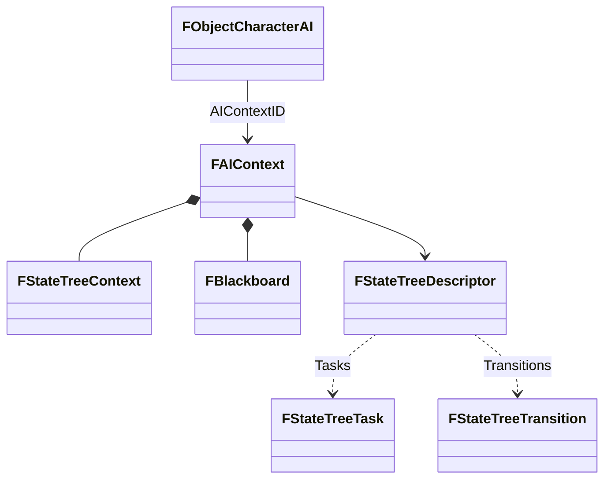
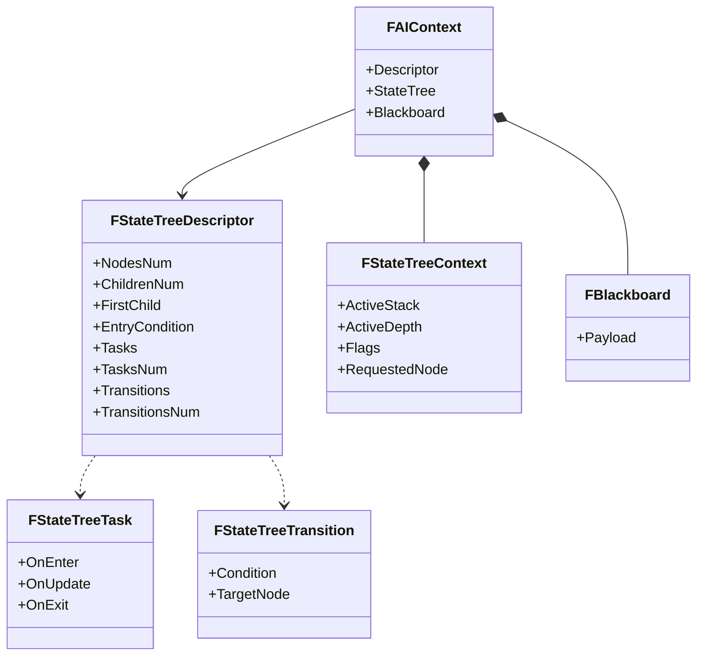

# 07. AI И StateTree

## Назначение Главы

Эта глава описывает AI-слой проекта как самостоятельную архитектурную подсистему.
Она связывает вместе:
- `FObjectCharacterAI`;
- `FAIContext`;
- `FBlackboard`;
- `FStateTreeContext`;
- `FStateTreeDescriptor`;
- `FStateTreeTask`;
- `FStateTreeTransition`;

Главная идея этой главы:
AI здесь реализуется не как внешний контроллер в стиле high-level game engine, а как data-driven runtime, привязанный к объекту мира через контекст AI.

## Вход В AI-Слой

На уровне игровых сущностей AI появляется в момент, когда `FObjectCharacter` расширяется до `FObjectCharacterAI`.
Новая структура добавляет поле:
- `AIContextID`.

Это означает, что объект-персонаж, управляемый AI, получает доступ не к одной функции и не к одному флагу, а к целому runtime-контексту поведения.

## `FAIContext` Как Центр AI-Системы

`FAIContext` сейчас хранит три компонента:
- `Descriptor`
- `StateTree`
- `Blackboard`

Даже этот минимальный набор уже показывает правильную архитектуру.

### `Descriptor`

Статическое описание поведения.
Это ответ на вопрос: как устроено дерево, какие в нём узлы, задачи, переходы и условия.

### `StateTree`

Динамическое состояние выполнения дерева.
Это ответ на вопрос: какой путь активен сейчас и в каком runtime-состоянии находится экземпляр дерева.

### `Blackboard`

Рабочие данные AI между тиками.
Это ответ на вопрос: что AI “помнит” и какие компактные факты использует для принятия решений.

### Почему Такое Разделение Правильное

Оно разводит три разных класса данных:
- описание;
- исполнение;
- рабочую память.

Это один из самых важных архитектурных признаков зрелой AI-модели.

## `FStateTreeDescriptor`

### Что Это Такое

`FStateTreeDescriptor` — статическое ROM-описание поведения.
Это не runtime-структура узлов и не объект дерева в памяти исполнения.
Это набор адресов таблиц, индексируемых по номеру узла.

### Что Он Хранит

Сейчас в дескрипторе лежат:
- `NodesNum`
- `ChildrenNum`
- `FirstChild`
- `EntryCondition`
- `Tasks`
- `TasksNum`
- `Transitions`
- `TransitionsNum`

### Архитектурный Смысл

Узел дерева не представлен отдельным runtime-объектом.
Вместо этого проект использует SoA-подход:
каждое свойство узла хранится в отдельной таблице, а доступ осуществляется через индекс узла.

### Почему Это Хорошо Для Платформы

Такой подход:
- экономит RAM;
- делает layout предсказуемым;
- упрощает хранение дерева в ROM;
- позволяет быстро извлекать свойства по `node index`.

### Ограничение Модели

Так как `ChildrenNum` и `FirstChild` описывают детей через contiguous layout, дети одного узла должны лежать подряд в индексном пространстве.
Это важно и должно соблюдаться на уровне построения дерева.

## `FStateTreeContext`

### Что Это Такое

`FStateTreeContext` — динамические данные конкретного экземпляра дерева состояний.
Он хранит:
- `ActiveStack`
- `ActiveDepth`
- `Flags`
- `RequestedNode`

### Что Это Значит По Смыслу

Это не дерево как описание.
Это след выполнения по дереву.

### `ActiveStack`

Путь активных узлов от корня к листу.
Это ключ к пониманию runtime-модели.
Проект не хранит “текущий указатель на один узел”, а хранит весь активный путь.

### `ActiveDepth`

Глубина текущего активного пути.
Нужна для корректной работы со стеком состояний.

### `Flags`

Runtime-флаги исполнения дерева.
На текущем этапе среди них уже предусмотрены биты:
- initialized;
- transition pending;
- blocked.

### `RequestedNode`

Промежуточное поле для запрошенного целевого узла.
Это полезно, если переход не применяется мгновенно или должен быть зафиксирован как отдельное состояние runtime.

## `FBlackboard`

### Текущее Состояние

Сейчас `FBlackboard` в проекте представлен как 8-байтный payload-заглушка.
Это означает, что архитектурный слот уже выделен, но фактическое содержимое ещё не стабилизировано окончательно.

### Почему Это Всё Равно Важно

Даже в виде placeholder структура уже фиксирует границу ответственности:
рабочая память AI должна существовать отдельно от:
- `FCharacter`;
- `FObjectCharacter`;
- `FStateTreeContext`.

### Что Здесь Должно Жить По Смыслу

В blackboard логично хранить:
- флаги восприятия;
- идентификаторы целей;
- короткие таймеры;
- квантизованные вычисленные значения;
- промежуточные итоги выбора.

### Чего Здесь Быть Не Должно

Blackboard не должен становиться дублем канонических данных мира.
Например:
- HP персонажа должен жить в своём источнике истины;
- а в blackboard может жить лишь вывод вроде `LowHealthFlag`.

## `FStateTreeTask`

### Роль Структуры

`FStateTreeTask` описывает исполняемую задачу узла.
Он хранит lifecycle callbacks:
- `OnEnter`
- `OnUpdate`
- `OnExit`

### Почему Логика Узла Вынесена В Task

Это одно из ключевых решений модели.
Проект сознательно ушёл от дублирования callback'ов одновременно в `Descriptor` и в `Task`.
В результате:
- `Descriptor` хранит только структуру дерева и ссылки на наборы задач;
- сами lifecycle callbacks живут внутри задач.

### Архитектурный Выигрыш

Такое решение делает ответственность чище:
- дескриптор описывает topology and bindings;
- задача описывает поведение.

## `FStateTreeTransition`

### Что Это Такое

Структура перехода между узлами дерева.
Она хранит:
- `Condition`
- `TargetNode`

### Особенности

Если `Condition.Function = 0`, переход трактуется как безусловный.
Приоритет переходов задаётся порядком в массиве.

### Почему Это Важно

Приоритет через порядок массива означает, что runtime может оставаться очень компактным.
Но при этом документация дерева должна внимательно фиксировать порядок переходов, потому что он несёт смысл поведения.

## `FFunctionRef`

AI-слой использует ссылку на функцию как компактный универсальный механизм вызова callbacks.
Это позволяет описывать:
- условия входа;
- задачи;
- условия переходов.

На уровне структуры это сохраняет общую дисциплину: разные элементы `StateTree` всё равно сводятся к единому понятию callback reference.

## Компактная Диаграмма AI-Слоя

## Полная Диаграмма Контрактов `StateTree`

## Как Эта Модель Должна Исполняться

По текущему runtime-прототипу и структурам можно описать следующий жизненный цикл экземпляра AI.

### 1. Есть объект `FObjectCharacterAI`

Он хранит `AIContextID`.

### 2. По `AIContextID` находится `FAIContext`

Из него получаются:
- descriptor дерева;
- runtime-контекст дерева;
- blackboard.

### 3. Init-логика строит активный путь

Runtime проходит по descriptor'у:
- начиная от корня;
- проверяя `EntryCondition`;
- выбирая допустимых детей;
- формируя `ActiveStack`.

### 4. Tick вызывает update-фазу задач

Для активных узлов и задач вызываются lifecycle callbacks `OnUpdate`.

### 5. Runtime проверяет переходы снизу вверх

Сначала анализируется лист, затем путь к корню.
При первом сработавшем переходе находится целевой узел.

### 6. Формируется новый путь

Runtime строит новый путь, сравнивает его со старым, выполняет:
- `OnExit` для покидаемой части пути;
- `OnEnter` для новой части пути.

Это очень похоже на логику иерархического state-driven runtime, но приспособлено под компактную модель проекта.

## Сильные Стороны Текущей AI-Модели

### 1. Чёткое разделение descriptor/runtime/blackboard

Это, пожалуй, самая сильная сторона текущей архитектуры.

### 2. Компактность для ограниченной платформы

Все основные структуры укладываются в очень небольшие размеры.
Это соответствует целям проекта.

### 3. Отсутствие runtime-объектов узлов

Решение хранить узлы как индексируемые таблицы экономит память и делает model layout предсказуемым.

### 4. Отдельный `AIContext`

Это позволяет не загрязнять базовые игровые сущности AI-полями там, где AI не нужен.

## Текущие Ограничения И Незавершённости

### 1. Blackboard пока placeholder

Структура есть, но её конкретная семантика ещё не стабилизирована окончательно.

### 3. Сложность дерева будет упираться в стоимость обхода

При усложнении descriptor-driven модели важно контролировать:
- глубину активного пути;
- число задач на узел;
- число переходов на узел;
- стоимость callbacks.

## Практический Итог Главы

AI-слой проекта уже сложился в правильную форму:
- объект AI хранит только ссылку на контекст;
- контекст связывает память поведения и память выполнения;
- дерево описано статически через таблицы;
- runtime хранит только активный путь и служебное состояние;
- поведение вынесено в задачи и переходы;

Следующая глава фиксирует архитектурные выводы и риски, которые следуют из всей структуры проекта.

