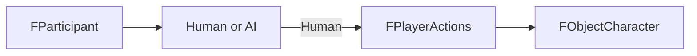

# 10. FParticipant И FPlayerActions

## Назначение Главы

Эта глава разбирает два соседних, но принципиально разных слоя player-domain модели:
- `FParticipant` как владельца, сторону и источник режима человек/компьютер;
- `FPlayerActions` как краткий контейнер намерения игрока.

Они находятся рядом в `Includes/Structs/Player/`, но представляют два разных уровня архитектуры.

## Почему Они Разобраны Вместе

Потому что именно через эту пару очень хорошо видно главное разграничение проекта:
- `FParticipant` отвечает на вопрос «кому принадлежит сущность и кто управляет стороной»;
- `FPlayerActions` отвечает на вопрос «какое конкретное действие сейчас хочет совершить человек».

То есть один уровень — ownership and mode, второй — immediate input intent.

## `FParticipantFaction`

### Что Это Такое

Это компактная подструктура фракционной принадлежности участника.
Она содержит поле `Flags`.

### Архитектурный Смысл

Хотя структура маленькая, именно она содержит одну из важнейших семантик системы:
бит `CH`, который определяет:
- человек это или компьютер;
- следовательно, должен ли персонаж участника идти по human path или AI path.

### Почему Это Важно

Проект не хранит “AI-флаг” в объекте мира как первичный источник истины.
Он поднимает этот вопрос выше — на уровень участника.
Это означает, что режим управления рассматривается как свойство стороны, а не случайной сущности на карте.

## `FParticipantSettings`

### Роль Структуры

Это стартовые настройки участника, используемые при инициализации.
Внутри находятся:
- `Faction`
- `CastleID`
- `HeroLocation`
- `Character`

### Что Это Значит

Проект различает:
- стартовый конфигурационный профиль;
- и runtime-экземпляр участника.

Это полезно, потому что позволяет держать инициализационные данные отдельно от состояния уже идущей партии.

## `FParticipant`

### Что Это Такое

`FParticipant` — это участник игры как сторона, субъект владения и источник режима управления.
Он хранит:
- `Faction`
- `CastleID`
- `CharactersNum`
- `Characters`

### В Каком Слое Он Живёт

Это gameplay-owner слой.
Структура не отвечает за:
- позицию на карте;
- спрайты;
- движение;
- UI.

Она отвечает за сторону в игре и её состав.

### Главная Роль В Архитектуре

`FParticipant` выполняет сразу три архитектурные функции.

#### 1. Владение

Он определяет, какому участнику принадлежат персонажи.

#### 2. Режим управления

Через `Faction.Flags.CH` определяется, это человек или компьютер.

#### 3. Группировка персонажей

Он хранит число персонажей и их массив, то есть является корневой точкой доступа к составу стороны.

### Почему Это Хорошо

Такое решение позволяет не смешивать контроль и мир.
Участник существует на слое правил и владения, а не на слое графического присутствия на карте.

### Практическая Цена

Так как `FParticipant` хранит массив персонажей, нужно внимательно следить за консистентностью ID при перестановках и изменениях структур.

## `FPlayerActions`

### Что Это Такое

`FPlayerActions` — структура краткого намерения игрока.
Сейчас она очень компактна:
- `SelectedHeroID`
- `Action`

### Почему Она Не Хранит Больше

Это важный архитектурный выбор.
Проект не пытается превратить структуру игрока в гигантский runtime-объект всего интерфейса.
Вместо этого он использует маленький контейнер команды.

### Архитектурная Роль

`FPlayerActions` не описывает мир и не описывает владение.
Она описывает конкретное действие человека в текущий момент.

### В Чём Её Сила

- компактность;
- предсказуемость;
- простая связь с input pipeline;
- минимальная цена в памяти.

### В Чём Её Ограничение

Структура сознательно минималистична.
Поэтому вся более сложная семантика пользовательского взаимодействия должна жить не внутри неё, а в обработчиках UI, input и runtime-модулях.

## Связь Между `FParticipant` И `FPlayerActions`

Между ними нет прямой структурной связи полями, и это хорошо.
Они встречаются только в логике runtime.

### `FParticipant`

Говорит:
- какая сторона сейчас рассматривается;
- человек это или компьютер;
- какие персонажи ей принадлежат.

### `FPlayerActions`

Говорит:
- какого героя человек выбрал;
- какое действие инициировал.

Именно поэтому они вместе образуют player-domain слой, но не дублируют друг друга.

## Диаграмма Роли В Системе

## Что Здесь Особенно Важно Для Проекта

Эта пара структур показывает философию всей архитектуры:
- ownership хранится отдельно;
- runtime-intent хранится отдельно;
- neither of them is the world object itself.

Это очень хорошее разделение обязанностей.

## Практический Итог Главы

`FParticipant` — это слой стороны, владения и режима управления.
`FPlayerActions` — это слой человеческой команды.
Они не заменяют друг друга и не дублируют друг друга. Вместе они формируют human-side управление проектом без отдельного heavyweight controller object.
