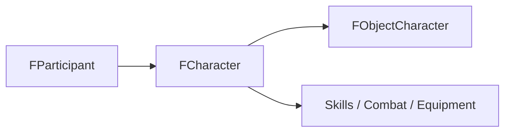

# 11. FCharacter

## Назначение Главы

Эта глава посвящена `FCharacter` и связанным с ним подструктурам.
Здесь важно понять: `FCharacter` — это не просто “ещё один объект на карте”, а persistent gameplay-ядро персонажа.

## Семейство Структур Персонажа

В character-слое проекта участвуют:
- `FCharacterSkills`
- `FCharacterSettings`
- `FCharacter`

А также подключаемые тематические подструктуры:
- первичные навыки;
- вторичные навыки;
- боевые состояния;
- экипировка.

Это уже показывает, что персонаж в проекте мыслится как составная игровая сущность, а не как один плоский блок данных.

## `FCharacterSkills`

### Что Это Такое

Слой навыков персонажа.
Он объединяет:
- первичные навыки;
- вторичные навыки.

### Зачем Это Отдельная Подструктура

Такое решение помогает не перегружать сам `FCharacter` длинным списком skill-полей и делает character-model более модульной.

## `FCharacterSettings`

### Роль

Это настройка персонажа участника на этапе инициализации.
Она содержит:
- `Class`
- `Skils`

### Смысл

Структура существует для того, чтобы стартовые установки персонажа были описаны отдельно от уже живого runtime-экземпляра.

Это согласуется с общей философией проекта:
разделять configuration-state и runtime-state.

## `FCharacter`

### Что Это Такое

`FCharacter` — это основной persistent gameplay-профиль персонажа.
Он хранит:
- `Class`
- `ParticipantID`
- `Skils`
- `CombatStates`
- `Equipment`
- `ObjectID`

### Что Он Не Хранит

Он не хранит:
- экранную позицию;
- спрайт;
- world movement runtime;
- AI runtime.

Именно это делает структуру чистой.

## Роль Каждого Ключевого Поля

### `Class`

Определяет класс персонажа.
Это влияет не только на визуальную идентичность, но и на игровые правила, например вероятность получения вторичных навыков.

### `ParticipantID`

Связывает персонажа с участником игры.
Через это поле персонаж получает ownership и режим человека/компьютера опосредованно через `FParticipant`.

### `Skils`

Слой навыков персонажа.
Это часть persistent gameplay-профиля.

### `CombatStates`

Боевые состояния.
Это уже не просто “паспорт персонажа”, а его текущее состояние в rules-layer логике.

### `Equipment`

Слой экипировки.
Опять же, это gameplay-смысл, а не world-runtime.

### `ObjectID`

Обратная связь с world-representation персонажа.
То есть `FCharacter` знает, какой `FObjectCharacter` сейчас его представляет в мире.

## Почему `FCharacter` — Не Объект Мира

Это один из главных архитектурных моментов проекта.

### Если бы `FCharacter` был объектом мира

В нём пришлось бы смешать:
- persistent gameplay data;
- movement state;
- sprite state;
- map presence;
- AI links.

Такая структура быстро стала бы тяжёлой и неясной.

### Текущая модель лучше

Сейчас `FCharacter` хранит только то, что должно жить независимо от конкретного перемещения по карте.
А world-representation вынесен в `FObjectCharacter`.

## Двусторонняя Связь С `FObjectCharacter`

У проекта сейчас двусторонняя сцепка:
- `FObjectCharacter` хранит `CharacterID`;
- `FCharacter` хранит `ObjectID`.

### Почему Это Удобно

Позволяет быстро ходить в обе стороны:
- от world-object к gameplay profile;
- от gameplay profile к world-object.

### Почему Это Требует Осторожности

Любое перемещение или переупаковка массивов объектов/персонажей требует обновления обеих сторон связи.

## В Каком Слое Живёт `FCharacter`

`FCharacter` живёт между:
- player-domain ownership моделью;
- world-domain representation.

Он является связующим gameplay-слоем, но сам не является ни объектом карты, ни UI-командой, ни AI-контекстом.

## Связь С Инициализацией Участника

Так как `FParticipantSettings` включает `FCharacterSettings`, character-model имеет ещё и стартовый конфигурационный уровень.
Это означает, что персонаж проектируется не только как runtime-единица, но и как стартовая сущность сценария/сессии.

## Диаграмма Роли В Системе

## Практический Итог Главы

`FCharacter` — это gameplay-core персонажа.
Он связывает ownership, rules-layer состояние, навыки, экипировку и world-representation, но не пытается хранить всё сразу. Именно поэтому структура остаётся архитектурно чистой и является хорошим центром модели персонажа.
