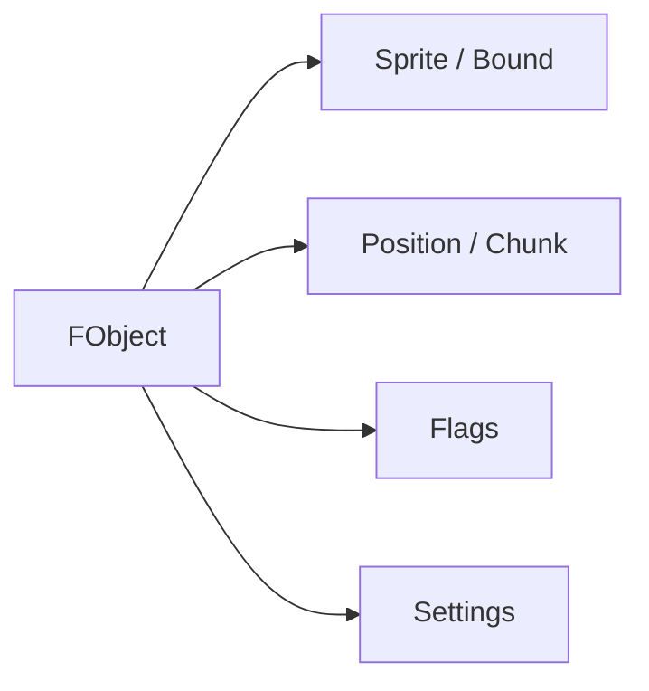

# 12. FObject

## Назначение главы

Эта глава разбирает `FObject` как базовую world-сущность проекта.
Если `FCharacter` хранит persistent gameplay-данные, то `FObject` хранит то, что делает сущность частью видимого и обновляемого мира.

## Что такое `FObject`

`FObject` — это базовый объект карты.
Он хранит:
- `Class`
- `Flags`
- `Position`
- `Chunk`
- `Sprite`
- `Bound`
- `Settings`

Это означает, что он объединяет:
- идентичность объекта;
- его пространственное положение;
- связь со спрайтовым и rendering-слоем;
- служебные флаги runtime-обновления.

## `Class`

### Двойная роль поля

Поле класса упаковывает сразу два измерения:
- принадлежность к фракции;
- класс объекта.

Это хороший пример плотной упаковки для платформы с жёсткими ограничениями памяти.

### Что это даёт

Позволяет в одном байте хранить достаточно много информации о типе сущности и её принадлежности.

### Цена

Поле требует внимательного документирования, потому что его семантика богаче, чем просто “номер класса”.

## `Flags`

### Смысл

Флаги содержат runtime-механику объекта.
Из комментариев структуры видно как минимум наличие состояний, связанных с необходимостью обновления и тиканием объекта.

### Почему это важно

`FObject` — не пассивная запись в памяти.
Он уже участвует в жизненном цикле world-runtime.

## `Position`

### Что хранится

Позиция хранится как `FVector16_YX` в fixed-point формате 12.4.
Это один из важнейших архитектурных признаков world-layer проекта.

### Почему это хорошо

Такое представление позволяет:
- иметь точное и компактное хранение положения;
- разделять целую и дробную части;
- использовать его и для движения, и для отрисовки.

## `Chunk`

Объект хранит информацию о чанке.
Это показывает, что spatial partitioning уже встроен в модель мира.
Следовательно, мир мыслится не как одно плоское поле без структурирования, а как пространство с разбивкой на области.

## `Sprite`

Поле спрайта связывает объект с буфером sprite-info.
Это прямой мост между моделью мира и visual/runtime слоем.

## `Bound`

Границы после отрисовки — это ещё один признак того, что `FObject` живёт на стыке данных мира и rendering-практики.
Структура хранит не только abstract game identity, но и сведения, полезные для экранной обработки.

## `Settings`

Ссылка на настройки по умолчанию делает `FObject` частью более широкой конфигурационной системы.
Это позволяет разделять:
- instance state объекта;
- default-profile объекта.

## Почему `FObject` нельзя считать просто базовым классом “для всего”

Хотя структура и является базовой, по смыслу она уже достаточно насыщенна.
Это не “пустой предок”, а полноценный world-contract.

Она уже задаёт:
- позиционную модель;
- связь со спрайтом;
- флаги жизненного цикла;
- идентичность объекта.

То есть любой наследник `FObject` автоматически входит в world-runtime модель.

## Чем `FObject` отличается от `FCharacter`

### `FCharacter`

Отвечает за gameplay-персонажа как владельца характеристик и связей.

### `FObject`

Отвечает за видимую, пространственно размещённую, обновляемую сущность мира.

Это фундаментальное различие, и оно делает архитектуру проекта чище.

## Диаграмма роли в системе

## Практический итог главы

`FObject` — это базовый world-runtime контракт проекта.
Он не хранит весь gameplay-смысл сущности, но задаёт её присутствие в мире, её позицию, связь со спрайтом, chunk-модель и признаки обновления. Это один из самых опорных типов всей архитектуры.
