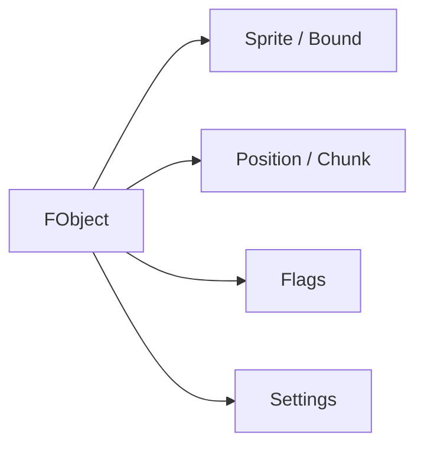

# 12. FObject

## Назначение главы

Эта глава разбирает `FObject` как базовую world-сущность проекта.
Если `FCharacter` хранит persistent gameplay-данные, то `FObject` хранит то, что делает сущность частью видимого и обновляемого мира.

## Что такое `FObject`

`FObject` — это базовый объект карты.
Он хранит:
- `Class`
- `Flags`
- `Position`
- `Chunk`
- `Sprite`
- `Bound`
- `Settings`

Это означает, что он объединяет:
- идентичность объекта;
- его пространственное положение;
- связь со спрайтовым и rendering-слоем;
- служебные флаги runtime-обновления.

## `Class`

### Двойная роль поля

Поле класса упаковывает сразу два измерения:
- принадлежность к фракции;
- класс объекта.

Это хороший пример плотной упаковки для платформы с жёсткими ограничениями памяти.

### Что это даёт

Позволяет в одном байте хранить достаточно много информации о типе сущности и её принадлежности.

### Цена

Поле требует внимательного документирования, потому что его семантика богаче, чем просто “номер класса”.

## `Flags`

### Смысл

Флаги содержат runtime-механику объекта.
Из комментариев структуры видно как минимум наличие состояний, связанных с необходимостью обновления и тиканием объекта.

### Почему это важно

`FObject` — не пассивная запись в памяти.
Он уже участвует в жизненном цикле world-runtime.

Флаг `OBJECT_WEAKLY_REFERENCED` означает, что на объект существует хотя бы одна слабая односторонняя ссылка. Сам объект не хранит идентификаторы владельцев таких ссылок.

## `Position`

### Что хранится

Позиция хранится как `FVector16_YX` в fixed-point формате 12.4.
Это один из важнейших архитектурных признаков world-layer проекта.

### Почему это хорошо

Такое представление позволяет:
- иметь точное и компактное хранение положения;
- разделять целую и дробную части;
- использовать его и для движения, и для отрисовки.

## `Chunk`

Объект хранит информацию о чанке.
Это показывает, что spatial partitioning уже встроен в модель мира.
Следовательно, мир мыслится не как одно плоское поле без структурирования, а как пространство с разбивкой на области.

## `Sprite`

Поле спрайта связывает объект с буфером sprite-info.
Это прямой мост между моделью мира и visual/runtime слоем.

## `Bound`

Границы после отрисовки — это ещё один признак того, что `FObject` живёт на стыке данных мира и rendering-практики.
Структура хранит не только abstract game identity, но и сведения, полезные для экранной обработки.

## `Settings`

Ссылка на настройки по умолчанию делает `FObject` частью более широкой конфигурационной системы.
Это позволяет разделять:
- instance state объекта;
- default-profile объекта.

## `ObjectsArray` и удаление через `RemoveAtSwap`

### Как хранятся объекты

Активные объекты занимают непрерывную часть `ObjectsArray` от первого элемента до `ObjectNum - 1`.
При создании новый объект размещается сразу после последнего активного элемента.

При удалении элемент не вырезается со сдвигом всей оставшейся части массива. `RemoveAtSwap` копирует на его место последний активный объект, после чего уменьшает `ObjectNum`:

```text
[ A ][ B ][ C ][ D ]
       удалить B
          ↓
[ A ][ D ][ C ]
```

Если удаляется последний элемент, копирование не требуется.

### Для чего используется замена последним элементом

Такой способ не оставляет пустых элементов между активными объектами:

- создание не требует искать свободный элемент между активными объектами;
- удаление не требует сдвигать все элементы после удаляемого;
- проходы могут обрабатывать непрерывный диапазон активных объектов;
- стоимость удаления не зависит от положения элемента в массиве.

Фактически удаление сводится к копированию одного элемента фиксированного размера `OBJECT_SIZE` и уменьшению счётчика. Благодаря непрерывному расположению активных объектов последующее создание также остаётся простым и быстрым.

### Цена удаления с заменой

`ObjectID` одновременно является индексом объекта в `ObjectsArray`. Поэтому объект, скопированный на место удалённого, получает новый адрес и новый `ObjectID`.

Все хранилища и связи, содержащие его прежний `ObjectID`, должны быть исправлены. `SmartRemove` уже обновляет индекс перемещённого объекта в `ChunkArray`; корректировка остальных связей выполняется в зависимости от их устройства.

### Двусторонние связи

Двусторонняя связь — связь между двумя структурами, при которой каждая сторона хранит идентификатор другой стороны. Поэтому перемещённый объект может напрямую найти связанную структуру и записать в неё свой новый `ObjectID`.

Примером является связь:

```text
FCharacter.ObjectID ↔ FObjectCharacter.CharacterID
```

Такое исправление выполняется быстро и не требует поиска по всем объектам. Обработчик определяется типом перемещённого объекта.

### Слабые односторонние связи

Слабая ссылка — односторонняя связь, при которой владелец ссылки хранит идентификатор целевого объекта, а целевой объект не хранит идентификатор владельца. Anchor у `FObjectUI` является частным случаем такой связи. Добавлять обратный `AnchorID` в каждый объект ради этого не требуется.

Наличие хотя бы одной слабой ссылки отмечается у целевого объекта флагом `OBJECT_WEAKLY_REFERENCED`. Если объект с этим флагом перемещён через `RemoveAtSwap`, `SmartRemove` должен:

```text
получить старый и новый ObjectID перемещённого объекта
→ пройти активные объекты
→ вызвать обработчики типов, которые могут содержать слабые ссылки
→ передать каждому обработчику старый и новый ObjectID
→ обработчик сам сравнит и при совпадении заменит сохранённый ObjectID
```

`SmartRemove` при этом не знает расположение и назначение конкретной слабой ссылки. Эти знания остаются у структуры, которая её хранит.

Полный проход является осознанным компромиссом: удаление объектов и изменение их индексов происходят редко, максимальное количество объектов ограничено, а постоянные обратные ссылки и дополнительные таблицы потребовали бы памяти и усложнили общую структуру.

Корректировка двусторонних и слабых связей пока зафиксирована в `SmartRemove` как `ToDo`.

Связное объяснение причин и компромиссов этого решения вынесено в мини-статью [«RemoveAtSwap: удаление с заменой последним элементом»](28_RemoveAtSwap.md).

## Почему `FObject` нельзя считать просто базовым классом “для всего”

Хотя структура и является базовой, по смыслу она уже достаточно насыщенна.
Это не “пустой предок”, а полноценный world-contract.

Она уже задаёт:
- позиционную модель;
- связь со спрайтом;
- флаги жизненного цикла;
- идентичность объекта.

То есть любой наследник `FObject` автоматически входит в world-runtime модель.

## Чем `FObject` отличается от `FCharacter`

### `FCharacter`

Отвечает за gameplay-персонажа как владельца характеристик и связей.

### `FObject`

Отвечает за видимую, пространственно размещённую, обновляемую сущность мира.

Это фундаментальное различие, и оно делает архитектуру проекта чище.

## Диаграмма роли в системе


```mermaid
flowchart LR
    Object[FObject] --> Render[Sprite / Bound]
    Object --> World[Position / Chunk]
    Object --> Runtime[Flags]
    Object --> Defaults[Settings]
```

## Практический итог главы

`FObject` — это базовый world-runtime контракт проекта.
Он не хранит весь gameplay-смысл сущности, но задаёт её присутствие в мире, её позицию, связь со спрайтом, chunk-модель и признаки обновления. Это один из самых опорных типов всей архитектуры.
