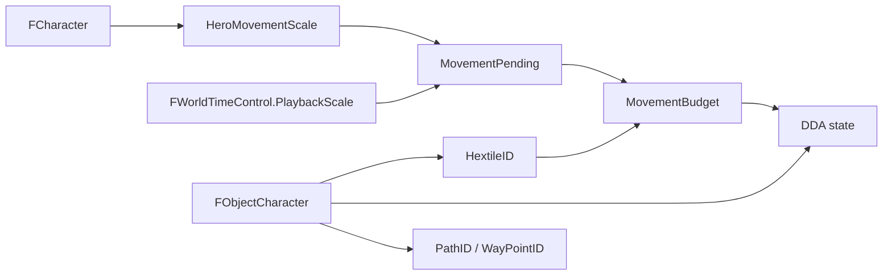

# 13. FObjectCharacter

## Назначение главы

`FObjectCharacter` связывает постоянные данные персонажа из `FCharacter` с его пространственным состоянием на карте.

Структура наследует `FObject` и хранит runtime-данные пути, DDA-траектории, текущей поверхности и движения.

`FObjectCharacter` занимает `31` байт из 32-байтного слота объекта. В расширении `FObjectCharacterAI` последний байт используется для `AIContextID`, поэтому свободным выравниванием базовую структуру дополнять нельзя.

## Связь с персонажем и маршрутом

- `CharacterID` связывает объект карты с владельцем `FCharacter`.
- `PathID` указывает текущую точку рассчитанного пути.
- `WayPointID` хранит текущий waypoint для автономного движения.

Игровые характеристики, навыки и экипировка принадлежат `FCharacter`. Состояние фактического перемещения принадлежит `FObjectCharacter`.

## Состояние линии DDA

Движение между двумя точками описывают:

- `MajorRemaining` — оставшееся количество шагов по главной оси;
- `MajorLength` — полная длина по главной оси;
- `MinorLength` — длина по вторичной оси;
- `LineError` — накопленная ошибка DDA;
- `MovementFlags` — главная ось и знаки изменения координат.

Все четыре поля состояния DDA являются беззнаковыми 16-битными значениями. Длины и остаток задаются в четвертях пикселя, а `LineError` при ненулевой длине находится в диапазоне от `0` до `MajorLength - 1`.

Поле `MovementFlags` использует три младших бита:

| Бит | Назначение | Значение `0` | Значение `1` |
|---:|---|---|---|
| 0 | Главная ось DDA | X | Y |
| 1 | Направление по X | вправо | влево |
| 2 | Направление по Y | вниз | вверх |

Один DDA-шаг изменяет главную координату на четверть пикселя и при необходимости изменяет вторичную координату на ту же величину. Алгоритм не привязан к центру гекса и может использоваться для движения к произвольной точке.

## Поверхность и единицы движения

`HextileID` хранит тип поверхности, на которой находится объект. После фактического перехода в другой гекс поле обновляется, поэтому последующие шаги оплачиваются уже по новой стоимости.

Движение использует два накопителя:

- `MovementPending` — единицы движения текущего масштаба времени, ещё не распределённые между cadence-проходами;
- `MovementBudget` — доступные единицы движения, которыми оплачиваются DDA-шаги.

`PlaybackScale` не хранится в `FObjectCharacter`. Это общий масштаб пакета времени текущей cadence-эпохи из `FWorldTimeControl`. Флаг активной фазы разрешает начислить новый пакет один раз, после чего объект продолжает распределять свой `MovementPending` до конца эпохи и расходует полученные единицы по стоимости текущей поверхности.

Оба накопителя являются беззнаковыми 16-битными значениями. При переполнении они насыщаются значением `#FFFF`, а не переходят через ноль.

## Состояние спрайта

Поле `Super.Sprite` базового объекта одновременно кодирует:

- состояние анимации;
- направление спрайта;
- индекс кадра анимации.

Отдельного поля `Direction` в текущей структуре нет.

## Разделение ответственности

### `FCharacter`

Хранит gameplay-профиль персонажа: класс, навыки, состояния и экипировку. Расчёт коэффициента подвижности героя из этих данных запланирован, но пока не реализован; фактически используется коэффициент `1`.

### `FObjectCharacter`

Хранит положение на карте, маршрут, DDA-состояние, текущую поверхность и единицы движения.

### `FWorldTimeControl`

Хранит оставшееся запрошенное мировое время, `PlaybackScale` текущей эпохи и флаг доставки нового пакета времени. После сброса флага масштаб сохраняется до конца эпохи, чтобы объекты завершили распределение уже начисленного бюджета.

## Схема взаимодействия

## Практический итог

`FObjectCharacter` является пространственным runtime-представлением персонажа. Он не определяет глобальную скорость проигрывания и не хранит характеристики героя, а применяет рассчитанную подвижность к маршруту и текущей поверхности.

Текущая реализация уже разделяет мировое время, доступные единицы движения, стоимость поверхности и геометрию DDA. Незавершёнными остаются формула подвижности персонажа, окончательный баланс поверхностей, проверка распределения бюджета между cadence-частотами и самостоятельная логика визуальной анимации.
