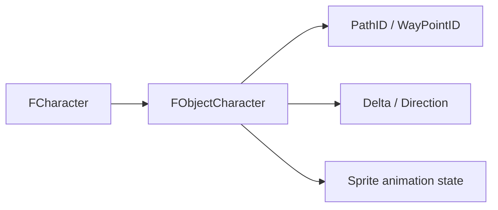

# 13. FObjectCharacter

## Назначение главы

Эта глава описывает `FObjectCharacter` как точку встречи двух миров:
- базового объекта карты;
- персонажа как gameplay-сущности.

Именно здесь project-level data model начинает превращаться в активную world-единицу.

## Что добавляет `FObjectCharacter`

Структура наследует `FObject` и добавляет:
- `CharacterID`
- `PathID`
- `WayPointID`
- `Delta`
- `Direction`

Из этого сразу видно, что её роль — не просто “объект, который знает своего персонажа”, а объект-персонаж с собственным runtime движения.

## `CharacterID`

### Главная функция

Связывает world-object с `FCharacter`.
Через это поле можно перейти от сущности, живущей на карте, к её persistent gameplay-профилю.

### Архитектурная ценность

Благодаря этому проект избегает тяжёлой модели, где все данные персонажа напрямую вложены в объект мира.

## `PathID`

Хранит текущий воспроизводимый индекс в массиве пути.
Это значит, что `FObjectCharacter` уже не просто “может когда-то ходить”, а непосредственно участвует в механике движения по рассчитанному маршруту.

## `WayPointID`

Хранит текущий воспроизводимый индекс waypoint.
Это ещё один признак того, что движение моделируется не как один общий target vector, а как поэтапное прохождение пути.

## `Delta`

### Смысл

Хранит дельты до достижения текущего waypoint.

### Почему это уместно именно здесь

`Delta` — это чистый world-runtime параметр.
Ему не место ни в `FCharacter`, ни в `FParticipant`, ни в AI-контексте.

Он должен жить там, где сущность реально перемещается по миру.

## `Direction`

### Смысл

Нормализованное направление движения.

### Архитектурная роль

Это связующее поле между:
- логикой движения;
- анимацией;
- рендером спрайта.

То есть `Direction` не только геометрическая, но и визуально-поведенческая величина.

## Комментарий к полю `Sprite` базового объекта

Внутри `FObjectCharacter` отдельно документирована семантика `Super.Sprite`:
- состояние анимации;
- направление спрайта;
- индекс анимации.

Это ещё один важный архитектурный сигнал:
`FObjectCharacter` не просто добавляет поля движения, но и уточняет, как world-object персонажа должен интерпретировать sprite-state.

## Чем `FObjectCharacter` отличается от `FObject`

### `FObject`

Это универсальная сущность мира.

### `FObjectCharacter`

Это world-объект, который:
- представляет персонажа;
- связан с `FCharacter`;
- умеет двигаться по пути;
- содержит state, нужный для движения и анимации.

## Чем `FObjectCharacter` отличается от `FCharacter`

### `FCharacter`

Отвечает за правила, owner-link и gameplay profile.

### `FObjectCharacter`

Отвечает за spatial-runtime и карту.

Это одна из ключевых разграничительных линий всей архитектуры.

## Диаграмма роли в системе

## Практический итог главы

`FObjectCharacter` — это world-воплощение персонажа.
Он связывает карту и gameplay-профиль, хранит runtime-путь, waypoint-и и параметры движения, а также уточняет трактовку sprite-state персонажа. Это одна из самых центральных структур всей world-модели проекта.
