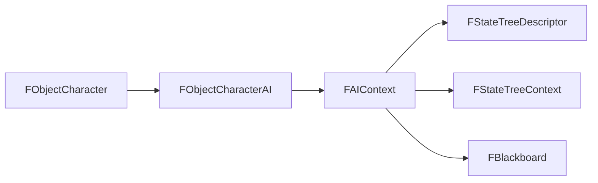

# 14. FObjectCharacterAI и FAIContext

## Назначение главы

Эта глава разбирает слой, в котором объект-персонаж получает AI-runtime.
Здесь встречаются две структуры:
- `FObjectCharacterAI`
- `FAIContext`

Именно они переводят модель персонажа из плоскости world presence в плоскость поведения, управляемого деревом состояний.

## `FObjectCharacterAI`

### Что это такое

`FObjectCharacterAI` — расширение `FObjectCharacter` для AI-управляемой сущности.
Он добавляет только одно поле:
- `AIContextID`

### Почему только одно поле

Это очень сильное решение.
Вместо того чтобы раздувать объект множеством полей:
- blackboard ID;
- state tree ID;
- flags AI;
- локальные AI-таймеры;

структура хранит один вход в AI-runtime слой.

### Что это даёт

- компактность;
- чистоту базовой модели;
- гибкость дальнейшего развития AI-контекста без переписывания world-object.

## `AIContextID`

### Смысл поля

Это идентификатор AI-контекста.
Он позволяет получить доступ к:
- descriptor поведения;
- runtime-состоянию дерева;
- рабочим данным AI.

### Почему это лучше, чем встраивать всё в объект

Потому что AI — это не базовое свойство любой world-сущности проекта.
Это специализированный runtime-layer.

Такой подход особенно хорош для платформы с ограниченной памятью, потому что не заставляет все персонажи платить одинаковую цену за AI, если AI нужен не всем.

## `FAIContext`

### Что это такое

`FAIContext` — агрегатор AI-runtime данных.
Сейчас он объединяет:
- `Descriptor`
- `StateTree`
- `Blackboard`

### Почему он важен архитектурно

Это структура, которая собирает AI как самостоятельную систему.
Без неё пришлось бы разносить части поведения по разным массивам и связывать их внешним соглашением.

### Компонент `Descriptor`

Адрес описания поведения.
Это статическая часть AI — ответ на вопрос, как устроена логика принятия решений.

### Компонент `StateTree`

Runtime-состояние дерева.
Это динамика поведения — ответ на вопрос, где AI находится внутри своего поведения сейчас.

### Компонент `Blackboard`

Рабочая память между тиками.
Это локальный operational memory слой AI.

## Почему `FObjectCharacterAI` и `FAIContext` надо читать вместе

`FObjectCharacterAI` без `FAIContext` — это просто объект с байтом ID.
`FAIContext` без `FObjectCharacterAI` — это отвязанный runtime-пакет.

Только вместе они образуют законченную архитектурную связку:
- объект даёт привязку к миру;
- контекст даёт мышление и состояние поведения.

## Чем этот слой отличается от Human Path

Для человека проект использует маленький контейнер `FPlayerActions`.
Для AI используется полноценный runtime-контекст.

Это логично, потому что:
- человек принимает решение вне игры и лишь передаёт команду;
- AI должен хранить своё рабочее состояние внутри самой системы.

## Диаграмма роли в системе

## Практический итог главы

`FObjectCharacterAI` — это world-object с входом в AI-layer.
`FAIContext` — это сам AI-layer в собранном виде. Вместе они дают чистую, компактную и масштабируемую модель подключения поведения к персонажу без загрязнения базовых структур мира.
