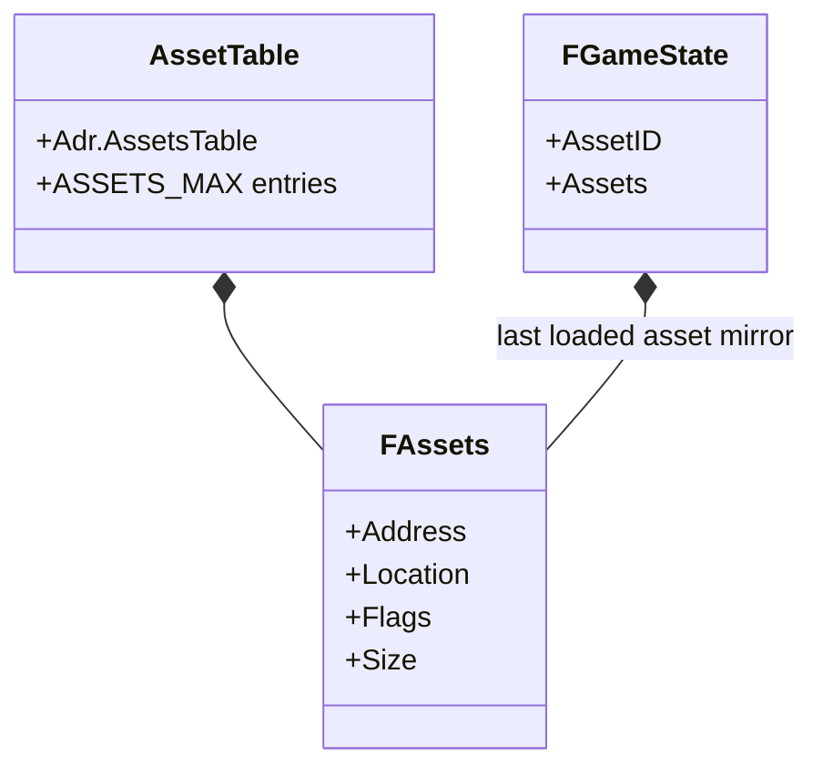

# 15. `FAssets` и Runtime-зеркало ассета

## Назначение главы

Эта глава разбирает одну из самых маленьких, но самых системно важных структур проекта:
`FAssets`.

Именно через неё проект связывает сразу три пространства:
- логический `AssetID`;
- физическое положение ресурса на диске;
- текущее расположение ресурса в ОЗУ.

Рядом с этим разбирается и второй важный элемент — зеркало последнего загруженного ассета в `FGameState`.
Без него трудно понять, как модули запускают code-assets и как runtime узнаёт, где лежит уже загруженный блок.

## Почему эта структура важнее, чем кажется по размеру

`FAssets` занимает всего 8 байт.
Но эти 8 байт выражают почти весь язык asset-runtime модели проекта.

Внутри них упакованы:
- место в памяти;
- место на диске;
- признаки загрузки и архивности;
- размер ресурса в компактном виде.

Это очень плотный и сильный контракт.
Проект не носит рядом отдельные жирные дескрипторы ресурсов в RAM.
Вместо этого он опирается на короткую, индексируемую и дешёвую запись.

## Где живёт `FAssets`

Структура объявлена в `Includes/Structs/Assets.inc`.
В рантайме записи `FAssets` лежат в `Adr.AssetsTable` на странице `Page.AssetManager`.
Размер таблицы вычисляется как:
- `FAssets * ASSETS_MAX`

То есть проект хранит не список указателей на ресурсы, а плотную таблицу фиксированного размера.

## Состав `FAssets`

Структура состоит из четырёх частей:
- `Address FLinearAddress`
- `Location FDisk`
- `Flags DB`
- `Size DB`

Каждую часть важно читать не отдельно, а как часть общего контракта.

## `Address`: где ассет находится в ОЗУ

`Address` хранит линейное положение ресурса в рабочей памяти.
Это ответ на вопрос:
куда ресурс уже загружен или куда он должен быть загружен.

Здесь есть два важных режима.

### Режим 1. Жёстко заданное размещение

Через макросы вроде `SET_LOAD_ASSETS` модуль может заранее сказать:
- в какую страницу надо поместить asset;
- по какому адресу внутри страницы его нужно разворачивать.

Так работает, например, старт `Core`, где код ядра загружается в строго заданную область.

### Режим 2. Автоматическое размещение

Если у ресурса не зафиксирована жёсткая позиция, `AssetsManager.Allocation` ищет непрерывную свободную область в доступной RAM и записывает её в `Address`.

Это превращает `Address` не просто в указатель, а в результат runtime-аллокатора ресурсов.

## Почему поле `Address.Page` несёт больше, чем просто страницу

В проекте байт страницы используется очень плотно.
Он хранит не только номер page, но и несколько runtime-признаков, связанных с жизненным циклом ассета.

Через отдельные биты там кодируются:
- пометка `marked`;
- необходимость автоматической аллокации;
- признак, что для ассета не требуется обычное page-switch поведение.

Это типичный для проекта приём:
максимально компактное совмещение layout-данных и runtime-флагов в одном контракте.

Плюс такого решения очевиден:
минимальный RAM-footprint.

Минус тоже очевиден:
понимание структуры требует аккуратного чтения констант и макросов, потому что “номер страницы” здесь уже не просто чистое числовое поле.

## `Location`: где ассет лежит на диске

`Location FDisk` хранит дисковое положение ресурса.
Это ответ на вопрос:
откуда именно `AssetsManager` должен читать данные.

Для runtime это важно по двум причинам.

### Причина 1. Дисковая позиция известна до загрузки

После инициализации таблицы `AssetsManager` уже знает сектор и размер ресурса на диске.
Значит, при фактической загрузке ему не нужно повторно искать файл по имени или каталогу.

### Причина 2. Builder и Runtime говорят на одном языке

Builder во время упаковки формирует линейную раскладку ресурсов.
Runtime потом работает уже не с именами файлов, а с готовыми дисковыми координатами.

Это как раз и есть одна из сильнейших сторон проекта:
сборка заранее переводит контент в форму, удобную для прямого исполнения.

## `Flags` и `Size`: компактное кодирование состояния и размера

Размер ассета хранится не одним словом, а разрезан между `Flags` и `Size`.

В `Flags` находятся:
- младшие биты реального размера блока;
- `LD` — признак, что ресурс уже загружен;
- `AR` — признак архивности ресурса.

В `Size` находятся старшие биты реального размера блока.

Такой layout нужен не ради красоты, а ради экономии.
Он позволяет хранить:
- состояние ресурса;
- признаки формата;
- размер блока до 16 КБ
в пределах двух байт.

## Почему размер кодируется именно так

`AssetsManager.CalcSizeToBlock` затем переводит это упакованное представление в количество блоков по 256 байт.
Это удобно, потому что вся allocator-модель проекта и bitmask `AvailableMem` работают именно в блоках по 256 байт.

Получается очень важная цепочка:
- Builder фиксирует размер;
- `FAssets` хранит его в компактном виде;
- `AssetsManager` переводит размер в блоки аллокатора;
- `Mark` и `Release` работают уже по этим блокам.

## Таблица ассетов как главный индексатор ресурсов

Таблица ресурсов лежит в `Adr.AssetsTable`.
Доступ к конкретной записи построен очень дёшево:
`AssetID << 3`, потому что `FAssets` имеет размер 8 байт.

Отсюда появляются макросы:
- `ASSETS_ADR`
- `ASSETS_ADR_A`
- `ASSETS_ADR_REG`

Это не косметические удобства, а часть performance-модели.
Проект изначально проектирует ресурсы так, чтобы lookup был тривиален и не требовал сложной арифметики или поиска по таблице переменной длины.

## Что делает `AssetsManager.Initialize`

Во время инициализации asset engine:
- читает с диска блок asset-метаданных в `Adr.ExtraBuffer`;
- очищает `Adr.AssetsTable`;
- заполняет для каждой записи `Location`, `Flags`, `Size`;
- сбрасывает RAM-адрес в состояние “ещё не размещён”.

То есть таблица `FAssets` не зашита полностью в код и не собирается вручную в runtime.
Она восстанавливается из упаковочного слоя метаданных.

## `GameState.AssetID` и `GameState.Assets`

В `FGameState` лежат два критически важных поля:
- `AssetID`
- `Assets`

`AssetID` — идентификатор последнего загруженного ассета.
`Assets` — копия структуры `FAssets` для этого последнего загруженного ресурса.

Важно понимать:
это не копия самих данных ресурса.
Это зеркало метаданных и runtime-расположения последнего loaded asset.

## Зачем нужна копия последнего ассета в `GameState`

На первый взгляд может показаться, что это лишнее дублирование.
Но на самом деле именно эта копия делает запуск assets удобным для следующего слоя runtime.

### Причина 1. Модулям не нужно повторно искать табличную запись

После `AssetsManager.Load` вызывающий код уже может читать `GameState.Assets` как текущий контекст последнего успешно загруженного ресурса.

### Причина 2. Упрощается запуск Code-Assets

Когда `Session.Launch` или другой runtime-слой хочет стартовать загруженный блок, ему удобно иметь рядом текущую копию записи, а не пересчитывать адрес таблицы заново.

### Причина 3. Работают макросы сохранения и восстановления ассета

Макросы `ASSETS_PUSH` и `ASSETS_POP` опираются именно на `GameState.AssetID`.
Это даёт простой механизм временного переключения asset-контекста и возврата к предыдущему ресурсу.

## Полный жизненный цикл через `FAssets`

Полезно мысленно пройти весь путь ресурса.

### Шаг 1. Builder создаёт метаданные

Сборка распределяет resources по секторам, формирует packing и делает asset-map для runtime.

### Шаг 2. `AssetsManager.Initialize` поднимает таблицу

При старте runtime asset manager читает метаданные и заполняет `Adr.AssetsTable`.

### Шаг 3. Вызывающий код обращается по `AssetID`

Макросы или прямой вызов `AssetsManager.Load` переводят `AssetID` в адрес записи `FAssets`.

### Шаг 4. Менеджер проверяет загрузку и размещение

Если asset уже в памяти, он переиспользуется.
Если нет — ищется или подтверждается место в RAM.

### Шаг 5. Таблица становится runtime-истиной

После загрузки запись `FAssets` уже знает:
- где ассет лежит на диске;
- где он теперь лежит в ОЗУ;
- загружен ли он;
- требует ли распаковки;
- сколько блоков памяти занимает.

### Шаг 6. `GameState` получает зеркало

Через `CopyAssetsData` текущая запись переносится в `GameState.Assets`, а `GameState.AssetID` запоминает идентификатор.

## Почему этот подход сильный

У этого решения есть несколько очень сильных сторон.

### 1. Единый контракт для всех типов ресурсов

Один и тот же формат записи описывает:
- code-assets;
- graphics;
- метаданные;
- text.

### 2. Дешёвый lookup

Фиксированный размер записи и простой индексатор делают работу с таблицей очень дешёвой по времени и коду.

### 3. Минимальные затраты RAM

На каждый ресурс расходуется только 8 байт метаданных.
Для платформы такого класса это очень хорошее инженерное решение.

### 4. Плотная связь build-time и runtime

Builder подготавливает layout, а runtime его почти напрямую потребляет.
Никакой тяжёлой прослойки между ними нет.

## Ограничения и цена компактности

У этой модели есть и ограничения.

### Ограничение 1. Таблица фиксированного размера

Сейчас система рассчитана на `ASSETS_MAX` записей.
Это удобно и дёшево, но требует заранее контролировать разрастание asset-space.

### Ограничение 2. Контракт очень плотный

Часть смысла структуры размазана между:
- `FAssets`;
- константами битов;
- memory map страницы asset manager;
- макросами размещения.

Это повышает мощность решения, но снижает порог входа.

### Ограничение 3. `GameState.Assets` — это singleton mirror

Зеркало последнего ассета очень удобно, но оно выражает именно текущий загруженный контекст.
Если одновременно нужно помнить несколько независимых “текущих” ресурсов, это уже требует либо стека, либо повторного обращения к таблице.

## Архитектурный вывод

`FAssets` — это не второстепенная структура “для работы с файлами”.
Это один из ключевых контрактов всего проекта.

Через неё проект переводит Builder-произведённые ресурсы в runtime-исполняемые сущности.
А `GameState.AssetID` и `GameState.Assets` делают этот контракт доступным следующему слою — модульному диспетчеру, launch-коду и runtime-логике.

