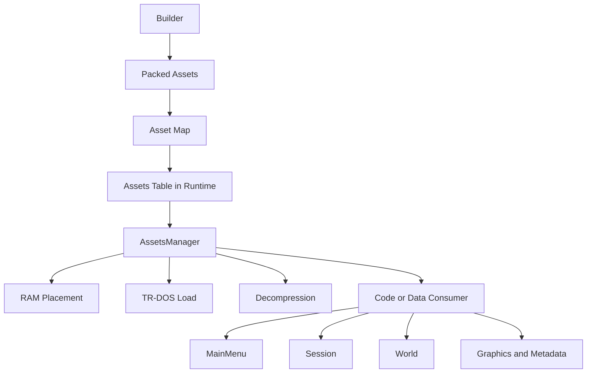

# 16. Главный Архитектурный Подход Проекта

## Назначение Главы

Эта глава формулирует ту идею, вокруг которой фактически собран весь проект.
Её важно проговорить отдельно, потому что без неё репозиторий легко воспринимается как просто большой набор asm-файлов, ресурсов и упаковочных скриптов.

На самом деле у проекта есть очень сильный и достаточно редкий подход:
он строится как asset-centric, page-oriented runtime-система.

Именно это и есть тот “супер мощный подход”, который нужно видеть при чтении всего остального кода.

## Короткая Формула Подхода

Проект мыслит не так:
- есть резидентная программа;
- рядом лежат данные;
- изредка что-то грузится с диска.

Проект мыслит так:
- есть единое пространство assets;
- assets могут быть и данными, и исполняемым кодом;
- build-time заранее подготавливает их к прямому runtime-потреблению;
- runtime через общий механизм размещает, загружает, распаковывает и исполняет их в page-based памяти.

То есть здесь asset — это не “файл с картинкой”.
Это базовая единица поставки и потребления содержимого проекта.

## Почему Это Важнее Обычного “Менеджера Ресурсов”

Во многих проектах менеджер ассетов — это вспомогательная подсистема.
Здесь всё иначе.

В HoMM asset layer задаёт:
- способ сборки проекта;
- формат поставки code/data на диск;
- способ размещения в памяти;
- способ переключения крупных runtime-состояний;
- язык, которым модульный dispatcher разговаривает с исполняемым кодом.

Иначе говоря, asset model здесь является не периферией, а одним из архитектурных центров системы.

## Первая Ось Подхода: Code И Data Существуют В Одном Пространстве

Самая сильная мысль проекта состоит в том, что исполняемый код не отделён принципиально от остальных ресурсов.

В asset-space одновременно живут:
- кодовые блоки `Core`, `MainMenu`, `Session`, `World`;
- графические пакеты;
- metadata;
- текстовые ресурсы.

Все они упаковываются, получают `AssetID`, фиксируются в asset-map и затем могут быть подняты через один общий runtime-механизм.

Это резко отличается от более привычной модели, где код “всегда уже в памяти”, а ассеты — только графика и контент.

## Вторая Ось Подхода: Builder И Runtime Говорят На Одном Языке

В проекте Builder — это не изолированный внешний конвейер.
Он заранее формирует ту модель, с которой потом живёт runtime.

Builder:
- группирует ресурсы;
- упаковывает их;
- разбивает по категориям `Code`, `Graphics`, `Metadata`, `Text`;
- строит asset-map;
- подготавливает дисковое размещение.

Runtime потом не повторяет эту работу заново.
Он получает уже готовую карту ресурсов и начинает мыслить не именами файлов, а короткими идентификаторами и дисковыми координатами.

Это и есть сильный инженерный ход:
дорогая часть организации информации выносится в сборку, а рантайм получает максимально дешёвую форму потребления.

## Третья Ось Подхода: Память Проектируется Явно

Проект не прячет память за абстракцией heap или “просто выделим буфер”.
Он мыслит ею явно:
- есть страницы по 16 КБ;
- есть конкретные адресные окна;
- есть служебная страница `AssetManager`;
- есть bitmask `AvailableMem`;
- есть deploy-блоки и копирование кода в рабочие области.

Это означает, что память в проекте — не вторичный технический факт, а такой же объект архитектуры, как модуль или структура данных.

## Четвёртая Ось Подхода: Модули Являются Загружаемыми Сценами

`MainMenu`, `World` и частично `Session` нельзя понимать как просто папки с кодом.
Они живут как загружаемые runtime-assets.

Это даёт несколько очень сильных эффектов.

### Эффект 1. Большие блоки логики не обязаны быть всегда резидентными

Можно держать постоянным только необходимый скелет рантайма, а тяжёлые смысловые блоки подтягивать тогда, когда они действительно нужны.

### Эффект 2. Переход между крупными состояниями выражается единым языком

Переход в `MainMenu` и переход в `World` — это не два разных инженерных мира.
Они описываются как вариации одного и того же asset-execution подхода.

### Эффект 3. Scene setup становится частью runtime-композиции

Launch-фазы модулей не просто “входят в функцию”, а собирают окружение:
- копируют deploy-код;
- выставляют loop/render/interrupt handlers;
- поднимают нужные таблицы и shared-screen блоки;
- подключают ввод и рендер.

## Пятая Ось Подхода: Контракты Важнее Локальных Реализаций

Этот проект невозможно понять, глядя только на `Source/`.
Слишком многое определяется заранее на уровне `Includes/`:
- layout структур;
- memory maps;
- page identifiers;
- kernel bindings;
- asset macros;
- bit layout полей.

Из-за этого подход проекта можно назвать contract-first.
`Source/` не изобретает систему заново, а исполняет уже описанную контрактами модель.

## Шестая Ось Подхода: Диспетчеры Тонкие, Нагрузка Вынесена В Payload

Очень характерный признак проекта — компактные `Execute`-слои.
Они часто делают совсем немного:
- выбирают asset page;
- указывают `AssetID`;
- вызывают общий механизм загрузки/исполнения.

Вся “тяжесть” уезжает в:
- loadable code-assets;
- launch-подготовку;
- runtime subsystems;
- shared code blocks.

Это хороший способ удерживать постоянное ядро небольшим и не распухать в одном огромном резидентном модуле.

## Диаграмма Подхода

## Где В Этой Модели Находится `AssetsManager`

Именно здесь становится видно, почему `AssetsManager` нельзя называть просто вспомогательным loader'ом.

Он выполняет сразу несколько ролей:
- индексатор asset-space;
- allocator RAM-области;
- loader с диска;
- переключатель страниц;
- распаковщик архивных payload'ов;
- поставщик runtime-контекста для загруженного ресурса;
- механизм передачи управления code-assets.

То есть `AssetsManager` — это реальный operational engine asset-centric архитектуры.

## Где В Этой Модели Находится `GameState`

`GameState` в этой архитектуре играет роль оперативного зеркала текущего системного состояния.
Он хранит не только input и render-флаги, но и контекст последнего загруженного ассета.

Это важно, потому что asset-runtime здесь встроен в главный цикл приложения, а не существует где-то отдельно сбоку.

## Где В Этой Модели Находится AI

AI вписывается в ту же общую логику.
Сначала система организует:
- участника;
- персонажа;
- объект на карте;
- AI-runtime контекст.

Затем уже модуль мира и его runtime-слой могут использовать эти данные.

То есть даже AI здесь живёт не в изоляции, а внутри того же page-based, asset-driven рантайма.

## Почему Подход Можно Назвать Очень Сильным

У него есть несколько реально мощных качеств.

### 1. Высокая плотность архитектуры

Одна и та же система решает сразу много задач:
- поставка ресурсов;
- кодовая модульность;
- экономия памяти;
- быстрый lookup;
- прямой запуск code-assets.

### 2. Хорошая масштабируемость контента

Когда код, графика, metadata и текст уже живут как assets, проекту проще расти без полного пересмотра модели поставки.

### 3. Сильная связь сборки и исполнения

Это убирает лишние прослойки и делает runtime дешевле.

### 4. Естественная поддержка page-based платформы

Архитектура не борется с ограничениями платформы, а строится вокруг них.

## Цена Такой Мощности

Однако у подхода есть и цена.

### Цена 1. Высокая когнитивная плотность

Многое связано одновременно:
- Builder;
- memory map;
- asset macros;
- runtime-dispatch;
- page switching;
- launch/deploy модели.

Новому разработчику трудно увидеть систему целиком с одного взгляда.

### Цена 2. Ошибки редко локальны

Если ломается asset contract, это может задеть:
- упаковку;
- таблицу ресурсов;
- загрузку;
- page selection;
- запуск модуля;
- декомпрессию.

### Цена 3. Компактность усложняет чтение

Многие поля и макросы очень плотные по смыслу.
Для сильной runtime-модели это оправдано, но цена в читаемости существует.

## Архитектурный Вывод

Главная идея проекта — это не просто “у нас есть ассеты”.
Главная идея проекта в том, что asset-space является общим языком для:
- поставки содержимого;
- модульного исполнения;
- page-based размещения;
- перехода между крупными состояниями игры.

Именно поэтому разбор `FAssets` и `AssetsManager` нужен не как приложение к общей архитектуре, а как её центральная ось.
