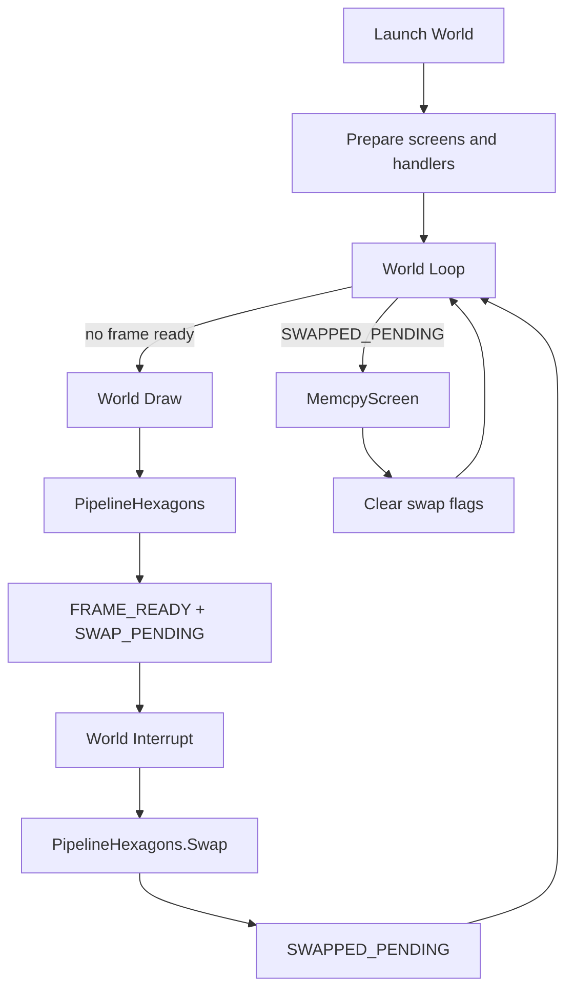

# 18. Rendering pipeline и двойная буферизация

## Назначение главы

Эта глава разбирает rendering pipeline проекта как целостную систему.
Важно сразу зафиксировать главный тезис:
в HoMM рендер не сводится к одной процедуре `Draw`.

Он состоит из нескольких связанных фаз:
- подготовка экранной среды;
- запуск draw-фазы через main loop;
- построение display data;
- отрисовка гексагонов и объектов;
- анализ dirty-зон;
- двухфазное переключение экранов;
- копирование обновлённых блоков в теневой экран;
- отдельный подпоток восстановления и перерисовки курсора в прерывании.

Именно поэтому правильнее говорить не "функция отрисовки", а "rendering pipeline".

## Почему у проекта вообще есть отдельный pipeline

Платформа диктует жёсткие ограничения:
- экранная память дорога;
- полная перерисовка всего окна каждый кадр слишком затратна;
- одновременно нужно поддерживать интерактивный курсор;
- нельзя позволить видимые артефакты на экране при переносе больших блоков данных.

Ответ проекта на эти ограничения — двухэкранная модель и staged rendering.

Система не пытается каждый раз:
- целиком заново рисовать всё в видимый экран;
- мгновенно и без анализа переключать буферы.

Вместо этого она строит управляемый конвейер:
- базовый экран выступает как экран сборки нового кадра;
- теневой экран выступает как стабильный видимый буфер;
- обновляются не все области, а только вычисленные dirty-блоки;
- курсор живёт поверх этого как отдельный небольшой pipeline.

## Главные участники render-пайплайна

Чтобы понимать дальнейшие шаги, полезно перечислить основные runtime-компоненты.

### Флаги `GameState.Render`

Именно они управляют глобальным состоянием кадра:
- `FRAME_READY_BIT`
- `SWAP_PENDING_BIT`
- `SWAPPED_PENDING_BIT`
- `SWAP_TARGET_BITS`
- `SWAP_DISABLE_BIT`
- `FPS_DISABLE_BIT`

Это не второстепенные биты.
Они формируют state-machine всего экранного цикла.

### Главный цикл мира

`Source/World/Loop.asm` решает:
- можно ли начинать новый draw;
- нужно ли завершить длинный swap;
- пора ли уступить управление отрисовщику.

### Прерывание мира

`Source/World/Interrupt.asm` отвечает за:
- финализацию swap;
- восстановление и перерисовку курсора;
- input scan;
- периодические tick-счётчики;
- глобальный tick мира.

### Draw-фаза мира

`Source/World/Render/Draw.asm` запускает предметную часть кадра:
- события;
- UI;
- обновление буферов;
- fog;
- pipeline гексагонов;
- отрисовку объектов;
- миникарту;
- debug-оверлеи.

### SharedScreen-подсистема

Отдельный слой в `Source/Modules/World/SharedScreen/` занимается:
- анализом изменённых гексагонов;
- вычислением dirty screen blocks;
- копированием только нужных блоков из базового экрана в теневой.

Именно здесь появляется настоящая экономия времени.

## Базовая экранная модель

Проект различает два экрана:
- базовый;
- теневой.

Через макросы памяти это выражается так:
- `SET_PAGE_SCREEN_BASE`
- `SET_PAGE_SCREEN_SHADOW`
- `SHOW_BASE_SCREEN`
- `SHOW_SHADOW_SCREEN`
- `SWAP_SCREEN`

На уровне архитектуры это значит следующее:
- один экран можно использовать как рабочую поверхность;
- второй — как стабильный, уже показанный пользователю буфер;
- между ними можно не только мгновенно переключаться, но и копировать данные частями.

Эта модель особенно важна для `World`, потому что там вместе существуют:
- большая игровая область;
- спрайтовые объекты;
- туман;
- рамка и орнамент;
- курсор;
- движение карты.

## Подготовка экранной среды при запуске мира

Render pipeline мира начинается не в `Draw`, а раньше — в `Source/Modules/World/Graphics/Display_GameWindow.asm`.

Этот файл делает несколько важных шагов:
- очищает базовый экран;
- очищает атрибуты базового экрана;
- рисует рамку игрового окна;
- показывает базовый экран;
- копирует его содержимое в теневой;
- переводит консоль в режим рисования сразу в оба экрана;
- показывает теневой экран.

Это означает, что мир стартует не "с нуля", а с уже синхронизированной парой экранов:
- базовый содержит исходную геометрию окна;
- теневой получает её копию;
- пользователь сразу видит стабильную экранную структуру.

Такой старт важен для всего последующего пайплайна.
Без него дальнейшее частичное обновление блоков не имело бы надёжной опоры.

## Как `Launch` встраивает render pipeline в runtime

`Source/Modules/World/Launch.asm` делает не только загрузку ассета мира.
Он собирает runtime-среду для пайплайна:
- копирует deploy-блок мира;
- разворачивает shared-screen код на отдельной странице;
- генерирует lookup tables;
- загружает спрайты;
- отображает игровое окно;
- настраивает loop, swap, render entrypoint и interrupt handler;
- включает нужный режим render flags.

Ключевые строки:
- `SET_MAIN_LOOP World.Base.Loop`
- `SET_MAIN_SWAP World.Base.Render.PipelineHexagons.Swap`
- `SET_WORLD_RENDER World.Base.Render.Draw`
- `SET_USER_HANDLER World.Base.Interrupt`
- `SET_RENDER_SHADOW`

То есть pipeline начинается с того, что модуль `World` встраивает свои обработчики в общую управляющую схему приложения.

## Каркас рендер-цикла: роль `World.Base.Loop`

`Source/World/Loop.asm` — это диспетчер render-цикла.
Он не рисует сам, а регулирует, в какую фазу система имеет право войти.

Логика цикла очень показательная.

### Шаг 1. Проверить, завершён ли длинный swap

Сначала цикл смотрит `SWAPPED_PENDING_BIT`.
Если этот бит установлен, управление немедленно уходит в `World.Base.Render.PipelineHexagons.MemcpyScreen`.

Это значит:
- новый draw запускать ещё нельзя;
- сначала нужно завершить перенос dirty-блоков в теневой экран.

### Шаг 2. Проверить, готов ли кадр

Если установлен `FRAME_READY_BIT`, но длинный swap ещё не завершён, цикл просто выходит.
Тем самым он запрещает запуск нового render-pass до завершения текущего экранного цикла.

Это очень важная защита.
Без неё система могла бы начать собирать следующий кадр поверх ещё не зафиксированного предыдущего.

### Шаг 3. Проверить `ML_EXIT_BIT`

После этого loop проверяет флаг выхода из текущего цикла.
Дальнейший переход на `FuncDraw` зависит уже от общего состояния main-loop, а не только от render-флагов.

### Шаг 4. Вызвать текущий draw-handler

Через patch-point `.FuncDraw` loop переходит в фактическую draw-фазу мира.

Итак, `World.Base.Loop` — это gatekeeper:
- он не даёт рендеру начаться слишком рано;
- он принудительно завершает незакрытые экранные операции;
- он удерживает чистую последовательность кадров.

## Внутренние фазы `World.Base.Render.Draw`

`Source/World/Render/Draw.asm` делит кадр на несколько логических состояний:
- transition;
- enter;
- update;
- tick.

Даже если не все из них всегда содержат активную логику, само разделение важно: render не является монолитной процедурой.

## Фаза `Enter`

На первом входе мир делает тяжёлую начальную подготовку:
- сбрасывает возможность восстановления фона курсора;
- очищает screen blocks;
- инициализирует события;
- устанавливает исходную позицию tilemap;
- делает разведку видимости;
- принудительно перестраивает tilemap- и render-буферы;
- генерирует display list;
- строит и копирует миникарту;
- обновляет миникарту на теневом экране.

Именно здесь pipeline создаёт первый полноценный набор данных для последующего кадра.

Важно, что эти действия не размазаны по всему проекту.
Они сконцентрированы в `Enter` и тем самым образуют явную фазу "холодного старта" мира.

## Фаза `Tick`

Основной рабочий кадр происходит в `Tick`.
Он включает:
- `Event.Handler.Before`
- `UI.Update`
- обновление движения карты;
- условную перестройку render/tilemap buffers;
- `Fog.Make`
- `Fog.Tick`
- `PipelineHexagons`
- `Event.Handler.After`
- debug-оверлеи;
- сброс флагов main loop.

Это хорошо показывает, что draw-фаза в проекте включает не только рисование пикселей.
Она отвечает за полную подготовку визуального состояния мира на данный кадр.

## Почему здесь есть tilemap- и render-буферы

Рендер не работает напрямую с "сырой картой".
Между картой и экраном есть промежуточные представления.

### TilemapBuffer

Это близкий к карте буфер, в котором отражается видимая часть тайлов.
Он обновляется, когда смещается отображаемая область или меняются исходные данные карты.

### RenderBuffer

Это уже не просто карта, а подготовленные данные для отображения:
- флаг принудительного обновления гексагона;
- флаг тумана;
- служебные анимационные и высотные данные;
- информация о столбцах, которые требуют обновления.

Такой буфер нужен потому, что rendering pipeline мира оперирует не "объектом карты вообще", а уже нормализованным набором признаков, пригодных для быстрой экранной обработки.

## Центральное ядро пайплайна: `PipelineHexagons`

`Source/World/Render/PipelineHexagons.asm` — это сердце визуального конвейера мира.
Именно здесь предметная логика мира превращается в готовый экранный результат.

Его последовательность можно читать почти как план кадра.

### Шаг 1. Переключиться на базовый экран

`Convert.SetBaseScreen` означает, что сборка нового кадра идёт на рабочем экране.

### Шаг 2. Вычислить границы видимого мира

`SetViewBound` подготавливает область карты, которая вообще может участвовать в текущем кадре.

### Шаг 3. Собрать список видимых объектов

Далее формируется список объектов в зоне видимости и при необходимости выставляются грязные окружения через `DirtyEnvir`.

Это уже мост между tile-слоем и object-layer.

### Шаг 4. Подготовить render buffer по колонкам

`AdjRenderBufCol` корректирует столбцы render-buffer'а перед фактическим рисованием.

### Шаг 5. Нарисовать гексагоны

`Draw.HexByDL` исполняет тяжёлую фазу визуализации карты.
На этом этапе строится основа игрового кадра.

### Шаг 6. Проанализировать dirty screen blocks

После отрисовки карта передаётся в `ScreenBlock.HexAnalysis`.
Это чрезвычайно важный шаг: система не просто нарисовала кадр, она тут же оценивает, какие экранные блоки реально изменились и требуют переноса в теневой экран.

### Шаг 7. Нарисовать объекты

Если есть видимые объекты, после анализа гексагонов вызывается `Object.Draw`.
Так мир получает свои динамические сущности поверх базового ландшафта.

### Шаг 8. Дорисовать орнамент окна

`World.Display.GameWindow.Ornament` восстанавливает внутренний декоративный слой рамки.
Это не мелочь: рамка и внутренняя отделка остаются частью целостной композиции экрана.

### Шаг 9. Пометить кадр как готовый

В конце pipeline выставляет:
- `FRAME_READY_BIT`
- `SWAP_PENDING_BIT`

И сбрасывает `FORCED_FRAME_UPDATE_BIT`.

Это значит:
- новый кадр собран на базовом экране;
- теперь нужно перевести его в фазу показа и синхронизации со вторым экраном.

## Почему анализ dirty-блоков вообще нужен

Полная копия всего игрового окна на каждый кадр была бы слишком дорогой.
Проект решает задачу иначе:
- каждый изменившийся гексагон оставляет след в render-buffer;
- по этим следам вычисляются затронутые screen blocks;
- в теневой экран переносятся только нужные области.

Это и есть главное отличие зрелого pipeline от "просто двойной буферизации".
Здесь не два полных экрана бездумно меняются местами.
Здесь один экран частично догоняет другой через анализ изменённых зон.

## `HexagonUpdateAnalysis`: как вычисляются dirty-блоки

`Source/Modules/World/SharedScreen/Screen/HexagonUpdateAnalysis.asm` — это аналитическая фаза pipeline.

Она решает задачу:
- взять display list;
- пройти по гексагонам;
- посмотреть, какие из них были реально обновлены;
- используя данные о высоте колонок, определить, какие screen blocks пересекаются с изменением;
- увеличить счётчики соответствующих screen blocks.

Это означает, что dirty-модель здесь не плоская.
Система учитывает не только "гексагон изменился", но и то, как его реальная высота и геометрия затрагивают соседние экранные блоки.

Для гексагональной карты это особенно важно.
Прямоугольный тайл можно было бы отслеживать намного проще.
Здесь же форма гексагона и высоты приводят к более сложной картине перекрытия.

## `MemcpyScreenBlocks`: как dirty-блоки догоняют теневой экран

`Source/Modules/World/SharedScreen/Screen/MemcpyScreenBlocks.asm` берёт массив `Adr.ScreenBlock` и проходит по 16 блокам игрового окна.

Если счётчик блока ненулевой:
- блок считается dirty;
- счётчик сбрасывается;
- вызывается специализированный memcpy-обработчик нужной геометрии.

Особенности реализации:
- окно разбито на блоки 6x6, 6x4, 4x6 и 4x4 знакомест;
- для каждого блока заранее описан маршрут копирования;
- используются специальные memcpy-пути вроде `Memcpy.Screen_6` и `Memcpy.Screen_4`.

То есть копирование dirty-зон здесь уже заранее "скомпилировано" под геометрию окна.
Это очень системный, заранее спроектированный подход.

## Длинный двухфазный swap

Мир использует не мгновенный swap, а длинный двухфазный экранный цикл.
Это одно из ключевых мест всей архитектуры рендера.

### Фаза 1. Кадр собран

После `PipelineHexagons` установлены:
- `FRAME_READY_BIT`
- `SWAP_PENDING_BIT`

Это сигнал: кадр на базовом экране готов, но ещё не финализирован для стабильного двуэкранного состояния.

### Фаза 2. Прерывание инициирует swap

В `Source/World/Interrupt.asm`, если `FRAME_READY_BIT` установлен, вызывается `Render.Swap`.
Через `SET_MAIN_SWAP` этот путь направлен не в обычный `Bootloader.EntryPoint.Swap.RET`, а в `World.Base.Render.PipelineHexagons.Swap`.

### Фаза 3. Мир показывает базовый экран

`PipelineHexagons.Swap` делает две вещи:
- ставит `SWAPPED_PENDING_BIT`;
- показывает базовый экран.

То есть пользователю показывается уже собранный кадр, но работа pipeline ещё не закончена.

### Фаза 4. Следующий оборот loop завершает перенос

На следующем заходе `World.Base.Loop` видит `SWAPPED_PENDING_BIT` и вместо нового draw прыгает в `PipelineHexagons.MemcpyScreen`.

Там выполняется:
- блокировка курсорного memcpy-gate;
- перенос dirty screen blocks в теневой экран;
- при необходимости восстановление фона под курсором;
- снятие `SWAPPED_PENDING` и `SWAP_PENDING`.

После этого:
- теневой экран синхронизирован с новым кадром;
- курсорный буфер снова можно использовать;
- pipeline готов к следующей полной итерации.

Именно поэтому swap здесь "длинный":
он распределён между interrupt-фазой и следующим оборотом главного цикла.

## Роль курсора как отдельного микропайплайна

Курсор в мире не является случайным мелким дополнением.
У него есть собственный экранный жизненный цикл.

### В начале interrupt-фазы

Мир переключается на теневой экран и пытается восстановить фон под курсором через `Draw.Restore`.
Но это разрешено не всегда.
Перед этим вызывается `Render.CursorMemcpyGate`.

Если gate закрыт, путь восстановления пропускается.

### Во второй части interrupt-фазы

Если gate не запрещает работу с курсором, вызываются:
- `UI_Cursor.Update`
- `UI_Cursor.Draw`

То есть курсор живёт именно в прерывании, а не в основной draw-фазе.

### Во время `MemcpyScreen`

Перед переносом dirty-блоков pipeline явно делает:
- `SET_FLAG_MODIFY CursorMemcpyGate.Flag`

Это закрывает gate и запрещает вмешательство курсорного буфера, пока теневой экран догоняет базовый.

После завершения переноса выполняется:
- `RES_FLAG_MODIFY CursorMemcpyGate.Flag`

И курсорный микропоток снова разрешается.

Это очень аккуратный пример того, как rendering pipeline и macro-system соединяются в одном инженерном решении.

## Почему `World` сложнее, чем `MainMenu`

Для сравнения полезно посмотреть `MainMenu`.

Там pipeline намного проще:
- `Draw` фактически поднимает `FRAME_READY_BIT`;
- interrupt видит готовый кадр и вызывает обычный `Render.Swap`;
- нет shared-screen анализа dirty-блоков;
- нет длинного двухфазного swap;
- нет сложной world-tile/object композиции.

Это подчёркивает, что усложнение рендера не является общей обязанностью всей игры.
Оно сосредоточено там, где действительно нужно: в `World`.

## Rendering pipeline как state machine

Если свести всю механику к крупным состояниям, получится такая схема:

Это полезная перспектива.
Она показывает, что рендер здесь живёт не как функция, а как явная машина состояний.

## Где именно заканчивается кадр

Важный практический вопрос: в какой точке кадр считается завершённым?

В этом проекте ответ многоступенчатый.

Кадр проходит несколько рубежей:
- draw-phase закончила построение содержимого;
- `FRAME_READY_BIT` помечает экран как готовый;
- interrupt запускает swap-фазу;
- базовый экран становится видимым;
- dirty-блоки копируются в теневой;
- swap-флаги снимаются;
- только после этого система действительно готова к следующему кадру.

То есть "конец кадра" здесь — не одна инструкция, а завершение всей последовательности синхронизации двух экранов.

## Почему этот pipeline силён архитектурно

### 1. Он выражен как последовательность фаз

В проекте можно указать:
- где начинается build нового кадра;
- где ставится признак готовности;
- где происходит swap;
- где завершается синхронизация второго экрана.

Это делает систему объяснимой.

### 2. Он оптимизирует перенос данных

Проект не копирует игровую область целиком без разбора.
Он вычисляет dirty-зоны и переносит только нужные screen blocks.

### 3. Он развёл предметный рендер и экранную синхронизацию

`Draw` отвечает за содержание кадра,
а shared-screen и interrupt-path — за его безопасную доставку пользователю.

### 4. Он умеет сосуществовать с курсором

Курсор не ломает экранную синхронизацию именно потому, что вынесен в отдельный микро-пайплайн с собственным gate-механизмом.

## Главные хрупкие места pipeline

### Тесная связка loop, interrupt и macro-patching

Rendering pipeline зависит не от одного файла, а от согласованной работы:
- `World/Loop.asm`
- `World/Interrupt.asm`
- `World/Render/Draw.asm`
- `World/Render/PipelineHexagons.asm`
- `SharedScreen/*`
- `Game_Render.inc`
- `Game_MainSwap.inc`

Ошибка в одном из контрактов быстро ломает весь цикл.

### Сильная зависимость от флаговой дисциплины

Если бит `FRAME_READY_BIT`, `SWAP_PENDING_BIT` или `SWAPPED_PENDING_BIT` будет выставлен или сброшен не в той точке, система получит:
- повторный draw слишком рано;
- незавершённый swap;
- рассинхронизацию экранов;
- артефакты курсора.

### Высокая стоимость случайной правки patch-point'ов

Рендер мира не просто вызывает функции.
Он зависит от патчей адресов и макросов переключения поведения.
Поэтому локальная "невинная" правка в loop/swap/interrupt может иметь непропорционально большой эффект.

## Практический вывод

Rendering pipeline HoMM — это одна из самых зрелых и интересных подсистем проекта.
Он объединяет:
- подготовку кадра;
- гексагональный draw;
- object-layer;
- анализ dirty-зон;
- двуэкранную синхронизацию;
- специальный interrupt-поток;
- cursor sub-pipeline;
- self-modifying gates.

Именно поэтому его нельзя описывать словом "отрисовка".
Это полноценная экранная машина состояний, тесно связанная с layout памяти, макро-системой и общей философией asset-centric runtime.
