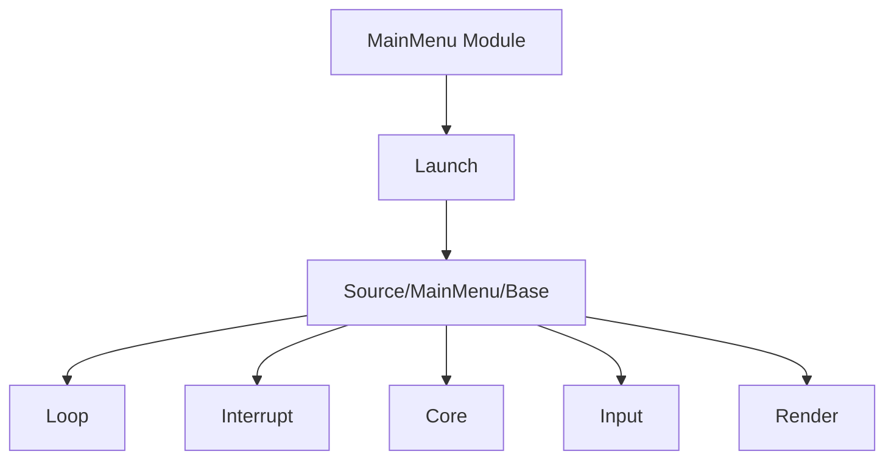

# 23. Модуль MainMenu

## Назначение главы

Эта глава разбирает `MainMenu` как первое полноценное runtime-состояние после базовой инициализации.
Очень важно понимать: в проекте главное меню — это не просто картинка с обработкой пары кнопок, а полноценный модуль со своим loop, render и interrupt handler.

## Два уровня `MainMenu`

У меню есть два архитектурных уровня:
- модульный уровень в `Source/Modules/MainMenu/`;
- shared/runtime уровень в `Source/MainMenu/`.

Это типичный паттерн проекта:
модульный слой отвечает за загрузку и разворачивание, а shared/runtime слой — за внутреннюю логику состояния.

## Execute-Фаза

`Source/Modules/MainMenu/Execute.asm`:
- включает страницу assets;
- загружает `ASSETS_ID_MAIN_MENU`;
- запускает модуль.

Это уровень диспетчеризации asset-модуля.

## Launch-Фаза

`Source/Modules/MainMenu/Launch.asm` делает уже содержательную работу:
- сохраняет страницу загруженного asset'а;
- копирует deploy-блок меню в рабочую область;
- устанавливает main loop;
- устанавливает lifecycle flags;
- назначает render;
- назначает interrupt handler;
- разрешает ввод;
- разрешает смену экранов;
- разрешает FPS;
- задаёт позицию мыши.

### Главный вывод

`MainMenu` — полноценное runtime-состояние, а не разовый вызов экранной функции.

## Shared Runtime слой `Source/MainMenu/`

`Source/MainMenu/Include.inc` собирает модуль `Base` и включает:
- `Loop.asm`
- `Interrupt.asm`
- `Core/Include.inc`
- `Input/Include.inc`
- `Render/Include.inc`

Это показывает очень чёткую внутреннюю структуру меню.

## Подмодуль `Core`

`Source/MainMenu/Core/Include.inc` сейчас содержит `ReleaseAsset.asm`.

### Что это говорит

Даже внутри меню выделен mini-core слой, связанный с освобождением ресурсов.
То есть menu-runtime отвечает не только за ввод и рисование, но и за корректное управление asset lifecycle.

## Подмодуль `Input`

`Source/MainMenu/Input/Include.inc` собирает input-layer меню и включает `Scan.asm`.

### Смысл

Меню имеет свой локальный входной слой, а не делит без оговорок всю input-логику мира.

## Подмодуль `Render`

`Source/MainMenu/Render/Include.inc` включает `Draw.asm`.

### Смысл

У меню есть собственная техника визуального вывода, отделённая и от input, и от модульного запуска.

## Почему `MainMenu` архитектурно важно

Меню показывает зрелость архитектуры проекта.
Если бы система была устроена слабо, меню было бы просто отдельной процедурой рисования и чтения клавиш.
Здесь же оно живёт как полноценный режим приложения.

Это хорошо, потому что:
- одинаковый язык состояния можно применять и к меню, и к миру;
- loop/render/interrupt модель становится универсальной;
- переходы между состояниями проще поддерживать концептуально.

## Диаграмма внутренней структуры

## Практический итог главы

`MainMenu` — это первое полное runtime-состояние проекта. Оно загружается как asset, разворачивает свой код в рабочую память и живёт как самостоятельный режим системы со своим loop, render, input и interrupt слоем. Это очень сильный архитектурный паттерн, который потом продолжается в `World`.
