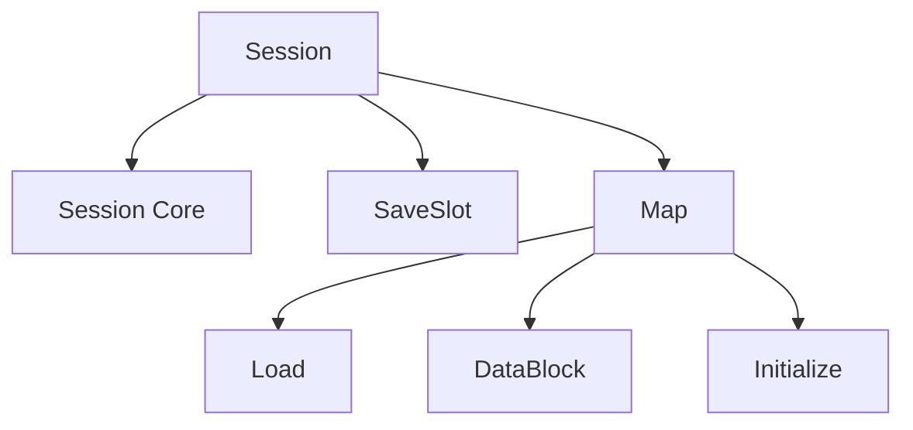

# 24. Модуль Session

## Назначение главы

Эта глава разбирает `Session` как переходный и подготовительный модуль между интерфейсным состоянием и реальным игровым миром.
Это один из самых важных модулей проекта, потому что именно здесь собирается конкретная игровая сессия.

## Почему `Session` нельзя считать просто “загрузкой карты”

По структуре каталогов видно, что модуль покрывает не только карту.
Внутри него присутствуют:
- `Kernel`
- `Core`
- `Utilities`
- `Map`
- `SaveSlot`
- `Session.inc`

То есть это целый слой подготовки runtime-среды сессии.

## Execute-Фаза

`Source/Modules/Session/Execute.asm` принимает идентификатор запускаемой функции в регистре `A`.

### Почему это важно

В отличие от `MainMenu` и `World`, `Session` задуман как более многофункциональный модуль.
Он не просто “загружается и запускается целиком”, а служит контейнером для нескольких session-операций.

## Launch-Фаза

`Source/Modules/Session/Launch.asm`:
- сохраняет страницу asset'а;
- извлекает фактический адрес функции из `GameState.Assets`;
- передаёт управление по адресу.

### Что это значит

`Session` работает как dispatch layer для набора session-функций.
Это делает модуль более похожим на functional service block, чем на один экранный runtime-state.

## Shared слой `Session.inc`

`Source/Modules/Session/Session.inc` собирает shared code block и включает:
- `Map/Include.inc`
- `Core/Include.inc`
- `SaveSlot/Include.inc`

### Смысл

Сессия состоит как минимум из трёх крупно тематических подсистем:
- работы с картой;
- служебного core-слоя;
- работы со слотами сохранения.

## `Session/Core`

`Source/Modules/Session/Core/Include.inc` включает:
- `ReleaseAsset.asm`
- `Initialize_TR-DOS.asm`

### Роль

Это service-layer сессии.
Он отвечает за инфраструктурную сторону session-операций, а не за содержимое карты как таковое.

## `Session/SaveSlot`

`Source/Modules/Session/SaveSlot/Include.inc` собирает модуль из файлов:
- `Make.asm`
- `Load.asm`
- `Save.asm`
- `Validation.asm`

### Что это говорит

Система сохранений уже задумана как отдельная целостная подсистема, а не как одиночная функция “записать файл”.
Она различает:
- создание структуры слота;
- загрузку;
- сохранение;
- валидацию.

Это очень хороший признак зрелости дизайна.

## `Session/Map`

`Source/Modules/Session/Map/Include.inc` включает:
- `Load/Include.inc`
- `DataBlock/Include.inc`
- `Initialize/Include.inc`
- `Load_Map.asm`
- `Utilities.asm`

### Что это значит

Map-layer сессии разделён минимум на три разные стадии:
- загрузка данных;
- работа с data blocks;
- инициализация runtime-представления карты.

## `Map/Load`

Включает:
- `Metadata.asm`
- `BaseGraphics.asm`
- `GraphicsPackages.asm`

Это означает, что на фазе загрузки карта рассматривается как совокупность не только layout-данных, но и метаданных и графических пакетов.

## `Map/DataBlock`

Включает:
- `Hextile.asm`
- `Objects.asm`
- `HextileTable.asm`
- `GraphicPack.asm`

Здесь видно, что карта разбивается на отдельные operational block'и данных:
- геометрия/тайлы;
- объекты;
- таблицы тайлов;
- графические пакеты.

## `Map/Initialize`

Включает:
- `Initial.asm`
- `Objects.asm`
- `BaseGraphics.asm`
- `GraphicsPackages.asm`
- `TG_MapAdrTable.asm`

### Смысл

После загрузки карта должна быть не просто прочитана, а приведена к runtime-форме.
Именно это и делает слой initialize.

Особенно важно наличие генерации таблицы адресов карты — это значит, что часть runtime-структур мира конструируется специально под удобство и скорость дальнейшего доступа.

## Почему `Session` архитектурно особенно важен

`Session` соединяет несколько больших миров проекта:
- файловую/asset-подготовку;
- карту;
- графические пакеты;
- данные объектов;
- сохранения;
- переход к миру.

Если `Core` подготавливает среду вообще, то `Session` подготавливает конкретную игровую реальность.

## Диаграмма внутренней структуры

## Практический итог главы

`Session` — это preparatory runtime module высокого значения. Он не просто загружает карту, а собирает игровую сессию из метаданных, графики, data blocks, save/load механики и служебной инфраструктуры. Именно он превращает абстрактный проект в конкретную партию, которая затем передаётся миру.

