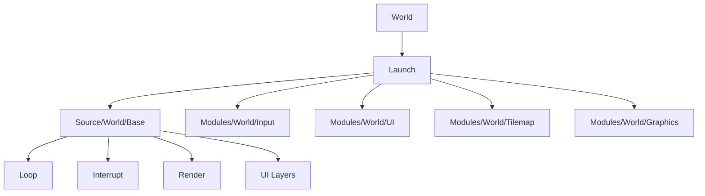

# 25. Модуль World

## Назначение главы

Эта глава посвящена `World` — самому насыщенному и центральному runtime-модулю проекта.
Если `MainMenu` задаёт интерфейсное состояние, а `Session` готовит данные сессии, то `World` — это уже собственно активный игровой мир.

## Почему `World` центральный

Именно в `World` встречаются:
- игровой loop;
- interrupt handler;
- render pipeline;
- tilemap-логика;
- UI мира;
- sprite-слой;
- input-обработка;
- world-object rendering;
- shared screen механика;
- генерация служебных таблиц.

То есть это не просто один из модулей. Это основная runtime-сцена игры.

## Два уровня `World`

Как и у `MainMenu`, здесь есть два слоя:
- модульный слой `Source/Modules/World/`;
- shared/runtime слой `Source/World/`.

### Модульный слой

Отвечает за загрузку, разворачивание, deploy-копирование и настройку окружения мира.

### Shared/runtime слой

Содержит постоянный для runtime код самого мира: loop, interrupt, render, tilemap и связанные механики.

## Execute-Фаза

`Source/Modules/World/Execute.asm`:
- переключает страницу assets;
- загружает asset мира;
- запускает его.

Это уровень asset-dispatch и перехода в мир.

## Launch-Фаза

`Source/Modules/World/Launch.asm` — один из самых информативных файлов проекта.
Он показывает, что запуск мира включает не просто вызов `World.Base.Loop`, а целую последовательность сборки runtime-среды.

### Что делает Launch

- сохраняет страницу asset'а мира;
- скрывает основной экран атрибутами;
- копирует deploy-блок мира;
- копирует код shared-screen слоя на отдельную страницу;
- генерирует и копирует служебные таблицы;
- инициализирует спрайты персонажей и курсора;
- отображает игровое окно;
- устанавливает главный loop мира;
- устанавливает render pipeline мира;
- устанавливает interrupt handler;
- разрешает input scan;
- настраивает render flags и shadow-screen;
- инициализирует позицию мыши.

### Почему это ключевой файл архитектуры

Он показывает реальную философию проекта:
мир не просто “существует”, а собирает часть своей среды исполнения динамически при старте.

## `Source/Modules/World/Include.inc`

Этот include-файл подключает:
- `Kernel_Bind.inc`
- `Launch.asm`
- `UI/Include.inc`
- `Input/Include.inc`
- `Tilemap/Include.inc`
- `Graphics/Include.inc`
- генераторы таблиц
- hexagon utilities
- deploy-блоки `Sprite`, `World`, `SharedScreen`

### Что это значит

Уже на модульном уровне мир описывается как композиция многих подсистем.
Здесь нет монолитного “world.asm, в котором всё подряд”.

## Shared Runtime слой `Source/World/`

`Source/World/Include.inc` формирует `module Base` и включает:
- `Loop.asm`
- `Interrupt.asm`
- `Render/Include.inc`
- `Tilemap/Include.inc`
- `Source/World/UI/Layers.inc`

Это skeleton runtime мира.

## Подмодуль `Input`

`Source/Modules/World/Input/Include.inc` включает:
- `Scan.asm`
- `Input_Select.asm`
- `Input_Movement.asm`
- `Input_Accelerate.asm`

### Смысл

World-input слой разделяет разные аспекты ввода:
- общий скан;
- выбор;
- движение;
- ускорение.

Это хороший признак, что input в мире моделируется как набор отдельных обязанностей, а не одна гигантская процедура.

## Подмодуль `UI`

`Source/Modules/World/UI/Include.inc` подключает `Handler/Include.inc`, который в свою очередь включает:
- `Minimap.asm`
- `GameWindow.asm`

### Смысл

UI мира уже разделён по подсистемам интерфейса.
Даже если он пока не полностью детально документирован, структура уже показывает дисциплину: minimap и game window выделены явно.

## Подмодуль `Tilemap`

`Source/Modules/World/Tilemap/Include.inc` включает `UpdateMovement.asm`.

### Что это показывает

Tilemap-слой мира не является только статической геометрией. Он напрямую участвует в механике обновления движения.

## Подмодуль `Graphics`

`Source/Modules/World/Graphics/Include.inc` включает:
- `Display_GameWindow.asm`
- бинарные данные frame и ornament

### Почему это важно

World-graphics слой связывает код отображения игрового окна с упакованными графическими ресурсами интерфейса мира.
Это ещё один пример того, как runtime и assets в проекте неразрывно связаны.

## `Source/World/Render/Include.inc`

Render-слой shared runtime мира включает:
- `Draw.asm`
- `Source/Cursor/Draw.asm`
- `Object/Include.inc`
- `UpdateMinimap.asm`
- `PipelineHexagons.asm`
- `SetViewWorldBound.asm`

### Что это значит

Render мира — это не просто “нарисовать всё”.
Он уже разбит на темы:
- общий draw;
- курсор;
- объектный рендер;
- обновление миникарты;
- pipeline гексагонов;
- вычисление границ видимой области мира.

Это серьёзная и зрелая структура render-подсистемы.

При этом важно не перепутать обзор модуля с полным разбором экранного цикла.
В этой главе World рассматривается как runtime-модуль целиком.
Подробная пошаговая схема кадра, двойной буферизации, dirty screen blocks, длинного swap и курсорного подпотока вынесена отдельно в [18_Rendering_Pipeline.md](18_Rendering_Pipeline.md).

## Роль SharedScreen

Модуль мира разворачивает отдельный shared-screen код на отдельную страницу.
Это подчёркивает, что экран и буферизация здесь являются частью архитектуры, а не мелкой технической деталью.

## Роль генерации таблиц

В запуске мира явно присутствуют генераторы:
- `BitScanLsbTable`
- `Div6Table`
- `ScrBlockTable`

### Что это показывает

Проект использует compile/runtime-generated lookup tables как способ оптимизации сложных или часто повторяемых операций.
Это очень характерно для системного подхода под ограниченную платформу.

## Почему `World` — самый богатый модуль проекта

Потому что он является местом, где одновременно сходятся:
- state machine приложения;
- spatial model мира;
- рендер;
- ввод;
- объекты;
- интерфейс;
- таблицы оптимизации;
- screen management.

Ни один другой модуль не держит столько пересечений предметных и платформенных слоёв сразу.

## Диаграмма внутренней структуры

## Практический итог главы

`World` — это центральная runtime-платформа проекта. Он загружается как asset, разворачивает код, генерирует таблицы, настраивает экранную инфраструктуру, поднимает sprite-слой, подключает input/UI/tilemap/render и становится главным активным состоянием игры. Это самый сложный и самый содержательный модуль всей текущей архитектуры.

