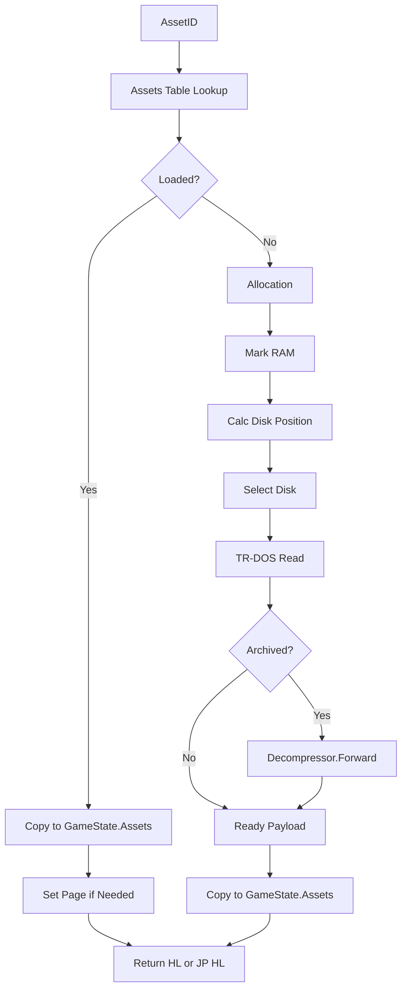

# 26. `AssetsManager` и движок исполнения ассетов

## Назначение главы

Эта глава разбирает центральный operational engine проекта — `AssetsManager`.

Если в других системах менеджер ресурсов может быть периферийной подсистемой, то здесь это один из основных механизмов рантайма.
Именно он превращает `AssetID` в живой runtime-объект:
- в кусок данных в памяти;
- в распакованный графический блок;
- в исполняемый code-asset;
- в функцию внутри крупного runtime-модуля.

Поэтому `AssetsManager` в этом проекте — не просто loader, а двигатель asset-centric архитектуры.

## Из каких слоёв складывается Asset Engine

Чтобы понять его правильно, нужно видеть несколько связанных слоёв.

### 1. Builder-слой

Builder:
- упаковывает code, graphics, метаданные и text;
- готовит asset-map;
- размещает ресурсы на диске;
- формирует метаданные, которые потом прочитает рантайм.

### 2. Contract-layer

`Includes/` задаёт:
- `FAssets`;
- константы флагов ресурса;
- memory map страницы asset manager;
- kernel bindings;
- макросы адресации, загрузки и исполнения.

### 3. Runtime implementation

`Source/AssetsManager/` реализует:
- инициализацию asset-table;
- аллокацию памяти;
- mark/release модель;
- загрузку с диска;
- распаковку;
- возврат runtime-контекста загруженного ассета.

### 4. Dispatch-layer

`Source/Modules/*/Execute.asm` и `Source/Functions/ExecuteAssetCode.asm` используют asset engine как универсальный язык запуска и потребления ресурсов.

## Почему `AssetsManager` надо считать не “менеджером”, а движком

Посмотрим на набор обязанностей.

Он умеет:
- поднимать таблицу ресурсов из метаданных ассетов;
- переводить `AssetID` в запись `FAssets`;
- выбирать или подтверждать место в RAM;
- вести карту занятости памяти;
- читать данные через TR-DOS;
- распаковывать архивные ресурсы;
- запоминать текущий asset-context в `GameState`;
- переключать страницу и передавать управление code-assets.

Такой набор обязанностей уже больше похож на маленький runtime-loader / allocator / dispatcher, чем на “обычный resource manager”.

## Положение в памяти

`AssetsManager` живёт на `Page.AssetManager`, то есть на странице 3.
Там же находятся:
- `Adr.AssetsTable`;
- `Adr.AvailableMem`;
- `Adr.InitialBlockMem`;
- `Adr.Stash_TRDOS`;
- рабочий код asset engine.

Это решение очень характерно для проекта:
engine и его основная runtime-метаинформация лежат рядом в одной служебной области.

## Служебные структуры и буферы Asset Engine

У `AssetsManager` есть несколько ключевых опор.

### `Adr.AssetsTable`

Массив записей `FAssets`, индексируемых по `AssetID`.
Это главный каталог runtime-ресурсов.

### `Adr.AvailableMem`

Битовая карта доступного ОЗУ.
Она работает блоками по 256 байт и позволяет engine искать непрерывные области памяти для размещения assets.

### `Adr.InitialBlockMem`

Битовая карта начальных блоков.
Сейчас она выглядит как часть подготовленной memory-модели и даёт понять, что engine задуман не только как loader, но и как система учёта структуры RAM.

### `Adr.Stash_TRDOS`

Служебная область для временного переноса драйвера TR-DOS в рабочий буфер.
Это отдельное напоминание о том, насколько тесно asset-runtime здесь связан с устройством платформы.

## Инициализация `AssetsManager`

Файл `Source/AssetsManager/Initialize.asm` показывает первый этап жизни engine.

### Что делает инициализация

- читает метаданные ассетов с диска в `Adr.ExtraBuffer`;
- очищает `Adr.AssetsTable`;
- для каждой записи восстанавливает `Location`, `Flags` и `Size`;
- сбрасывает поля `Address`, потому что ресурс ещё не размещён в рабочей RAM;
- рассчитывает линейное дисковое положение следующего ресурса.

### Архитектурный смысл инициализации

Engine не сканирует файловую систему по именам и не занимается поиском ресурсов в каталоге.
Он поднимает уже заранее подготовленную Builder-модель и переводит её в компактную runtime-таблицу.

Это именно тот случай, когда сборка и рантайм говорят на одном языке.

## `Core.asm`: базовые преобразования

Файл `Source/AssetsManager/Core.asm` содержит математическое ядро engine.

### `CalcSizeToBlock`

Преобразует compact size, хранящийся в `FAssets`, в число блоков по 256 байт.
Это мост между asset descriptor и allocator-моделью памяти.

### `CalcSecToDisk`

Переводит линейную дисковую позицию ресурса в:
- номер диска;
- номер дорожки;
- номер сектора.

Это мост между логическим положением asset'а и физическим доступом через TR-DOS.

### `CalcAvailableMem`

Преобразует линейный RAM-адрес в положение соответствующего бита в `AvailableMem`.
Это ключевая функция для `Mark`, `Release` и других операций с bitmask памяти.

### `CopyAssetsData`

Копирует текущую запись `FAssets` в `GameState.Assets`.
С виду мелкая утилита, но именно она связывает asset engine с остальным рантаймом.

## `Load.asm`: сердце всего движка

Файл `Source/AssetsManager/Load.asm` — главный operational центр asset engine.

Полезно пройти его по шагам.

### Шаг 1. Запомнить `AssetID`

В начале загрузки `GameState.AssetID` получает идентификатор нужного ресурса.
Это создаёт runtime-контекст “текущего ресурса”.

### Шаг 2. Найти запись `FAssets`

Через `ASSETS_ADR_A` менеджер быстро получает адрес записи по `AssetID`.

### Шаг 3. Подготовить TR-DOS

Через `ASSETS_TRDOS` driver переносится во временный буфер.
Это показывает, что asset engine не только работает с таблицами, но и реально готовит platform IO pipeline.

### Шаг 4. Проверить, уже загружен ли ресурс

Если стоит `ASSETS_LOAD_BIT`, то ресурс не грузится повторно.
Вместо этого:
- снимается `marked`;
- данные записи копируются в `GameState.Assets`;
- при необходимости выставляется страница ресурса;
- вызывающий код получает готовый `HL`.

Это важнейшая часть модели:
asset engine умеет не только грузить, но и переиспользовать уже находящиеся в памяти payload'ы.

### Шаг 5. Если нужно, выполнить allocation

Если ресурс ещё не размещён и для него не задано жёсткое положение, вызывается `Allocation`.
При неудаче engine возвращает carry и даёт шанс на освобождение памяти через `TryToFree`.

### Шаг 6. Отметить загрузку и занятость

После успешного размещения:
- ставится `ASSETS_LOAD_BIT`;
- запись копируется в `GameState.Assets`;
- вызывается `Mark` для битовой карты памяти.

### Шаг 7. Подготовить адрес фактической загрузки

Если asset архивный, engine резервирует дополнительный 256-байтный хвост, чтобы поддерживать распаковку с перекрытием.
Это уже очень низкоуровневое и продуманное поведение.

### Шаг 8. Перевести дисковое положение в TR-DOS координаты

Через `CalcSecToDisk` вычисляются диск, дорожка и сектор.
Затем `SelectDisk` переключает drive context.

### Шаг 9. При необходимости выставить page

Если ресурс не помечен как `not switch`, engine сам устанавливает страницу перед чтением.

### Шаг 10. Прочитать сектора

Через TR-DOS вызывается чтение группы секторов в рабочий адрес.

### Шаг 11. Если нужно, распаковать

Для архивных payload'ов вызывается `Decompressor.Forward`.
На выходе вызывающий код получает уже готовый рабочий блок.

## `Allocation.asm`: Runtime-аллокатор для ресурсов

`AssetsManager.Allocation` показывает вторую половину engine — управление RAM.

### Как работает аллокатор

- преобразует размер ассета в блоки по 256 байт;
- если ресурс архивный, добавляет дополнительный блок;
- начинает сканировать `Adr.AvailableMem`;
- ищет непрерывную свободную область по страницам 16 КБ;
- при успехе вычисляет `Address.Page` и `Address.Adr`;
- записывает найденное положение в `FAssets`.

### Почему это сильное решение

Здесь особенно хорошо видно, что runtime опирается не на абстрактный heap, а на явный и очень дешёвый битовый allocator.
Это хорошо согласуется с платформой и удерживает engine компактным.

### Ограничение

Аллокатор ищет непрерывную область.
Это просто и быстро, но даёт понятную зависимость от фрагментации памяти.
Именно отсюда важность `Release`, `MarkAsUnclaimed` и потенциально `TryToFree`.

## `Mark.asm` и `Release.asm`: бухгалтерия занятости памяти

Эти два файла реализуют строгую симметрию:
- `Mark` помечает блоки как занятые;
- `Release` снимает занятость.

Обе операции:
- переводят размер ресурса в блоки;
- корректируют число блоков для невыровненного адреса;
- вычисляют стартовый бит через `CalcAvailableMem`;
- затем проходом по битовой маске выставляют или сбрасывают флаги занятости.

Это очень системная часть engine.
Если `Load` отвечает за доставку payload'а, то `Mark/Release` отвечают за честную картину RAM.

## `MarkAsUnclaimed.asm`: ленивое освобождение

`MarkAsUnclaimed` не освобождает память сразу.
Он помечает resource как невостребованный и, по carry-флагу, может сбросить признак загрузки.

Это важный архитектурный намёк:
проект различает как минимум два состояния ресурса:
- технически размещён в памяти;
- больше не считается активным потребителем.

Такой подход удобен для стратегий lazy reclamation и более умной future-переработки `TryToFree`.

## `SelectDisk.asm`: минимальный, но не случайный файл

`SelectDisk` кажется простым, потому что по сути только обновляет `TRDOS.DEFAULT_DRV` и `TRDOS.TMP_DRIVE`.
Но его наличие важно архитектурно.

Это значит, что asset engine знает о многодисковой модели и может работать не только в рамках “всё на одном носителе”.
Даже если сценарий сейчас прост, интерфейс под такую модель уже заложен.

## Макро-Язык Asset Engine

Особенно сильной систему делает то, что вокруг `AssetsManager` построен выразительный набор макросов.

### Адресация и доступ

- `ASSETS_ADR`
- `ASSETS_ADR_A`
- `ASSETS_ADR_REG`

Они превращают `AssetID` в адрес записи `FAssets`.

### Жёсткое размещение

- `SET_LOAD_ASSETS`
- `SET_LOAD_ASSETS_REG`

Они позволяют заранее закрепить page и адрес размещения для asset'а.
Это особенно важно для code-assets, которым нужен фиксированный runtime-address.

### Простая загрузка

- `LOAD_ASSETS`
- `LOAD_ASSETS_A`
- `LOAD_ASSETS_REG`

Это общий интерфейс получения ресурса в рабочую память.

### Загрузка и немедленный запуск

- `LOAD_EXE_ASSETS`
- `EXE_ASSETS_NOT_PARAM`
- `EXE_ASSET_FUNCTION`

Здесь особенно видно, насколько asset engine встроен в модульную архитектуру.
Он не только загружает payload, но и обеспечивает передачу управления внутрь code-asset или конкретной функции внутри него.

### Работа с контекстом текущего ассета

- `ASSETS_PUSH`
- `ASSETS_POP`

Эти макросы позволяют сохранить и восстановить идентификатор последнего загруженного ресурса.
То есть engine поддерживает стековый переход между asset contexts.

### Явная пометка памяти

- `MARK_RAM`

Этот макрос позволяет вручную отметить region как занятый, даже если он не получен через обычный path автоматической аллокации.
Это делает asset engine полезным не только для дисковых ресурсов, но и как часть общей memory bookkeeping модели.

## `ExecuteAssetCode.asm`: мост между Asset Engine и кодом

Файл `Source/Functions/ExecuteAssetCode.asm` превращает asset loading в непосредственное исполнение кода.

### Что он делает

- включает страницу asset manager;
- вызывает `AssetsManager.Load`;
- при неудаче пытается вызвать `TryToFree`;
- на успешной загрузке делает `JP (HL)`.

Вторая часть файла, `RestoreAsset`, восстанавливает прежний asset-context и заново запускает его инициализацию.

Это уже не просто “удобная обёртка”.
Это operational bridge между asset layer и исполняемым кодом проекта.

## Как Asset Engine используют крупные модули

### `Core`

`Source/Modules/Core/Execute.asm`:
- включает asset page;
- жёстко задаёт место загрузки `ASSETS_ID_CORE`;
- запускает функцию инициализации из code-asset через `JP_EXE_ASSETS_NOT_PARAM`.

Это показывает модель fixed placement для системного кода.

### `MainMenu` и `World`

Оба модуля используют `LOAD_EXE_ASSETS`.
То есть с точки зрения диспетчера это просто загрузить payload и сразу передать ему управление.

### `Session`

`Session` интереснее.
Он использует `JP_EXE_ASSET_FUNCTION`, потому что внутри одного крупного asset'а вызываются разные функции.

Это особенно сильный момент архитектуры:
asset может быть не только “один модуль = один вход”, но и shared code block с несколькими функциями назначения.

## Почему `Session` особенно хорошо показывает мощность подхода

Через `Session` видно, что asset engine умеет обслуживать не только screen-level модули вроде `MainMenu` и `World`, но и более инструментальные, многофункциональные блоки.

Это значит, что asset model годится не только для сцен, но и для shared operational code.

## Что происходит с code-asset после загрузки

Для code-assets в проекте нужно различать две ситуации:
- код уже готов к исполнению по фиксированному адресу;
- код является перемещаемым и требует корректировки адресов после загрузки.

### Фиксированные code-assets

Некоторые блоки после `Load` можно сразу исполнять по возвращённому адресу.
Для них `HL` указывает прямо на рабочее начало payload'а.

### Перемещаемые code-assets

`MainMenu`, `Session` и `World` устроены иначе.
После загрузки `HL` указывает не на “чистое тело” модуля, а на специальный пролог:
- сначала идёт `AdjustmentAdr`;
- затем таблица релокации;
- затем уже тело модуля.

Поэтому `JP (HL)` в `LOAD_EXE_ASSETS` передаёт управление сначала не сцене, а корректировщику адресов.

## Как работает корректировка адресов

`Source/Functions/AdjustmentAddress.asm` делает несколько шагов подряд.

### Шаг 1. Получить адрес фактической загрузки

В `HL` приходит реальный адрес блока в памяти.

### Шаг 2. Найти таблицу релокации

Сразу после пролога лежит таблица смещений.
Её первый байт хранит количество адресов, которые нужно исправить.

### Шаг 3. Вычислить начало настоящего кода

По длине таблицы корректировщик вычисляет, где начинается уже не служебная часть, а реальное тело модуля.
Этот адрес становится runtime-базой для всех поправок.

### Шаг 4. Исправить адресозависимые слова

Дальше корректировщик:
- читает очередное приращение смещения;
- находит нужное 16-битное слово внутри payload'а;
- прибавляет к нему фактический базовый адрес;
- записывает исправленное значение обратно.

Builder заранее выполняет дорогую часть анализа, а runtime просто пробегает по готовому списку мест, которые зависят от адреса размещения.

## Что происходит после релокации

После исправления адресов `AdjustmentAdr` подменяет начало собственного блока коротким рабочим прологом.

В результате старт asset'а превращается в последовательность вида:
- `LD HL, <runtime code start>`
- `POP AF`
- `JP Func.JumpTable`

После этого выполняется повторный вход через уже изменённое начало блока, и управление уходит в jump-table модуля.

Это очень компактная схема:
- первый запуск делает релокацию;
- тот же asset сразу становится исполнимым;
- дополнительный внешний объект релокации в runtime не нужен.

## Полная цепочка исполнения перемещаемого code-asset

Если собрать процесс целиком, получается такая последовательность:

1. Builder дважды собирает модуль с разными `ORG`.
2. Builder по разнице двух бинарников строит таблицу релокации.
3. Builder собирает финальный asset как `AdjustmentAdr + relocation table + code`.
4. `AssetsManager.Load` размещает asset в RAM и при необходимости распаковывает его.
5. Макрос `LOAD_EXE_ASSETS` делает `JP (HL)`.
6. Первый вход попадает в `AdjustmentAdr`.
7. `AdjustmentAdr` исправляет все адресозависимые слова внутри payload'а.
8. Пролог подменяет своё начало рабочим trampoline.
9. Управление передаётся в реальный код модуля.

Именно эта цепочка объясняет, как в проекте совмещаются:
- единый asset-loader;
- page-based память;
- сжатые payload'ы;
- перемещаемый исполняемый код.

## Связь с `GameState`

Каждый успешный `Load` обновляет:
- `GameState.AssetID`;
- `GameState.Assets`.

Это даёт остальному рантайму короткий путь к текущему asset context.
Без этой связи модульному launch-коду пришлось бы всё время повторно вычислять адрес записи и вручную переносить runtime-поля.

## Где у Engine сейчас есть точки роста

Код уже очень содержателен, но есть и явно незавершённые места.

### `TryToFree.asm`

Сейчас это заглушка `RET`.
Архитектурно её наличие очень показательно:
система явно задумана как умеющая реагировать на нехватку памяти не только ошибкой, но и попыткой расчистки.

### `MemAllocation.asm` и `MemRelease.asm`

Обе части тоже пока выглядят как stub-слой.
Это подсказывает, что дальнейшая эволюция engine может идти в сторону выделения ещё более общего memory service поверх текущего asset-allocator.

## Сильные стороны `AssetsManager`

### 1. Он объединяет несколько обязанностей в один ясный runtime path

Инициализация, lookup, allocation, mark/release, disk IO, decompression и execution не разбросаны хаотично по проекту.
Они собраны в одну понятную ось.

### 2. Он очень хорошо соответствует платформе

Page-based память, TR-DOS, bitmask allocator и компактные descriptors здесь не выглядят натянутыми. Они образуют естественную систему.

### 3. Он делает модульность реальной, а не декларативной

Без `AssetsManager` модульная архитектура проекта была бы только идеей в папках `Modules/`.
Именно asset engine превращает её в рабочий runtime-механизм.

## Основные ограничения

### Ограничение 1. Высокая плотность смыслов

Очень многое спрятано в:
- битах полей;
- memory maps;
- side effects макросов;
- implicit соглашениях о страницах и адресах.

Это мощно, но требует дисциплины.

### Ограничение 2. Стратегия освобождения памяти ещё не доведена до конца

Пока `TryToFree` не реализован полноценно, модель reuse существует сильнее на уровне замысла и mark/unclaim логики, чем на уровне реального recovery path.

### Ограничение 3. Часть системы сильно зависит от правильности сборочных метаданных

Если packing или asset-map повреждены, runtime-путь уже не сможет “догадаться” о правильной структуре ресурса.

## Диаграмма загрузки и исполнения

## Архитектурный вывод

`AssetsManager` — это не обслуживающая утилита проекта.
Это фактический runtime-engine, который держит вместе:
- page-based memory model;
- asset lookup;
- модульную загрузку кода;
- поставку данных и графики;
- переходы между крупными состояниями приложения.

Именно поэтому без глубокого понимания `AssetsManager` невозможно до конца понять ни `Builder`, ни `Modules`, ни реальную архитектурную мощность проекта.

